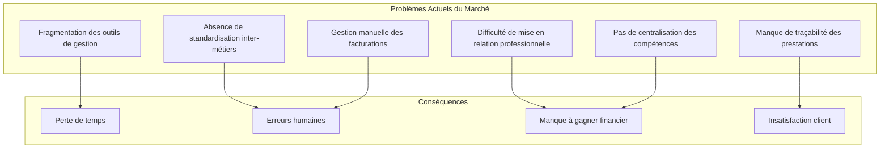
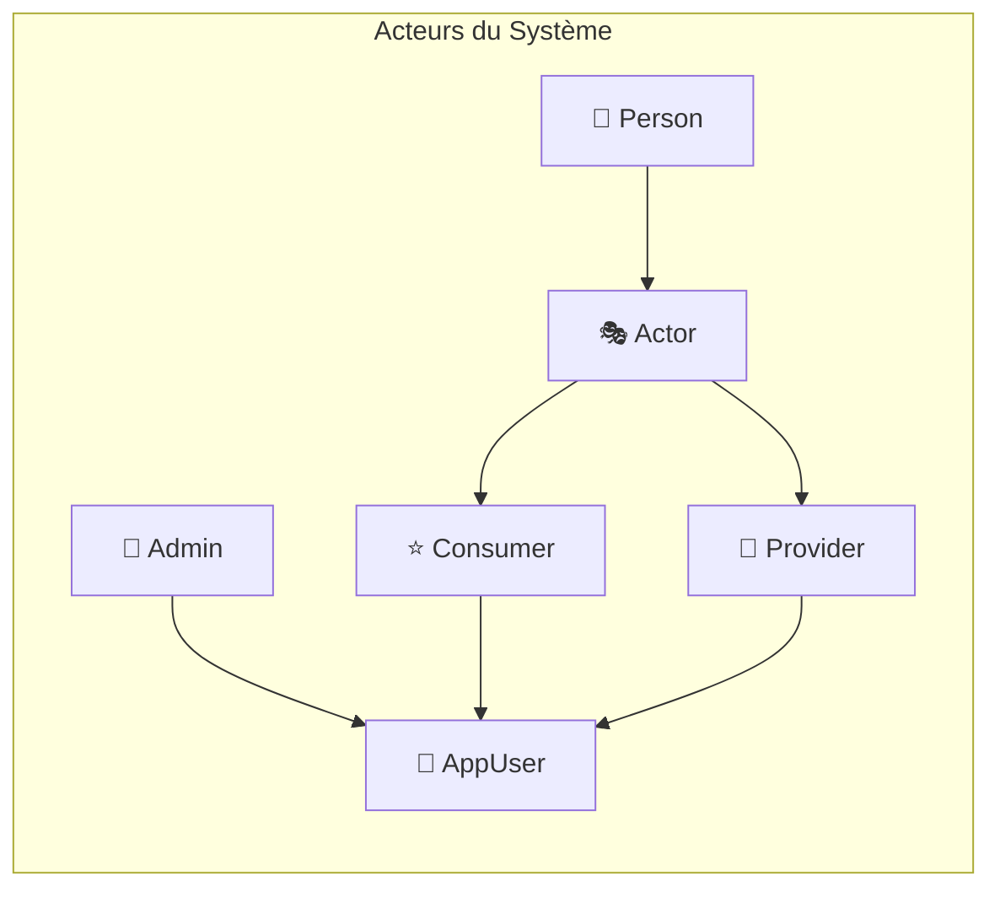
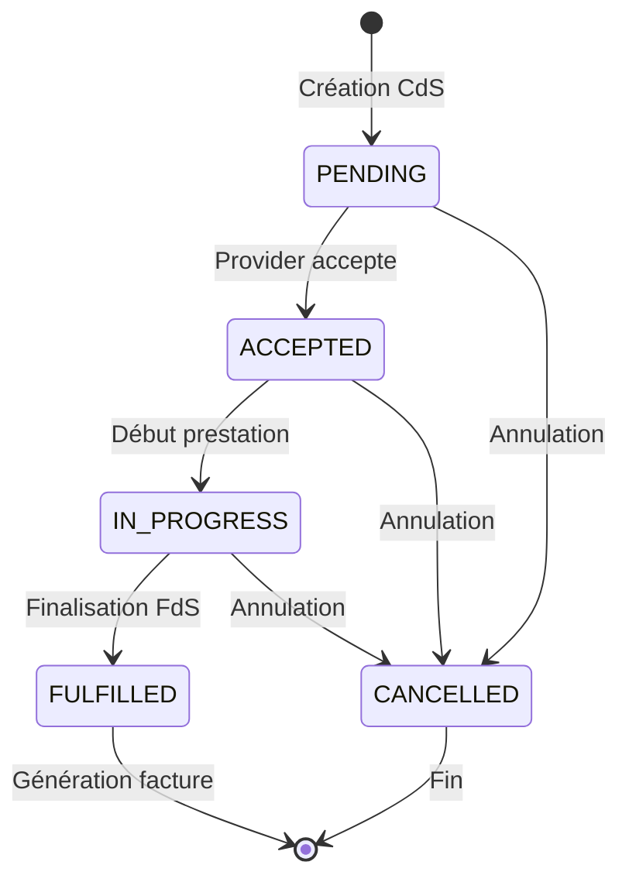
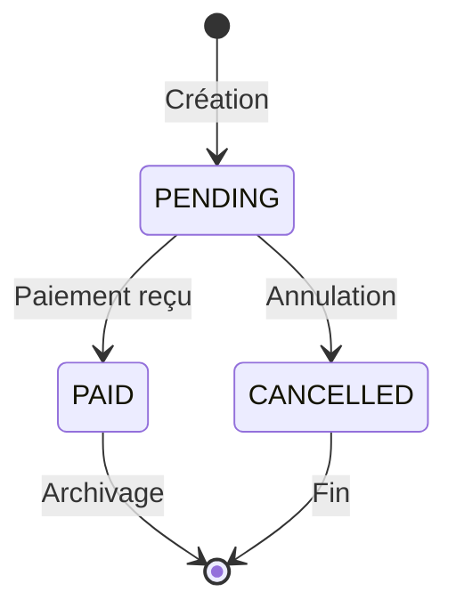
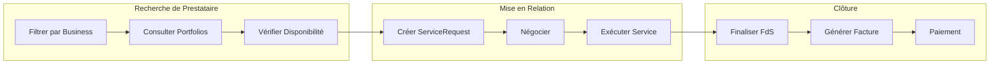
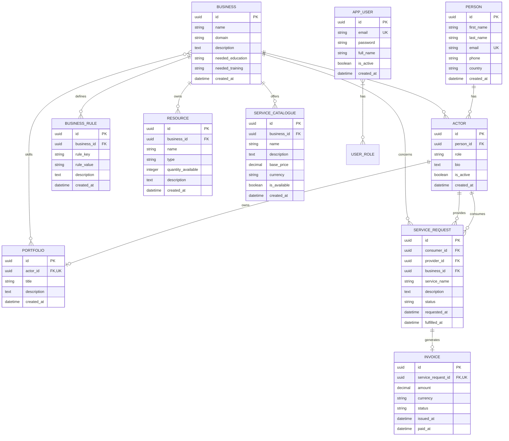

# CAHIER DES CHARGES - BIZCORE

## Version 1.0
**Date** : Mars 2026  
**Projet** : BizCore - Business as a Service Platform  
**Statut** : En développement

---

## 1. PRÉSENTATION DU PROJET

### 1.1 Contexte et Justification

Dans un contexte économique africain en pleine transformation digitale, les professionnels et artisans font face à un défi majeur : la gestion décentralisée et non standardisée de leurs activités. Chaque métier (plombier, avocat, consultant, etc.) utilise des outils disparates, sans interopérabilité ni traçabilité des échanges.

**BizCore** répond à cette problématique en proposant une plateforme de **Gestion Générique des Métiers** implémentant le concept **BaaS (Business as a Service)**. Cette infrastructure centralisée permet de gérer, standardiser et orchestrer différents métiers avec leurs règles métier, services, ressources et processus associés.

### 1.2 Objectifs Généraux

| Objectif | Description | Priorité |
|----------|-------------|----------|
| **Standardisation** | Définir un cadre commun pour tous les métiers | P0 |
| **Interopérabilité** | Permettre la communication fluide entre consommateurs et fournisseurs | P0 |
| **Traçabilité** | Gérer le cycle de vie complet des demandes de services | P0 |
| **Scalabilité** | Architecture extensible pour l'ajout de nouveaux métiers | P1 |
| **Sécurité** | Protection des données et authentification robuste | P0 |

### 1.3 Portée du Projet (Périmètre)

**Inclus dans le périmètre :**
- Gestion des identités (Personnes et Acteurs)
- Gestion des métiers (Business) et leurs règles
- Catalogue de services par métier
- Gestion des ressources
- Portfolios de compétences
- Demandes de services (CdS → FdS)
- Facturation automatique
- Authentification et autorisation JWT

**Hors périmètre (évolutions futures) :**
- Géolocalisation avancée (PostGIS)
- Messagerie temps réel (WebSocket)
- Paiement en ligne intégré
- Application mobile native
- Intelligence artificielle prédictive

---

## 2. PROBLÉMATIQUE

### 2.1 Problèmes Identifiés



### 2.2 Analyse des Besoins

#### Besoins des Consommateurs
- Trouver rapidement un prestataire qualifié
- Suivre l'état de leurs demandes en temps réel
- Recevoir des factures claires et traçables
- Évaluer les services reçus

#### Besoins des Prestataires (Providers)
- Centraliser leur offre de services
- Gérer leur portfolio de compétences
- Recevoir des demandes qualifiées
- Automatiser la facturation
- Suivre leurs ressources

#### Besoins des Administrateurs
- Gérer les métiers référencés
- Configurer les règles métier
- Superviser l'activité globale
- Gérer les utilisateurs et rôles

### 2.3 Enjeux et Défis

| Enjeu | Description | Impact |
|-------|-------------|--------|
| **Adoption multi-métiers** | La plateforme doit s'adapter à des métiers très différents | Critique |
| **Confiance numérique** | Sécuriser les échanges et paiements | Critique |
| **Performance** | Gérer un volume croissant de transactions | Élevé |
| **Conformité réglementaire** | Respecter les normes de protection des données | Critique |
| **Évolutivité** | Permettre l'ajout de nouvelles fonctionnalités | Élevé |

---

## 3. BESOINS FONCTIONNELS

### 3.1 Acteurs du Système



#### Détail des Acteurs

| Acteur | Description | Rôles Possibles |
|--------|-------------|-----------------|
| **Person** | Identité physique d'un individu (nom, email, téléphone) | - |
| **Actor** | Rôle joué par une Person dans le système | CONSUMER, PROVIDER |
| **Consumer** | Acteur demandeur de services | USER, CONSUMER |
| **Provider** | Acteur fournisseur de services | USER, PROVIDER |
| **Admin** | Administrateur système | USER, ADMIN |

### 3.2 Fonctionnalités par Acteur

#### 3.2.1 Gestion des Identités (Person)

| ID | Fonctionnalité | Description | Contraintes |
|----|----------------|-------------|-------------|
| F-PER-001 | Créer une Person | Enregistrer une nouvelle identité physique | Email unique obligatoire |
| F-PER-002 | Modifier une Person | Mettre à jour les informations personnelles | Validation email |
| F-PER-003 | Rechercher des Persons | Recherche par nom, email, pays | Pagination obligatoire |
| F-PER-004 | Supprimer une Person | Désactivation logique (soft delete) | Vérifier absence d'Actors actifs |

#### 3.2.2 Gestion des Acteurs (Actor)

| ID | Fonctionnalité | Description | Contraintes |
|----|----------------|-------------|-------------|
| F-ACT-001 | Créer un Actor | Associer un rôle à une Person | Une Person peut avoir plusieurs Actors |
| F-ACT-002 | Définir le rôle | CONSUMER ou PROVIDER | Valeur obligatoire |
| F-ACT-003 | Gérer la biographie | Ajouter/modifier la bio | Max 2000 caractères |
| F-ACT-004 | Activer/Désactiver | Soft delete via isActive | - |
| F-ACT-005 | Filtrer par rôle | Liste des Actors par rôle | - |

#### 3.2.3 Gestion des Métiers (Business)

| ID | Fonctionnalité | Description | Contraintes |
|----|----------------|-------------|-------------|
| F-BUS-001 | Créer un Business | Définir un nouveau métier | Nom et domaine obligatoires |
| F-BUS-002 | Décrire le métier | Formation et éducation requises | - |
| F-BUS-003 | Rechercher par domaine | Filtrer les métiers par catégorie | - |
| F-BUS-004 | Modifier un Business | Mise à jour des informations | - |
| F-BUS-005 | Supprimer un Business | Soft delete | Vérifier absence d'Actors associés |

#### 3.2.4 Gestion des Règles Métier (BusinessRule)

| ID | Fonctionnalité | Description | Contraintes |
|----|----------------|-------------|-------------|
| F-BRU-001 | Créer une règle | Définir une règle clé-valeur | Clé unique par Business |
| F-BRU-002 | Associer à un Business | Lier la règle à un métier | Business obligatoire |
| F-BRU-003 | Modifier une règle | Mise à jour de la valeur | - |
| F-BRU-004 | Lister les règles | Règles d'un Business spécifique | - |

#### 3.2.5 Gestion des Catalogues de Services (ServiceCatalogue)

| ID | Fonctionnalité | Description | Contraintes |
|----|----------------|-------------|-------------|
| F-SCA-001 | Créer un service | Définir un service dans un métier | Business obligatoire |
| F-SCA-002 | Fixer le prix | Prix de base et devise | Devise validée parmi la liste supportée |
| F-SCA-003 | Activer/Désactiver | Disponibilité du service | isAvailable par défaut true |
| F-SCA-004 | Lister par métier | Services d'un Business | - |
| F-SCA-005 | Modifier un service | Mise à jour des informations | - |

#### 3.2.6 Gestion des Ressources (Resource)

| ID | Fonctionnalité | Description | Contraintes |
|----|----------------|-------------|-------------|
| F-RES-001 | Créer une ressource | Définir une ressource métier | Nom et type obligatoires |
| F-RES-002 | Gérer le stock | Quantité disponible | Entier >= 0 |
| F-RES-003 | Associer à un Business | Lien avec le métier | - |
| F-RES-004 | Modifier une ressource | Mise à jour | - |

#### 3.2.7 Gestion des Portfolios (Portfolio)

| ID | Fonctionnalité | Description | Contraintes |
|----|----------------|-------------|-------------|
| F-POR-001 | Créer un Portfolio | Associer à un Actor | Un seul Portfolio par Actor |
| F-POR-002 | Définir les compétences | Associer des Businesses | Relation N:N |
| F-POR-003 | Modifier le Portfolio | Titre, description, compétences | - |
| F-POR-004 | Consulter un Portfolio | Vue détaillée avec compétences | - |

#### 3.2.8 Gestion des Demandes de Service (ServiceRequest)

| ID | Fonctionnalité | Description | Contraintes |
|----|----------------|-------------|-------------|
| F-SRE-001 | Créer une demande (CdS) | Consumer demande un service | Consumer, Provider, Business obligatoires |
| F-SRE-002 | Accepter une demande | Provider accepte | Changement statut PENDING → ACCEPTED |
| F-SRE-003 | Démarrer le service | Début de la prestation | Statut ACCEPTED → IN_PROGRESS |
| F-SRE-004 | Finaliser le service (FdS) | Service exécuté | Statut IN_PROGRESS → FULFILLED |
| F-SRE-005 | Annuler une demande | Par Consumer ou Provider | Statut → CANCELLED |
| F-SRE-006 | Suivre les demandes | Filtrage par statut, acteur | - |

**Cycle de vie d'une demande :**


#### 3.2.9 Gestion de la Facturation (Invoice)

| ID | Fonctionnalité | Description | Contraintes |
|----|----------------|-------------|-------------|
| F-INV-001 | Générer une facture | Auto ou manuel lors du FULFILLED | Une seule Invoice par ServiceRequest |
| F-INV-002 | Définir le montant | Montant et devise | Devise validée (XAF par défaut) |
| F-INV-003 | Marquer comme payée | Changement statut PENDING → PAID | Date de paiement enregistrée |
| F-INV-004 | Annuler une facture | Statut → CANCELLED | - |
| F-INV-005 | Consulter les factures | Filtrage par statut, acteur | - |

**Cycle de vie d'une facture :**


#### 3.2.10 Gestion des Devises (Currency)

| ID | Fonctionnalité | Description | Contraintes |
|----|----------------|-------------|-------------|
| F-CUR-001 | Lister les devises | Devises supportées | Lecture seule |
| F-CUR-002 | Validation devise | Vérification lors création facture/service | Enumération fixe |

**Devises supportées :**
| Code | Nom | Région |
|------|-----|--------|
| XAF | Franc CFA BEAC | Cameroun, Congo, Gabon, Tchad, RCA, Guinée Équatoriale |
| XOF | Franc CFA BCEAO | Sénégal, Côte d'Ivoire, Mali, Burkina, Bénin, Togo, Niger |
| NGN | Naira | Nigeria |
| KES | Shilling Kenyan | Kenya |
| GHS | Cedi | Ghana |
| USD | Dollar américain | International |
| EUR | Euro | International |
| GBP | Livre sterling | Royaume-Uni |

#### 3.2.11 Authentification et Sécurité (Auth)

| ID | Fonctionnalité | Description | Contraintes |
|----|----------------|-------------|-------------|
| F-AUT-001 | Inscription | Créer un compte AppUser | Email unique, mot de passe sécurisé |
| F-AUT-002 | Connexion | Authentification JWT | Token valide 24h |
| F-AUT-003 | Attribuer un rôle | ADMIN ajoute des rôles | USER, ADMIN, PROVIDER, CONSUMER |
| F-AUT-004 | Retirer un rôle | ADMIN retire des rôles | - |
| F-AUT-005 | Désactiver un compte | Soft delete via isActive | - |

### 3.3 Processus Métier Principaux

#### 3.3.1 Processus de Demande de Service (CdS → FdS)

```mermaid
sequenceDiagram
    actor C as Consumer
    participant API as BizCore API
    database DB as PostgreSQL
    actor P as Provider

    C->>API: POST /api/service-requests<br/>{serviceName, description}
    API->>DB: Vérifier Consumer, Provider, Business
    API->>DB: INSERT ServiceRequest (PENDING)
    API-->>C: 201 Created + ID demande
    
    P->>API: PATCH /api/service-requests/{id}/accept
    API->>DB: UPDATE status = ACCEPTED
    API-->>P: 200 OK
    
    P->>API: PATCH /api/service-requests/{id}/start
    API->>DB: UPDATE status = IN_PROGRESS
    API-->>P: 200 OK
    
    P->>API: PATCH /api/service-requests/{id}/fulfill
    API->>DB: UPDATE status = FULFILLED<br/>SET fulfilledAt = now()
    API->>DB: CREATE Invoice (PENDING)
    API-->>P: 200 OK + Invoice générée
    
    C->>API: GET /api/invoices/{id}
    API-->>C: 200 OK + Détails facture
```

#### 3.3.2 Processus d'Inscription et Création de Portfolio

```mermaid
sequenceDiagram
    actor U as Utilisateur
    participant API as BizCore API
    database DB as PostgreSQL

    U->>API: POST /api/auth/register<br/>{email, password, fullName}
    API->>DB: INSERT AppUser (role=USER)
    API-->>U: 201 Created
    
    U->>API: POST /api/auth/login<br/>{email, password}
    API-->>U: 200 OK + JWT Token
    
    U->>API: POST /api/persons<br/>{firstName, lastName, email, phone}
    API->>DB: INSERT Person
    API-->>U: 201 Created
    
    U->>API: POST /api/actors<br/>{personId, role, bio}
    API->>DB: INSERT Actor
    API-->>U: 201 Created
    
    U->>API: POST /api/portfolios<br/>{actorId, title, description, businessIds}
    API->>DB: INSERT Portfolio + associations
    API-->>U: 201 Created
```

#### 3.3.3 Processus de Recherche et Mise en Relation



---

## 4. BESOINS NON-FONCTIONNELS

### 4.1 Performance

| ID | Exigence | Objectif | Mesure |
|----|----------|----------|--------|
| NF-PER-001 | Temps de réponse API | < 500ms (p95) | Monitoring via logs |
| NF-PER-002 | Temps de chargement liste | < 1s pour 1000 éléments | Pagination 20 éléments/page |
| NF-PER-003 | Connexions simultanées | Support 1000 users concurrents | Tests de charge |
| NF-PER-004 | Disponibilité base de données | Reconnexion auto en < 5s | Pool de connexions HikariCP |

### 4.2 Sécurité

| ID | Exigence | Description | Implémentation |
|----|----------|-------------|----------------|
| NF-SEC-001 | Authentification | JWT avec expiration | Token 24h, secret 256 bits |
| NF-SEC-002 | Autorisation | Contrôle d'accès par rôle | @PreAuthorize sur endpoints |
| NF-SEC-003 | Chiffrement mots de passe | BCrypt | Force par défaut (10) |
| NF-SEC-004 | Protection injections | Prévention SQL Injection | JPA/Hibernate (paramètres bindés) |
| NF-SEC-005 | Validation entrées | Sanitization des inputs | Bean Validation (@Valid) |
| NF-SEC-006 | CORS | Contrôle origines requêtes | Configuration Spring Security |
| NF-SEC-007 | HTTPS | Chiffrement transport | Obligatoire en production |
| NF-SEC-008 | Audit | Traçabilité des actions | Logs structurés |

### 4.3 Disponibilité

| ID | Exigence | Objectif | Stratégie |
|----|----------|----------|-----------|
| NF-DIS-001 | Uptime | 99.5% | Monitoring + alerting |
| NF-DIS-002 | Récupération incident | RTO < 4h | Procédures documentées |
| NF-DIS-003 | Perte de données | RPO < 1h | Backups automatisés |
| NF-DIS-004 | Maintenance | Fenêtres planifiées | Notification 48h à l'avance |

### 4.4 Évolutivité

| ID | Exigence | Description |
|----|----------|-------------|
| NF-EVO-001 | Extensibilité métiers | Ajout d'un nouveau métier sans modification code |
| NF-EVO-002 | API versionnée | Support v1, v2 via URL (/api/v1/...) |
| NF-EVO-003 | Scalabilité horizontale | Support multi-instance (stateless) |
| NF-EVO-004 | Modularité | Architecture en couches découplées |

### 4.5 Contraintes Techniques

| ID | Contrainte | Valeur | Justification |
|----|------------|--------|---------------|
| NF-TEC-001 | Langage | Java 21 | LTS, performance, records |
| NF-TEC-002 | Framework | Spring Boot 3.5.x | Écosystème mature |
| NF-TEC-003 | Base de données | PostgreSQL 15+ | Robustesse, extensions |
| NF-TEC-004 | ORM | JPA/Hibernate | Standard Java |
| NF-TEC-005 | Migrations | Liquibase | Versionnement schema |
| NF-TEC-006 | Documentation API | OpenAPI 3.0 | Swagger UI intégré |
| NF-TEC-007 | Tests | JUnit 5 + Mockito | Couverture > 60% |
| NF-TEC-008 | Build | Maven 3.9+ | Standard industrie |

---

## 5. EXIGENCES ET CONTRAINTES

### 5.1 Contraintes Métier

| ID | Contrainte | Description | Impact |
|----|------------|-------------|--------|
| CM-001 | Email unique | Une Person ne peut avoir qu'un email unique | Validation en base + application |
| CM-002 | Un Portfolio par Actor | Relation 1:1 entre Actor et Portfolio | Vérification lors création |
| CM-003 | Une Invoice par ServiceRequest | Relation 1:1 entre ServiceRequest et Invoice | Contrainte unique base |
| CM-004 | Devises limitées | Seules les devises de l'énumération sont acceptées | Validation service |
| CM-005 | Soft delete | Suppression logique via isActive | Pas de DELETE physique |
| CM-006 | Cycle de vie statut | Transitions de statut valides uniquement | Validation métier |
| CM-007 | Rôles multiples | Un AppUser peut avoir plusieurs rôles | Collection de rôles |
| CM-008 | CD→FD unidirectionnel | Une fois FULFILLED, pas de retour | Final |

### 5.2 Contraintes Techniques

| ID | Contrainte | Description |
|----|------------|-------------|
| CT-001 | UUID comme clé primaire | Toutes les entités utilisent UUID v4 |
| CT-002 | Pas de DELETE en cascade | Soft delete uniquement |
| CT-003 | Dates auto | createdAt, updatedAt gérés par @PrePersist |
| CT-004 | Pagination obligatoire | Toutes les listes doivent être paginées |
| CT-005 | Validation Bean | @NotNull, @NotBlank sur champs obligatoires |
| CT-006 | Gestion erreurs centralisée | @ControllerAdvice pour exceptions |
| CT-007 | Stateless | Pas de session serveur (JWT) |
| CT-008 | Configuration externe | Variables d'environnement pour secrets |

### 5.3 Contraintes Réglementaires

| ID | Contrainte | Description | Référence |
|----|------------|-------------|-----------|
| CR-001 | Protection données personnelles | Consentement explicité collecte données | GDPR / Loi nationale |
| CR-002 | Conservation données | Durée légale de conservation | 5 ans pour factures |
| CR-003 | Sécurité financière | Tracabilité des transactions | Normes bancaires locales |
| CR-004 | Accès données | Droit à l'oubli et portabilité | GDPR Article 17 & 20 |
| CR-005 | Logs de sécurité | Conservation logs authentification | 1 an minimum |

---

## 6. LIVRABLES ATTENDUS

### 6.1 Application Backend

#### 6.1.1 Architecture Livrée

```
📦 bizcore-backend/
├── 📂 src/main/java/com/bizcore/bizcore_backend/
│   ├── 📂 domain/              # Entités JPA (11 entités)
│   ├── 📂 repository/          # Repositories Spring Data
│   ├── 📂 service/             # Services métier
│   ├── 📂 controller/          # Controllers REST
│   ├── 📂 dto/                 # Data Transfer Objects
│   ├── 📂 security/            # JWT et filtres sécurité
│   ├── 📂 auth/                # Authentification
│   ├── 📂 config/              # Configuration Spring
│   ├── 📂 exception/           # Gestion exceptions
│   └── BizcoreBackendApplication.java
├── 📂 src/main/resources/
│   ├── 📂 db/changelog/        # Migrations Liquibase (11 fichiers)
│   ├── application.properties
│   └── static/templates/
├── 📂 src/test/java/           # Tests unitaires
├── pom.xml
├── mvnw / mvnw.cmd
└── .gitignore
```

#### 6.1.2 API REST Disponibles

| Domaine | Endpoints | Méthodes |
|---------|-----------|----------|
| Auth | `/api/auth/**` | POST register, POST login, PATCH roles, DELETE roles |
| Persons | `/api/persons/**` | CRUD complet + recherche |
| Actors | `/api/actors/**` | CRUD complet + filtre par rôle |
| Businesses | `/api/businesses/**` | CRUD complet + recherche par domaine |
| Portfolios | `/api/portfolios/**` | CRUD complet |
| BusinessRules | `/api/business-rules/**` | CRUD complet |
| ServiceCatalogues | `/api/service-catalogues/**` | CRUD complet |
| Resources | `/api/resources/**` | CRUD complet |
| ServiceRequests | `/api/service-requests/**` | CRUD + fulfill + cancel |
| Invoices | `/api/invoices/**` | CRUD + pay + cancel |
| Currencies | `/api/currencies` | GET liste |

#### 6.1.3 Entités Domaine

| Entité | Description | Relations Clés |
|--------|-------------|----------------|
| Person | Identité physique | 1:N → Actor |
| Actor | Rôle CONSUMER/PROVIDER | N:1 → Person, 1:1 → Portfolio |
| Business | Métier/profession | 1:N → BusinessRule, Resource, ServiceCatalogue |
| BusinessRule | Règle configurable | N:1 → Business |
| Portfolio | Compétences d'un Actor | 1:1 → Actor, N:N → Business |
| Resource | Ressource métier | N:1 → Business |
| ServiceCatalogue | Service proposé | N:1 → Business |
| ServiceRequest | Demande de service | N:1 → Consumer, Provider, Business |
| Invoice | Facture | 1:1 → ServiceRequest |
| AppUser | Utilisateur application | N:N → Role |
| SupportedCurrency | Enum devises | - |

### 6.2 Documentation Technique

| Document | Description | Emplacement |
|----------|-------------|-------------|
| API Documentation | Swagger/OpenAPI 3.0 | `/swagger-ui.html` (runtime) |
| Documentation architecture | Vue d'ensemble technique | `DOCUMENTATION.MD` |
| Cahier des charges | Ce document | `docs/CAHIER_DES_CHARGES.md` |
| Guide de contribution | Standards de code | `CONTRIBUTING.md` (à créer) |
| Changelog | Historique versions | `CHANGELOG.md` (à créer) |

### 6.3 Documentation Utilisateur

| Document | Public Cible | Contenu |
|----------|--------------|---------|
| Guide d'installation | Développeurs/DevOps | Installation, configuration, déploiement |
| Guide d'intégration API | Développeurs frontend | Authentification, endpoints, exemples |
| Guide utilisateur | End users | Parcours Consumer, Provider, Admin |
| FAQ | Tous | Questions fréquentes |

---

## 7. MODÈLE DE DONNÉES

### 7.1 Diagramme Entité-Relation



### 7.2 Contraintes d'Intégrité Référentielle

| Table | Contrainte | Type | Description |
|-------|------------|------|-------------|
| persons | uk_persons_email | Unique | Email unique |
| actors | fk_actors_person | Foreign Key | Person doit exister |
| portfolios | uk_portfolios_actor | Unique | Un portfolio par actor |
| portfolios | fk_portfolios_actor | Foreign Key | Actor doit exister |
| service_requests | fk_sr_consumer | Foreign Key | Consumer doit exister |
| service_requests | fk_sr_provider | Foreign Key | Provider doit exister |
| service_requests | fk_sr_business | Foreign Key | Business doit exister |
| invoices | uk_invoices_sr | Unique | Une invoice par service_request |
| invoices | fk_invoices_sr | Foreign Key | ServiceRequest doit exister |

---

## 8. PLANIFICATION ET JALONS

### 8.1 Phases du Projet

| Phase | Livrables | Durée Estimée |
|-------|-----------|---------------|
| **Phase 1** - Fondation | Entités, Repositories, Services de base, Auth JWT | 4 semaines |
| **Phase 2** - Core Métier | Controllers, DTOs, Validation, Tests unitaires | 4 semaines |
| **Phase 3** - Intégration | Tests d'intégration, Documentation, Docker | 3 semaines |
| **Phase 4** - Évolution | PostGIS, Multi-tenant, Redis, Kafka | 8 semaines |
| **Phase 5** - Production | Monitoring, CI/CD, Sécurité renforcée | 4 semaines |

### 8.2 Critères d'Acceptation

| ID | Critère | Méthode de Vérification |
|----|---------|------------------------|
| ACC-001 | Tous les endpoints REST répondent correctement | Tests d'intégration API |
| ACC-002 | Authentification JWT fonctionne | Tests manuels + automatisés |
| ACC-003 | Cycle de vie CdS → FdS complet | Scénario de test end-to-end |
| ACC-004 | Génération facture automatique | Vérification base de données |
| ACC-005 | Couverture tests > 60% | Rapport JaCoCo |
| ACC-006 | Documentation Swagger à jour | Validation visuelle |
| ACC-007 | Temps réponse < 500ms (p95) | Tests de performance |

---

## 9. GLOSSAIRE

| Terme | Définition |
|-------|------------|
| **BaaS** | Business as a Service - Modèle fournissant des fonctionnalités métier via API |
| **CdS** | Cahier des Charges - Document de demande de service (Consumer → Provider) |
| **FdS** | Feuille de Service - Document attestant l'exécution du service (Provider → Consumer) |
| **Actor** | Entité représentant un rôle joué par une Person (Consumer ou Provider) |
| **Business** | Métier ou profession référencée dans le système |
| **Portfolio** | Ensemble des compétences et métiers maîtrisés par un Provider |
| **ServiceRequest** | Demande formelle de service entre un Consumer et un Provider |
| **Soft Delete** | Suppression logique (isActive = false) conservant les données en base |
| **JWT** | JSON Web Token - Standard de token pour authentification |
| **DTO** | Data Transfer Object - Objet de transfert de données entre couches |

---

## 10. VALIDATION ET APPROBATION

| Version | Date | Auteur | Modifications | Validé par |
|---------|------|--------|---------------|------------|
| 1.0 | 2026-03-23 | Équipe BizCore | Version initiale | - |

---

*Document généré pour le projet BizCore - Business as a Service Platform*
