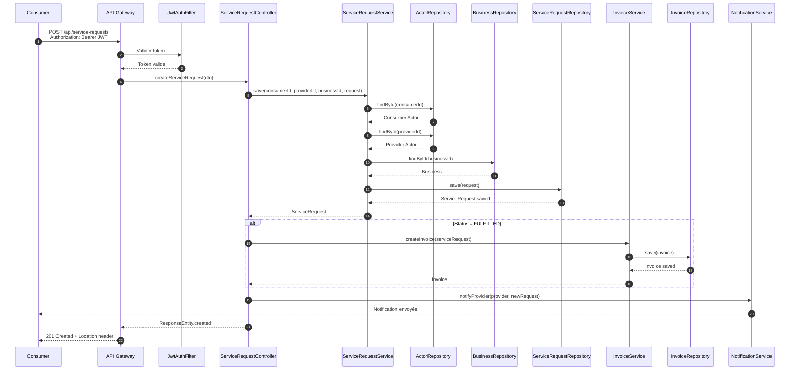
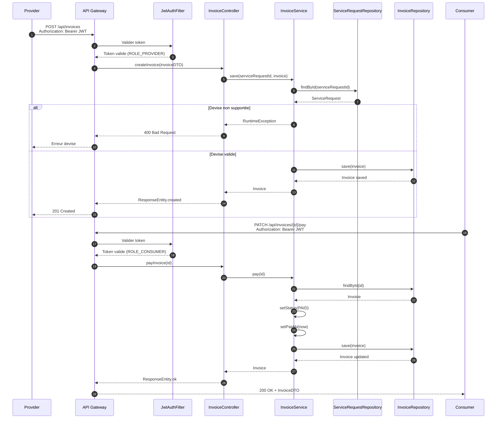
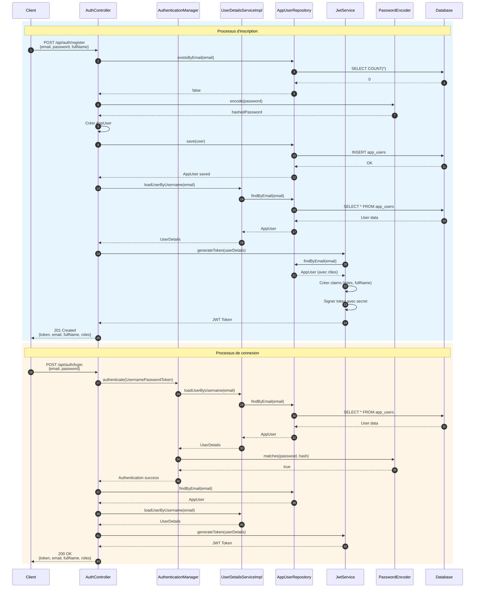
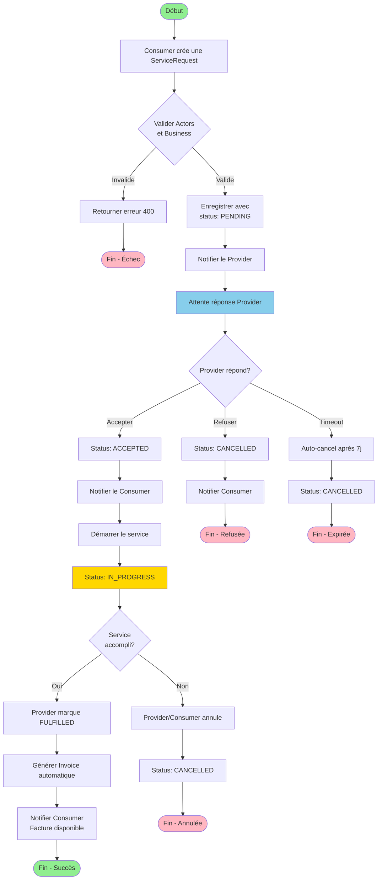
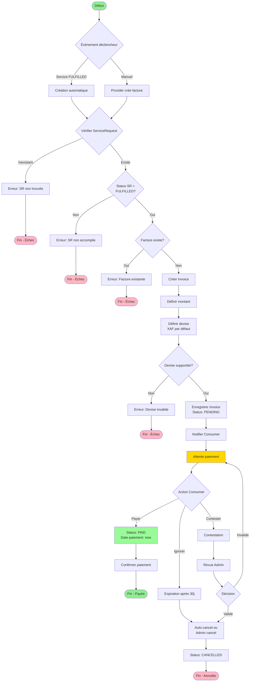
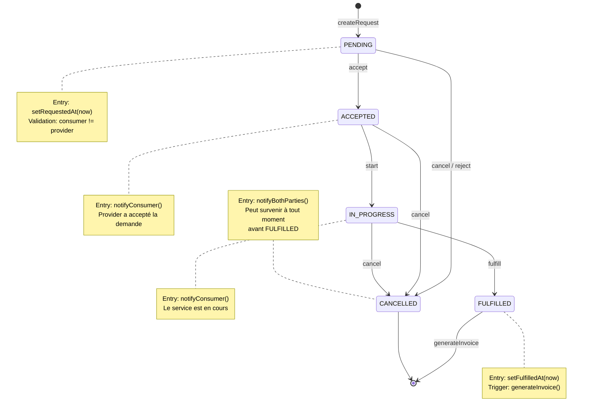
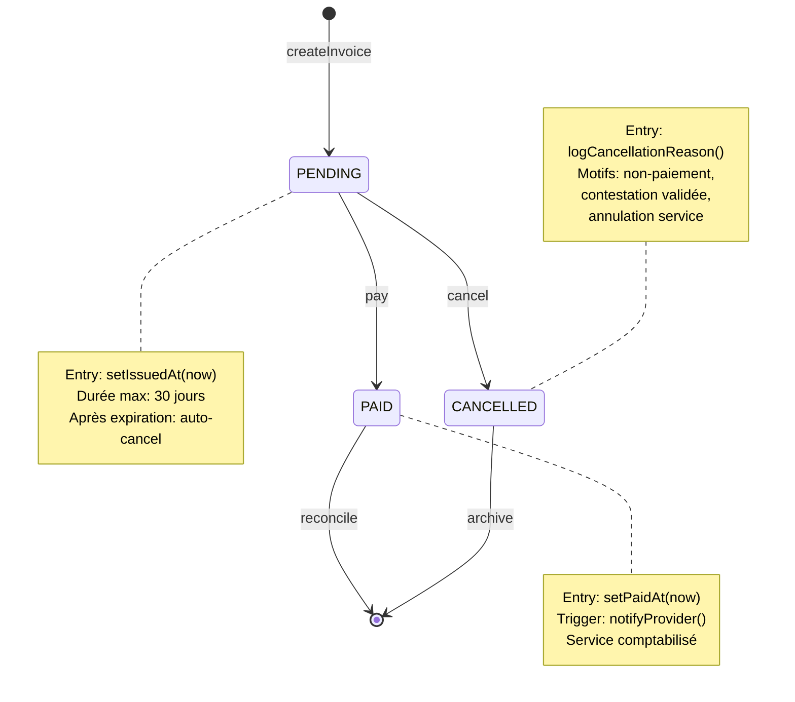
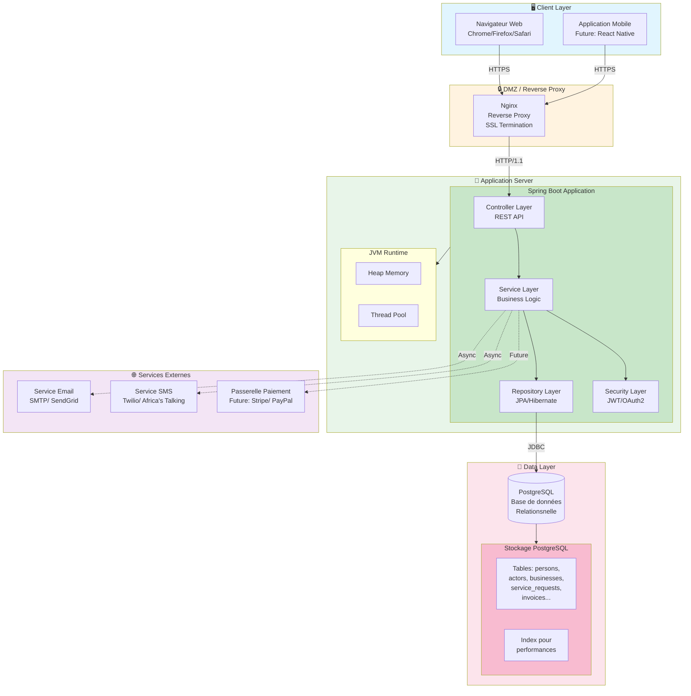
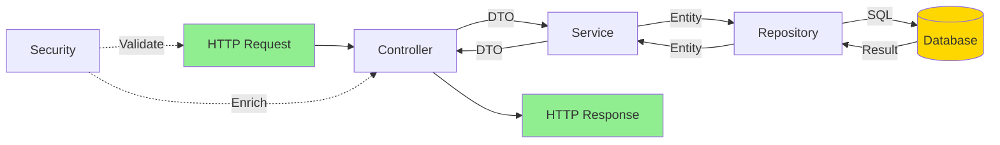

# DIAGRAMMES UML - BIZCORE

## 1. DIAGRAMME DE CAS D'UTILISATION (Use Case Diagram)

### 1.1 Diagramme global

```mermaid
graph TB
    subgraph Acteurs["👥 Acteurs"]
        G[👤 Guest<br/Visiteur]
        C[⭐ Consumer<br/>Demandeur de services]
        P[🔧 Provider<br/>Fournisseur de services]
        A[👑 Admin<br/>Administrateur]
    end

    subgraph Authentification["🔐 Authentification"]
        UC1[S'inscrire]
        UC2[S'authentifier]
        UC3[Gérer son profil utilisateur]
    end

    subgraph GestionIdentites["📝 Gestion des Identités"]
        UC4[Créer une Person]
        UC5[Modifier une Person]
        UC6[Rechercher des Persons]
    end

    subgraph GestionActeurs["🎭 Gestion des Acteurs"]
        UC7[Créer un Actor]
        UC8[Définir son rôle]
        UC9[Gérer sa biographie]
        UC10[Activer/Désactiver Actor]
    end

    subgraph GestionBusiness["🏢 Gestion des Métiers"]
        UC11[Créer un Business]
        UC12[Modifier un Business]
        UC13[Rechercher par domaine]
        UC14[Gérer les règles métier]
    end

    subgraph GestionPortfolio["📁 Gestion des Portfolios"]
        UC15[Créer son Portfolio]
        UC16[Modifier son Portfolio]
        UC17[Ajouter des compétences Business]
    end

    subgraph GestionServices["📋 Gestion des Services"]
        UC18[Créer un ServiceCatalogue]
        UC19[Modifier un ServiceCatalogue]
        UC20[Activer/Désactiver Service]
    end

    subgraph GestionRessources["📦 Gestion des Ressources"]
        UC21[Créer une Resource]
        UC22[Gérer le stock]
        UC23[Modifier une Resource]
    end

    subgraph DemandesServices["🔄 Demandes de Services"]
        UC24[Créer une ServiceRequest]
        UC25[Consulter ses demandes]
        UC26[Accepter une demande]
        UC27[Refuser une demande]
        UC28[Démarrer le service]
        UC29[Marquer comme FULFILLED]
        UC30[Annuler une demande]
    end

    subgraph Facturation["💰 Facturation"]
        UC31[Générer une Invoice]
        UC32[Consulter ses factures]
        UC33[Payer une facture]
        UC34[Annuler une facture]
    end

    subgraph Administration["⚙️ Administration"]
        UC35[Gérer les utilisateurs]
        UC36[Gérer les rôles]
        UC37[Superviser l'activité]
    end

    %% Relations Guest
    G --> UC1
    G --> UC2

    %% Relations Consumer
    C --> UC2
    C --> UC3
    C --> UC4
    C --> UC5
    C --> UC7
    C --> UC8
    C --> UC9
    C --> UC15
    C --> UC16
    C --> UC24
    C --> UC25
    C --> UC32
    C --> UC33

    %% Relations Provider
    P --> UC2
    P --> UC3
    P --> UC4
    P --> UC5
    P --> UC7
    P --> UC8
    P --> UC9
    P --> UC15
    P --> UC16
    P --> UC18
    P --> UC19
    P --> UC20
    P --> UC21
    P --> UC22
    P --> UC23
    P --> UC26
    P --> UC27
    P --> UC28
    P --> UC29
    P --> UC31
    P --> UC32

    %% Relations Admin
    A --> UC2
    A --> UC3
    A --> UC6
    A --> UC10
    A --> UC11
    A --> UC12
    A --> UC13
    A --> UC14
    A --> UC17
    A --> UC30
    A --> UC34
    A --> UC35
    A --> UC36
    A --> UC37

    %% Include relationships
    UC24 ..> UC7 : <<include>>
    UC31 ..> UC29 : <<include>>
    UC33 ..> UC32 : <<include>>
```

### 1.2 Description des acteurs

| Acteur | Description | Rôles Système |
|--------|-------------|---------------|
| **👤 Guest** | Visiteur non authentifié | Peut s'inscrire et s'authentifier uniquement |
| **⭐ Consumer** | Acteur demandeur de services | USER, CONSUMER - Crée des demandes de service, consulte ses factures |
| **🔧 Provider** | Acteur fournisseur de services | USER, PROVIDER - Gère son portfolio, catalogue de services, ressources, accepte/refuse demandes |
| **👑 Admin** | Administrateur système | USER, ADMIN - Supervise l'ensemble, gère les métiers, règles métier, utilisateurs |

### 1.3 Description des cas d'utilisation principaux

| ID | Cas d'utilisation | Description | Acteurs |
|----|-------------------|-------------|---------|
| UC1 | S'inscrire | Création d'un compte AppUser avec rôle USER par défaut | Guest |
| UC2 | S'authentifier | Connexion avec email/password, obtention JWT | Tous |
| UC4 | Créer une Person | Enregistrement de l'identité physique | Consumer, Provider |
| UC7 | Créer un Actor | Association d'un rôle métier à une Person | Consumer, Provider |
| UC15 | Créer son Portfolio | Création du portfolio professionnel | Consumer, Provider |
| UC24 | Créer une ServiceRequest | Demande de service à un provider | Consumer |
| UC26 | Accepter une demande | Le provider accepte une demande de service | Provider |
| UC29 | Marquer comme FULFILLED | Le provider marque le service comme accompli | Provider |
| UC31 | Générer une Invoice | Création automatique de facture | Provider |
| UC33 | Payer une facture | Le consumer paie sa facture | Consumer |

---

## 2. DIAGRAMME DE CLASSES (Class Diagram)

### 2.1 Diagramme du domaine

```mermaid
classDiagram
    direction TB

    class Person {
        -UUID id
        -String firstName
        -String lastName
        -String email
        -String phone
        -String country
        -LocalDateTime createdAt
        +getId() UUID
        +getFirstName() String
        +setFirstName(String) void
        +getLastName() String
        +setLastName(String) void
        +getEmail() String
        +setEmail(String) void
        +getPhone() String
        +setPhone(String) void
        +getCountry() String
        +setCountry(String) void
        +getCreatedAt() LocalDateTime
    }

    class Actor {
        -UUID id
        -Person person
        -String role
        -String bio
        -Boolean isActive
        -LocalDateTime createdAt
        +getId() UUID
        +getPerson() Person
        +setPerson(Person) void
        +getRole() String
        +setRole(String) void
        +getBio() String
        +setBio(String) void
        +getIsActive() Boolean
        +setIsActive(Boolean) void
        +getCreatedAt() LocalDateTime
    }

    class Business {
        -UUID id
        -String name
        -String domain
        -String description
        -String neededEducation
        -String neededTraining
        -LocalDateTime createdAt
        +getId() UUID
        +getName() String
        +setName(String) void
        +getDomain() String
        +setDomain(String) void
        +getDescription() String
        +setDescription(String) void
        +getNeededEducation() String
        +setNeededEducation(String) void
        +getNeededTraining() String
        +setNeededTraining(String) void
        +getCreatedAt() LocalDateTime
    }

    class Portfolio {
        -UUID id
        -Actor actor
        -String title
        -String description
        -Set~Business~ businesses
        -LocalDateTime createdAt
        +getId() UUID
        +getActor() Actor
        +setActor(Actor) void
        +getTitle() String
        +setTitle(String) void
        +getDescription() String
        +setDescription(String) void
        +getBusinesses() Set~Business~
        +setBusinesses(Set~Business~) void
        +getCreatedAt() LocalDateTime
    }

    class BusinessRule {
        -UUID id
        -Business business
        -String ruleKey
        -String ruleValue
        -String description
        -LocalDateTime createdAt
        +getId() UUID
        +getBusiness() Business
        +setBusiness(Business) void
        +getRuleKey() String
        +setRuleKey(String) void
        +getRuleValue() String
        +setRuleValue(String) void
        +getDescription() String
        +setDescription(String) void
        +getCreatedAt() LocalDateTime
    }

    class Resource {
        -UUID id
        -Business business
        -String name
        -String type
        -Integer quantityAvailable
        -String description
        -LocalDateTime createdAt
        +getId() UUID
        +getBusiness() Business
        +setBusiness(Business) void
        +getName() String
        +setName(String) void
        +getType() String
        +setType(String) void
        +getQuantityAvailable() Integer
        +setQuantityAvailable(Integer) void
        +getDescription() String
        +setDescription(String) void
        +getCreatedAt() LocalDateTime
    }

    class ServiceCatalogue {
        -UUID id
        -Business business
        -String name
        -String description
        -BigDecimal basePrice
        -String currency
        -Boolean isAvailable
        -LocalDateTime createdAt
        +getId() UUID
        +getBusiness() Business
        +setBusiness(Business) void
        +getName() String
        +setName(String) void
        +getDescription() String
        +setDescription(String) void
        +getBasePrice() BigDecimal
        +setBasePrice(BigDecimal) void
        +getCurrency() String
        +setCurrency(String) void
        +getIsAvailable() Boolean
        +setIsAvailable(Boolean) void
        +getCreatedAt() LocalDateTime
    }

    class ServiceRequest {
        <<enumeration>> Status
        PENDING
        ACCEPTED
        IN_PROGRESS
        FULFILLED
        CANCELLED
        ---
        -UUID id
        -Actor consumer
        -Actor provider
        -Business business
        -String serviceName
        -String description
        -Status status
        -LocalDateTime requestedAt
        -LocalDateTime fulfilledAt
        +getId() UUID
        +getConsumer() Actor
        +setConsumer(Actor) void
        +getProvider() Actor
        +setProvider(Actor) void
        +getBusiness() Business
        +setBusiness(Business) void
        +getServiceName() String
        +setServiceName(String) void
        +getDescription() String
        +setDescription(String) void
        +getStatus() Status
        +setStatus(Status) void
        +getRequestedAt() LocalDateTime
        +getFulfilledAt() LocalDateTime
        +setFulfilledAt(LocalDateTime) void
    }

    class Invoice {
        <<enumeration>> Status
        PENDING
        PAID
        CANCELLED
        ---
        -UUID id
        -ServiceRequest serviceRequest
        -BigDecimal amount
        -String currency
        -Status status
        -LocalDateTime issuedAt
        -LocalDateTime paidAt
        +getId() UUID
        +getServiceRequest() ServiceRequest
        +setServiceRequest(ServiceRequest) void
        +getAmount() BigDecimal
        +setAmount(BigDecimal) void
        +getCurrency() String
        +setCurrency(String) void
        +getStatus() Status
        +setStatus(Status) void
        +getIssuedAt() LocalDateTime
        +getPaidAt() LocalDateTime
        +setPaidAt(LocalDateTime) void
    }

    class AppUser {
        <<enumeration>> Role
        USER
        ADMIN
        PROVIDER
        CONSUMER
        ---
        -UUID id
        -String email
        -String password
        -String fullName
        -Set~Role~ roles
        -Boolean isActive
        -LocalDateTime createdAt
        +getId() UUID
        +getEmail() String
        +setEmail(String) void
        +getPassword() String
        +setPassword(String) void
        +getFullName() String
        +setFullName(String) void
        +getRoles() Set~Role~
        +setRoles(Set~Role~) void
        +addRole(Role) void
        +removeRole(Role) void
        +getIsActive() Boolean
        +setIsActive(Boolean) void
        +getCreatedAt() LocalDateTime
    }

    Person "1" --> "0..*" Actor : possède
    Actor "1" --> "0..1" Portfolio : détient
    Actor "1" --> "0..*" ServiceRequest : en tant que consumer
    Actor "1" --> "0..*" ServiceRequest : en tant que provider
    Portfolio "1" --> "0..*" Business : contient
    Business "1" --> "0..*" BusinessRule : définit
    Business "1" --> "0..*" Resource : dispose
    Business "1" --> "0..*" ServiceCatalogue : propose
    Business "1" --> "0..*" ServiceRequest : concerne
    ServiceRequest "1" --> "0..1" Invoice : génère
```



### 2.2 Description des classes

| Classe | Description | Responsabilité |
|--------|-------------|----------------|
| **Person** | Représente une identité physique | Stocke les informations personnelles d'un individu |
| **Actor** | Rôle joué par une Person dans le système | Associe une Person à un métier avec un rôle spécifique |
| **Business** | Métier ou activité professionnelle | Définit un domaine d'activité avec ses caractéristiques |
| **Portfolio** | Portfolio professionnel d'un Actor | Regroupe les compétences et métiers d'un acteur |
| **BusinessRule** | Règle métier configurable | Définit des règles clé-valeur spécifiques à un métier |
| **Resource** | Ressource matérielle ou immatérielle | Gère les ressources nécessaires à un métier |
| **ServiceCatalogue** | Service proposé dans un métier | Catalogue des services disponibles avec tarification |
| **ServiceRequest** | Demande de service | Gère le cycle de vie d'une demande entre consumer et provider |
| **Invoice** | Facture | Représente la facturation d'une demande de service |
| **AppUser** | Utilisateur du système | Gestion de l'authentification et des autorisations |

### 2.3 Relations entre classes

| Relation | Cardinalité | Description |
|----------|-------------|-------------|
| Person → Actor | 1 → 0..* | Une Person peut avoir plusieurs Actors |
| Actor → Portfolio | 1 → 0..1 | Un Actor a au maximum un Portfolio |
| Actor → ServiceRequest | 1 → 0..* | Un Actor peut être consumer ou provider de plusieurs demandes |
| Portfolio → Business | 1 → 0..* | Un Portfolio contient plusieurs métiers |
| Business → BusinessRule | 1 → 0..* | Un Business définit plusieurs règles métier |
| Business → Resource | 1 → 0..* | Un Business dispose de plusieurs ressources |
| Business → ServiceCatalogue | 1 → 0..* | Un Business propose plusieurs services |
| Business → ServiceRequest | 1 → 0..* | Un Business concerne plusieurs demandes |
| ServiceRequest → Invoice | 1 → 0..1 | Une demande génère au maximum une facture |

---

## 3. DIAGRAMMES DE SÉQUENCE (Sequence Diagrams)

### 3.1 Création d'une demande de service



### 3.2 Workflow de facturation



### 3.3 Authentification JWT



---

## 4. DIAGRAMME D'ACTIVITÉ (Activity Diagram)

### 4.1 Cycle de vie d'une demande de service



### 4.2 Processus de facturation



---

## 5. DIAGRAMME D'ÉTAT-TRANSITION (State Machine Diagram)

### 5.1 États de ServiceRequest



### 5.2 États de Invoice



---

## 6. DIAGRAMME DE DÉPLOIEMENT (Deployment Diagram)



### 6.1 Description de l'architecture de déploiement

| Composant | Technologie | Description |
|-----------|-------------|-------------|
| **Client** | Navigateur / Mobile | Interface utilisateur, accès HTTPS |
| **Reverse Proxy** | Nginx | Terminaison SSL, load balancing, cache |
| **Application** | Spring Boot 3.x | Backend REST API, logique métier |
| **Sécurité** | JWT / Spring Security | Authentification stateless |
| **Base de données** | PostgreSQL 15+ | Persistance relationnelle |
| **Services externes** | SMTP, SMS, Payment | Notifications et paiements |

---

## 7. DIAGRAMME DE COMPOSANTS (Component Diagram)

```mermaid
graph TB
    subgraph PresentationLayer["🎨 Presentation Layer"]
        REST[REST Controllers<br/>@RestController]
        DTO[DTOs<br/>Data Transfer Objects]
        ExceptionHandler[Global Exception Handler]
    end

    subgraph BusinessLayer["⚙️ Business Layer"]
        Services[Service Layer<br/>@Service]
        Domain[Domain Layer<br/>@Entity]
        Enums[Enumerations<br/>Status, Role]
    end

    subgraph DataAccessLayer["💾 Data Access Layer"]
        Repositories[Repository Layer<br/>@Repository]
        JPA[JPA/Hibernate]
        Liquibase[Liquibase<br/>Migrations]
    end

    subgraph SecurityLayer["🔒 Security Layer"]
        JwtAuth[JwtAuthFilter<br/>OncePerRequestFilter]
        JwtService[JwtService<br/>Token generation]
        UserDetails[UserDetailsServiceImpl]
        SecurityConfig[SecurityConfig<br/>Spring Security]
    end

    subgraph InfrastructureLayer["🔧 Infrastructure Layer"]
        Config[Configuration<br/>@Configuration]
        OpenAPI[OpenAPI Config<br/>Documentation]
        Validation[Bean Validation<br/>Jakarta Validation]
    end

    subgraph DatabaseLayer["🗄️ Database Layer"]
        PostgreSQL[(PostgreSQL Database)]
    end

    %% Relations Presentation Layer
    REST --> DTO
    REST --> Services
    REST --> ExceptionHandler

    %% Relations Business Layer
    Services --> Domain
    Services --> Enums
    Services --> Repositories

    %% Relations Data Access Layer
    Repositories --> JPA
    JPA --> PostgreSQL
    Liquibase --> PostgreSQL

    %% Relations Security Layer
    JwtAuth --> JwtService
    JwtAuth --> UserDetails
    JwtAuth --> SecurityConfig
    SecurityConfig --> UserDetails

    %% Cross-cutting
    REST --> JwtAuth
    Services --> Validation
    Config --> OpenAPI

    %% Styling
    style PresentationLayer fill:#e3f2fd
    style BusinessLayer fill:#e8f5e9
    style DataAccessLayer fill:#fff3e0
    style SecurityLayer fill:#fce4ec
    style InfrastructureLayer fill:#f3e5f5
    style DatabaseLayer fill:#e0e0e0
```

### 7.1 Description des composants

| Couche | Composant | Responsabilité |
|--------|-----------|----------------|
| **Presentation** | REST Controllers | Exposition des endpoints REST, gestion HTTP |
| **Presentation** | DTOs | Transport de données entre layers |
| **Presentation** | Exception Handler | Gestion centralisée des erreurs |
| **Business** | Service Layer | Logique métier, orchestration |
| **Business** | Domain Layer | Entités, valeurs, règles métier |
| **Data Access** | Repository Layer | Abstraction de persistance |
| **Data Access** | JPA/Hibernate | ORM, mapping objet-relationnel |
| **Data Access** | Liquibase | Gestion des migrations schema |
| **Security** | JwtAuthFilter | Filtrage et validation JWT |
| **Security** | JwtService | Génération/validation tokens |
| **Security** | UserDetailsService | Chargement utilisateurs |
| **Infrastructure** | Configuration | Beans Spring, propriétés |
| **Infrastructure** | OpenAPI | Documentation API |
| **Infrastructure** | Validation | Contraintes métier |

### 7.2 Flux de données entre composants



---

## Résumé des Diagrammes

| Diagramme | Objectif | Fichier source principal |
|-----------|----------|--------------------------|
| **Use Case** | Identifier les acteurs et fonctionnalités | [`CAHIER_DES_CHARGES.md`](CAHIER_DES_CHARGES.md) |
| **Class** | Modéliser la structure statique du système | [`domain/*.java`](../src/main/java/com/bizcore/bizcore_backend/domain/) |
| **Sequence** | Décrire les interactions temporelles | [`service/*.java`](../src/main/java/com/bizcore/bizcore_backend/service/) |
| **Activity** | Modéliser les flux de travail métier | [`ServiceRequestService.java`](../src/main/java/com/bizcore/bizcore_backend/service/ServiceRequestService.java) |
| **State Machine** | Décrire les cycles de vie des entités | [`ServiceRequest.java`](../src/main/java/com/bizcore/bizcore_backend/domain/ServiceRequest.java) |
| **Deployment** | Illustrer l'architecture physique | [`application.properties`](../src/main/resources/application.properties) |
| **Component** | Organiser les modules logiciels | Architecture Spring Boot |

---

*Document généré pour le projet BizCore - Business as a Service Platform*  
*Date de génération : Mars 2026*  
*Version : 1.0*
