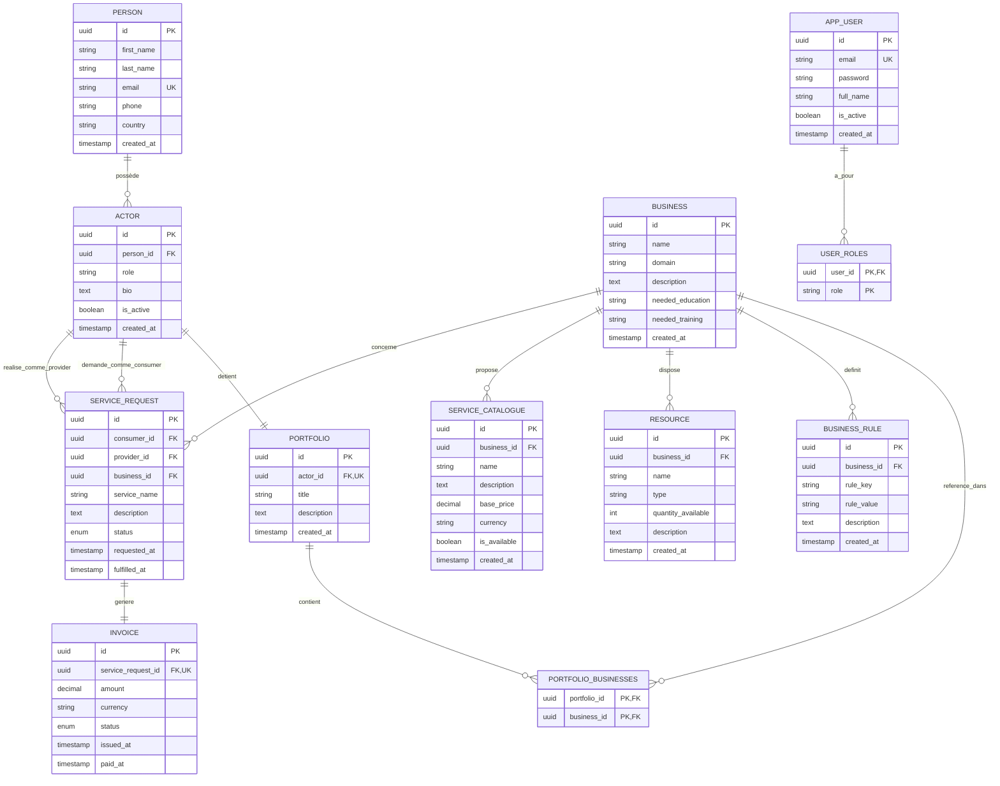

# MODÈLE CONCEPTUEL DE DONNÉES (MCD) - BIZCORE

## 1. INTRODUCTION

### 1.1 Définition du MCD

Le Modèle Conceptuel de Données (MCD) est une représentation formelle et structurée des données manipulées par le système BizCore. Il identifie les entités métier, leurs attributs, les associations entre ces entités ainsi que les cardinalités qui définissent les règles de correspondance entre les occurrences.

Le MCD sert de fondement pour :
- Comprendre la structure informationnelle du système
- Assurer la cohérence des données entre les différents modules
- Guider la conception de la base de données physique (MPD)
- Documenter les règles de gestion métier associées aux données

### 1.2 Convention de notation Merise

Ce document utilise la notation **Merise** pour représenter le modèle conceptuel :

| Élément | Notation | Exemple |
|---------|----------|---------|
| Entité | Rectangle | `PERSON` |
| Association | Losange | `possède` |
| Attribut | Liste dans l'entité | `id: UUID [PK]` |
| Clé primaire | Souligné ou [PK] | `id: UUID [PK]` |
| Clé étrangère | [FK] ou préfixe # | `#person_id: UUID [FK]` |
| Cardinalité | 0,1 - 1,1 - 0,N - 1,N | `1,N` |

**Convention de nommage :**
- Noms d'entités en UPPER_SNAKE_CASE (ex: `SERVICE_CATALOGUE`)
- Attributs en snake_case (ex: `first_name`)
- Tables de jointure N:M : `{entity1}_{entity2}`

---

## 2. DICTIONNAIRE DE DONNÉES

### 2.1 Entités et attributs

#### PERSON - Personne physique

| Attribut | Type | Description | Contraintes |
|----------|------|-------------|-------------|
| id | UUID | Identifiant unique de la personne | PK, auto-généré |
| first_name | VARCHAR(255) | Prénom de la personne | NOT NULL |
| last_name | VARCHAR(255) | Nom de famille | NOT NULL |
| email | VARCHAR(255) | Adresse email unique | NOT NULL, UNIQUE |
| phone | VARCHAR(255) | Numéro de téléphone | NULL |
| country | VARCHAR(255) | Pays de résidence | NULL |
| created_at | TIMESTAMP | Date de création du compte | auto-généré |

#### ACTOR - Acteur métier

| Attribut | Type | Description | Contraintes |
|----------|------|-------------|-------------|
| id | UUID | Identifiant unique de l'acteur | PK, auto-généré |
| person_id | UUID | Référence vers la personne | FK → PERSON, NOT NULL |
| role | VARCHAR(255) | Rôle de l'acteur (ex: provider, consumer) | NOT NULL |
| bio | TEXT | Biographie/description | NULL |
| is_active | BOOLEAN | Statut actif/inactif | DEFAULT TRUE |
| created_at | TIMESTAMP | Date de création | auto-généré |

#### BUSINESS - Métier/Activité professionnelle

| Attribut | Type | Description | Contraintes |
|----------|------|-------------|-------------|
| id | UUID | Identifiant unique du métier | PK, auto-généré |
| name | VARCHAR(255) | Nom du métier | NOT NULL |
| domain | VARCHAR(255) | Domaine d'activité | NOT NULL |
| description | TEXT | Description détaillée | NULL |
| needed_education | VARCHAR(255) | Formation requise | NULL |
| needed_training | VARCHAR(255) | Certification requise | NULL |
| created_at | TIMESTAMP | Date de création | auto-généré |

#### PORTFOLIO - Portfolio professionnel

| Attribut | Type | Description | Contraintes |
|----------|------|-------------|-------------|
| id | UUID | Identifiant unique du portfolio | PK, auto-généré |
| actor_id | UUID | Référence vers l'acteur propriétaire | FK → ACTOR, NOT NULL, UNIQUE |
| title | VARCHAR(255) | Titre du portfolio | NOT NULL |
| description | TEXT | Description du portfolio | NULL |
| created_at | TIMESTAMP | Date de création | auto-généré |

#### PORTFOLIO_BUSINESSES - Table de jointure N:M

| Attribut | Type | Description | Contraintes |
|----------|------|-------------|-------------|
| portfolio_id | UUID | Référence vers le portfolio | FK → PORTFOLIO, PK |
| business_id | UUID | Référence vers le métier | FK → BUSINESS, PK |

#### BUSINESS_RULE - Règle métier

| Attribut | Type | Description | Contraintes |
|----------|------|-------------|-------------|
| id | UUID | Identifiant unique de la règle | PK, auto-généré |
| business_id | UUID | Référence vers le métier concerné | FK → BUSINESS, NOT NULL |
| rule_key | VARCHAR(255) | Clé identifiant la règle | NOT NULL |
| rule_value | VARCHAR(255) | Valeur de la règle | NOT NULL |
| description | TEXT | Description de la règle | NULL |
| created_at | TIMESTAMP | Date de création | auto-généré |

#### RESOURCE - Ressource matérielle ou immatérielle

| Attribut | Type | Description | Contraintes |
|----------|------|-------------|-------------|
| id | UUID | Identifiant unique de la ressource | PK, auto-généré |
| business_id | UUID | Référence vers le métier | FK → BUSINESS, NOT NULL |
| name | VARCHAR(255) | Nom de la ressource | NOT NULL |
| type | VARCHAR(255) | Type de ressource | NOT NULL |
| quantity_available | INTEGER | Quantité disponible | DEFAULT 0 |
| description | TEXT | Description de la ressource | NULL |
| created_at | TIMESTAMP | Date de création | auto-généré |

#### SERVICE_CATALOGUE - Service du catalogue

| Attribut | Type | Description | Contraintes |
|----------|------|-------------|-------------|
| id | UUID | Identifiant unique du service | PK, auto-généré |
| business_id | UUID | Référence vers le métier | FK → BUSINESS, NOT NULL |
| name | VARCHAR(255) | Nom du service | NOT NULL |
| description | TEXT | Description du service | NULL |
| base_price | DECIMAL(15,2) | Prix de base | NULL |
| currency | VARCHAR(3) | Devise (XAF par défaut) | DEFAULT 'XAF' |
| is_available | BOOLEAN | Disponibilité du service | DEFAULT TRUE |
| created_at | TIMESTAMP | Date de création | auto-généré |

#### SERVICE_REQUEST - Demande de service

| Attribut | Type | Description | Contraintes |
|----------|------|-------------|-------------|
| id | UUID | Identifiant unique de la demande | PK, auto-généré |
| consumer_id | UUID | Référence vers l'acteur consommateur | FK → ACTOR, NOT NULL |
| provider_id | UUID | Référence vers l'acteur prestataire | FK → ACTOR, NOT NULL |
| business_id | UUID | Référence vers le métier concerné | FK → BUSINESS, NOT NULL |
| service_name | VARCHAR(255) | Nom du service demandé | NOT NULL |
| description | TEXT | Description de la demande | NULL |
| status | ENUM | Statut (PENDING, ACCEPTED, IN_PROGRESS, FULFILLED, CANCELLED) | DEFAULT 'PENDING' |
| requested_at | TIMESTAMP | Date de la demande | auto-généré |
| fulfilled_at | TIMESTAMP | Date d'accomplissement | NULL |

#### INVOICE - Facture

| Attribut | Type | Description | Contraintes |
|----------|------|-------------|-------------|
| id | UUID | Identifiant unique de la facture | PK, auto-généré |
| service_request_id | UUID | Référence vers la demande de service | FK → SERVICE_REQUEST, NOT NULL, UNIQUE |
| amount | DECIMAL(15,2) | Montant de la facture | NOT NULL |
| currency | VARCHAR(3) | Devise | DEFAULT 'XAF' |
| status | ENUM | Statut (PENDING, PAID, CANCELLED) | DEFAULT 'PENDING' |
| issued_at | TIMESTAMP | Date d'émission | auto-généré |
| paid_at | TIMESTAMP | Date de paiement | NULL |

#### APP_USER - Utilisateur de l'application

| Attribut | Type | Description | Contraintes |
|----------|------|-------------|-------------|
| id | UUID | Identifiant unique de l'utilisateur | PK, auto-généré |
| email | VARCHAR(255) | Email de connexion | NOT NULL, UNIQUE |
| password | VARCHAR(255) | Mot de passe hashé | NOT NULL |
| full_name | VARCHAR(255) | Nom complet | NOT NULL |
| is_active | BOOLEAN | Compte actif/inactif | DEFAULT TRUE |
| created_at | TIMESTAMP | Date de création | auto-généré |

#### USER_ROLES - Table de jointure pour les rôles

| Attribut | Type | Description | Contraintes |
|----------|------|-------------|-------------|
| user_id | UUID | Référence vers l'utilisateur | FK → APP_USER, PK |
| role | VARCHAR(50) | Rôle (USER, ADMIN, PROVIDER, CONSUMER) | PK |

### 2.2 Types de données

| Type | Description | Domaine |
|------|-------------|---------|
| UUID | Identifiant unique universel | 128 bits (RFC 4122) |
| VARCHAR(n) | Chaîne de caractères variable | 1 à n caractères |
| TEXT | Texte long illimité | UTF-8 |
| INTEGER | Nombre entier | -2^31 à 2^31-1 |
| DECIMAL(p,s) | Nombre décimal | p précision, s échelle |
| BOOLEAN | Valeur booléenne | TRUE/FALSE |
| TIMESTAMP | Date et heure | ISO 8601 |
| ENUM | Énumération | Valeurs prédéfinies |

### 2.3 Contraintes d'intégrité

| Type | Description | Exemple |
|------|-------------|---------|
| PK (Primary Key) | Identifiant unique de l'entité | `id` dans chaque table |
| FK (Foreign Key) | Référence vers une autre entité | `person_id` → PERSON |
| NOT NULL | Valeur obligatoire | `email` NOT NULL |
| UNIQUE | Valeur unique dans la table | `email` UNIQUE |
| CHECK | Vérification de condition | `quantity_available >= 0` |
| DEFAULT | Valeur par défaut | `is_active` DEFAULT TRUE |

---

## 3. DIAGRAMME MCD (MERISE)



---

## 4. DESCRIPTION DES ENTITÉS

### 4.1 Entités fortes

Les entités fortes sont celles qui possèdent une clé primaire propre et n'ont pas besoin d'autres entités pour exister.

#### PERSON
**Sémantique :** Représente une personne physique dans le système.
**Identification :** Identifiant UUID unique.
**Cycle de vie :** Créée lors de l'inscription d'une personne, supprimée sur demande RGPD.
**Population estimée :** Nombre d'utilisateurs inscrits sur la plateforme.

#### BUSINESS
**Sémantique :** Représente un métier ou une activité professionnelle pouvant être exercé.
**Identification :** Identifiant UUID unique.
**Cycle de vie :** Créée par les administrateurs ou importée, mise à jour selon les évolutions métier.
**Population estimée :** Catalogue de métiers référencés (quelques centaines).

#### APP_USER
**Sémantique :** Représente un compte utilisateur pour l'authentification.
**Identification :** Identifiant UUID unique + email unique.
**Cycle de vie :** Créé à l'inscription, désactivé en cas de résiliation, supprimé sur demande.
**Population estimée :** Nombre de comptes utilisateurs actifs.

### 4.2 Entités faibles

Les entités faibles dépendent d'une entité forte pour leur existence (clé étrangère obligatoire).

#### ACTOR
**Sémantique :** Représente le rôle qu'une personne joue dans le système (prestataire, consommateur).
**Dépendance :** Dépend de PERSON (person_id obligatoire).
**Identification :** Identifiant UUID propre.
**Cardinalité parent :** Une PERSON peut avoir plusieurs ACTOR (1:N).

#### PORTFOLIO
**Sémantique :** Représente le portfolio professionnel d'un acteur.
**Dépendance :** Dépend de ACTOR (actor_id obligatoire).
**Identification :** Identifiant UUID propre.
**Cardinalité parent :** Un ACTOR a exactement un PORTFOLIO (1:1).

#### BUSINESS_RULE
**Sémantique :** Règle de gestion spécifique à un métier.
**Dépendance :** Dépend de BUSINESS (business_id obligatoire).
**Identification :** Identifiant UUID propre.
**Cardinalité parent :** Un BUSINESS peut avoir plusieurs règles (1:N).

#### RESOURCE
**Sémantique :** Ressource nécessaire à l'exercice d'un métier.
**Dépendance :** Dépend de BUSINESS (business_id obligatoire).
**Identification :** Identifiant UUID propre.
**Cardinalité parent :** Un BUSINESS peut avoir plusieurs ressources (1:N).

#### SERVICE_CATALOGUE
**Sémantique :** Service proposé dans le cadre d'un métier.
**Dépendance :** Dépend de BUSINESS (business_id obligatoire).
**Identification :** Identifiant UUID propre.
**Cardinalité parent :** Un BUSINESS peut proposer plusieurs services (1:N).

#### SERVICE_REQUEST
**Sémantique :** Demande de service entre un consommateur et un prestataire.
**Dépendance :** Dépend de ACTOR (consumer_id, provider_id) et BUSINESS (business_id).
**Identification :** Identifiant UUID propre.
**Cardinalité parent :** Un ACTOR peut être consommateur ou prestataire de plusieurs demandes.

#### INVOICE
**Sémantique :** Facture associée à une demande de service.
**Dépendance :** Dépend de SERVICE_REQUEST (service_request_id obligatoire).
**Identification :** Identifiant UUID propre.
**Cardinalité parent :** Une SERVICE_REQUEST génère exactement une INVOICE (1:1).

### 4.3 Associations détaillées

#### ASSOCIATION : possède (PERSON → ACTOR)
- **Type :** 1:N (Unidirectionnelle de ACTOR vers PERSON)
- **Sens de navigation :** ACTOR connaît sa PERSON
- **Contrainte :** Chaque ACTOR doit être associé à exactement une PERSON

#### ASSOCIATION : detient (ACTOR → PORTFOLIO)
- **Type :** 1:1
- **Sens de navigation :** Bidirectionnel
- **Contrainte :** Un ACTOR possède exactement un PORTFOLIO (création automatique)

#### ASSOCIATION : demande/realise (ACTOR → SERVICE_REQUEST)
- **Type :** 1:N (deux associations distinctes)
- **consumer :** ACTOR qui demande le service
- **provider :** ACTOR qui réalise le service
- **Contrainte :** consumer_id ≠ provider_id (un acteur ne peut pas se demander à lui-même)

#### ASSOCIATION : contient (PORTFOLIO → BUSINESS)
- **Type :** N:M
- **Table de jointure :** PORTFOLIO_BUSINESSES
- **Clés :** (portfolio_id, business_id) composite PK
- **Sémantique :** Un portfolio référence les métiers que l'acteur maîtrise

#### ASSOCIATION : genere (SERVICE_REQUEST → INVOICE)
- **Type :** 1:1
- **Contrainte :** Une demande ne génère qu'une seule facture
- **Cycle de vie :** La facture est créée lors du passage au statut ACCEPTED

---

## 5. CARDINALITÉS ET RÈGLES DE GESTION

### 5.1 Tableau récapitulatif des cardinalités

| Entité Source | Relation | Entité Cible | Cardinalité | Description |
|---------------|----------|--------------|-------------|-------------|
| PERSON | possède | ACTOR | 1:N | Une personne peut avoir plusieurs rôles |
| ACTOR | detient | PORTFOLIO | 1:1 | Un acteur a exactement un portfolio |
| PORTFOLIO | contient | BUSINESS | N:M | Un portfolio référence plusieurs métiers |
| BUSINESS | definit | BUSINESS_RULE | 1:N | Un métier a plusieurs règles |
| BUSINESS | dispose | RESOURCE | 1:N | Un métier utilise plusieurs ressources |
| BUSINESS | propose | SERVICE_CATALOGUE | 1:N | Un métier propose plusieurs services |
| ACTOR | demande | SERVICE_REQUEST | 1:N | Un acteur peut faire plusieurs demandes |
| ACTOR | realise | SERVICE_REQUEST | 1:N | Un acteur peut réaliser plusieurs services |
| BUSINESS | concerne | SERVICE_REQUEST | 1:N | Un métier concerné par plusieurs demandes |
| SERVICE_REQUEST | genere | INVOICE | 1:1 | Une demande génère une facture |
| APP_USER | a_pour | USER_ROLES | 1:N | Un utilisateur a plusieurs rôles |

### 5.2 Règles de gestion métier

#### RG1 - Unicité des emails
**Règle :** L'email d'une PERSON et d'un APP_USER doit être unique dans le système.
**Type :** Contrainte d'intégrité (UNIQUE)
**Justification :** Permet d'identifier de manière unambiguous les utilisateurs.

#### RG2 - Portfolio unique par acteur
**Règle :** Chaque ACTOR possède exactement un PORTFOLIO créé automatiquement à la création de l'acteur.
**Type :** Contrainte structurelle (1:1)
**Justification :** Un acteur doit présenter ses compétences dans un unique portfolio.

#### RG3 - Auto-référencement interdit
**Règle :** Un ACTOR ne peut pas être consommateur et prestataire de la même SERVICE_REQUEST.
**Type :** Contrainte comportementale
**Formule :** `consumer_id ≠ provider_id`
**Justification :** Un acteur ne peut pas se demander un service à lui-même.

#### RG4 - Facturation unique
**Règle :** Une SERVICE_REQUEST ne peut générer qu'une seule INVOICE.
**Type :** Contrainte structurelle (1:1)
**Justification :** Une demande = une transaction financière.

#### RG5 - Ressources positives
**Règle :** La quantité disponible d'une RESOURCE doit être supérieure ou égale à zéro.
**Type :** Contrainte de domaine
**Formule :** `quantity_available >= 0`

#### RG6 - Statuts de cycle de vie
**Règle :** Les statuts des demandes et factures suivent un cycle de vie défini.

**SERVICE_REQUEST :**
```
PENDING → ACCEPTED → IN_PROGRESS → FULFILLED
    ↓         ↓           ↓
CANCELLED  CANCELLED   CANCELLED
```

**INVOICE :**
```
PENDING → PAID
    ↓
CANCELLED
```

#### RG7 - Dates cohérentes
**Règle :** Les dates doivent respecter une chronologie logique.
- `requested_at <= fulfilled_at` (pour SERVICE_REQUEST)
- `issued_at <= paid_at` (pour INVOICE)
- `created_at` non modifiable

#### RG8 - Rôles utilisateur
**Règle :** Un APP_USER doit avoir au moins un rôle parmi : USER, ADMIN, PROVIDER, CONSUMER.
**Type :** Contrainte comportementale
**Défaut :** ROLE_USER attribué automatiquement à la création.

#### RG9 - Cohérence métier-service
**Règle :** Le prestataire (provider) d'une SERVICE_REQUEST doit exercer le métier (business) concerné.
**Type :** Contrainte métier
**Vérification :** Le provider doit avoir le business dans son portfolio.

#### RG10 - Activation des entités
**Règle :** Les entités ACTOR et APP_USER peuvent être désactivées sans suppression.
**Type :** Contrainte comportementale
**Champ :** `is_active` (soft delete)

---

## 6. CONTRAINTES ET VALIDATIONS

### 6.1 Contraintes structurelles

#### C1 - Clés primaires
Toutes les tables doivent avoir une clé primaire unique et non nulle.

```sql
-- Exemple pour PERSON
PRIMARY KEY (id)
```

#### C2 - Clés étrangères
Toutes les références doivent être validées par des contraintes d'intégrité référentielle.

| Clé étrangère | Table source | Table cible | Action DELETE | Action UPDATE |
|---------------|--------------|-------------|---------------|---------------|
| person_id | ACTOR | PERSON | RESTRICT | CASCADE |
| actor_id | PORTFOLIO | ACTOR | RESTRICT | CASCADE |
| business_id | BUSINESS_RULE | BUSINESS | CASCADE | CASCADE |
| business_id | RESOURCE | BUSINESS | CASCADE | CASCADE |
| business_id | SERVICE_CATALOGUE | BUSINESS | CASCADE | CASCADE |
| consumer_id | SERVICE_REQUEST | ACTOR | RESTRICT | CASCADE |
| provider_id | SERVICE_REQUEST | ACTOR | RESTRICT | CASCADE |
| business_id | SERVICE_REQUEST | BUSINESS | RESTRICT | CASCADE |
| service_request_id | INVOICE | SERVICE_REQUEST | RESTRICT | CASCADE |

#### C3 - Unicités
Champs devant être uniques dans leur table :

```sql
-- PERSON
UNIQUE (email)

-- PORTFOLIO  
UNIQUE (actor_id)

-- APP_USER
UNIQUE (email)

-- INVOICE
UNIQUE (service_request_id)

-- PORTFOLIO_BUSINESSES
PRIMARY KEY (portfolio_id, business_id)

-- USER_ROLES
PRIMARY KEY (user_id, role)
```

#### C4 - Contraintes NOT NULL
Champs obligatoires par entité :

| Entité | Champs NOT NULL |
|--------|-----------------|
| PERSON | id, first_name, last_name, email |
| ACTOR | id, person_id, role |
| BUSINESS | id, name, domain |
| PORTFOLIO | id, actor_id, title |
| BUSINESS_RULE | id, rule_key, rule_value |
| RESOURCE | id, name, type |
| SERVICE_CATALOGUE | id, name |
| SERVICE_REQUEST | id, consumer_id, provider_id, business_id, service_name, status |
| INVOICE | id, service_request_id, amount, status |
| APP_USER | id, email, password, full_name |

### 6.2 Contraintes comportementales

#### V1 - Validation des emails
Format email valide selon RFC 5322 :
```regex
^[a-zA-Z0-9._%+-]+@[a-zA-Z0-9.-]+\.[a-zA-Z]{2,}$
```

#### V2 - Validation des montants
Les montants doivent être positifs :
```java
amount >= 0
base_price >= 0
```

#### V3 - Validation des dates
Chronologie temporelle respectée :
```java
// SERVICE_REQUEST
if (fulfilled_at != null) {
    assert fulfilled_at >= requested_at;
}

// INVOICE
if (paid_at != null) {
    assert paid_at >= issued_at;
}
```

#### V4 - Validation des statuts
Valeurs énumérées uniquement :

**ServiceRequest.Status :**
- PENDING
- ACCEPTED
- IN_PROGRESS
- FULFILLED
- CANCELLED

**Invoice.Status :**
- PENDING
- PAID
- CANCELLED

**AppUser.Role :**
- USER
- ADMIN
- PROVIDER
- CONSUMER

#### V5 - Validation des devises
Code devise sur 3 caractères (ISO 4217) :
- XAF (Franc CFA BEAC) - défaut
- EUR (Euro)
- USD (Dollar US)

#### V6 - Validation des quantités
Les quantités doivent être des entiers positifs :
```java
quantity_available >= 0
```

#### V7 - Validation des mots de passe
Le mot de passe doit respecter les critères de sécurité :
- Minimum 8 caractères
- Au moins une majuscule
- Au moins une minuscule
- Au moins un chiffre
- Au moins un caractère spécial

#### V8 - Validation des rôles
Un utilisateur doit avoir au moins un rôle valide parmi l'énumération.

---

## 7. NOTES DE CONCEPTION

### 7.1 Choix de modélisation

1. **Séparation PERSON et ACTOR :** Permet à une même personne physique d'avoir plusieurs rôles (ex: consommateur et prestataire) avec des portfolios distincts.

2. **Table de jointure PORTFOLIO_BUSINESSES :** Gère la relation N:M entre portfolio et métiers, permettant à un acteur de maîtriser plusieurs métiers.

3. **Soft Delete :** Les champs `is_active` permettent de désactiver des entités sans les supprimer, préservant l'historique.

4. **UUID comme identifiants :** Utilisés pour tous les IDs afin d'éviter les collisions et faciliter la distribution.

5. **Séparation APP_USER et PERSON :** APP_USER gère l'authentification, PERSON gère les données personnelles. Cette séparation facilite la gestion RGPD.

### 7.2 Extensions futures envisagées

- **CATÉGORIE_BUSINESS :** Classification hiérarchique des métiers
- **ÉVALUATION :** Notation et commentaires sur les services
- **MESSAGE :** Messagerie entre consommateur et prestataire
- **DOCUMENT :** Pièces jointes associées aux demandes
- **NOTIFICATION :** Système de notifications push/email
- **TRANSACTION :** Historique détaillé des paiements

---

*Document généré le 23 mars 2026*  
*Version : 1.0*  
*Auteur : Équipe Architecture BizCore*
