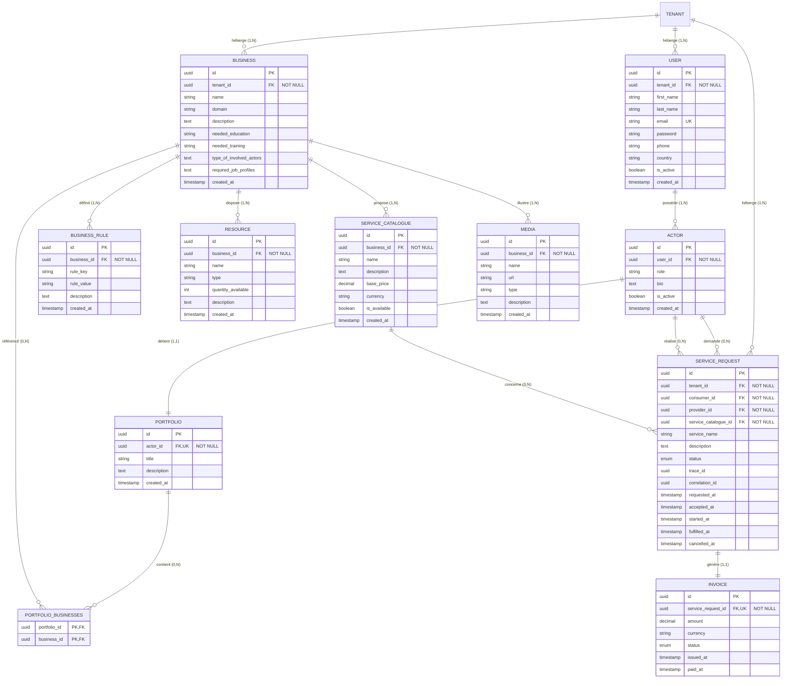

# MODÈLE CONCEPTUEL DE DONNÉES (MCD) - BIZCORE

## 1. INTRODUCTION

### 1.1 Définition du MCD

Le Modèle Conceptuel de Données (MCD) est une représentation formelle et structurée des données manipulées par le système BizCore. Il identifie les entités métier, leurs attributs, les associations entre ces entités ainsi que les cardinalités qui définissent les règles de correspondance entre les occurrences.

### 1.2 Conventions de notation Merise

| Élément | Notation |
|---------|----------|
| Entité | Rectangle |
| Association | Losange |
| Cardinalité | `N,M` — lue du côté de l'entité vers l'association |
| Clé primaire | [PK] |
| Clé étrangère | [FK] |

### 1.3 Décisions de modélisation

- **USER = PERSON + APP_USER** : fusion definitive (2026-04-07). Rationalise l'authentification et les données personnelles en une seule entité.
- **Multi-tenancy obligatoire** : imposé par le Project List 3GI. TENANT est une entité obligatoire.
- **SERVICE_REQUEST → BUSINESS** : pas d'association directe. SERVICE_REQUEST est liée à SERVICE_CATALOGUE (concerne), le BUSINESS est accessible via SERVICE_CATALOGUE → BUSINESS.
- **Héritage de tenant** : les entités non-directement hébergées par TENANT héritent du tenant via leurs parents (pas d'association directe avec TENANT).

---

## 2. DICTIONNAIRE DE DONNÉES

### 2.1 Entités validées (11)

#### TENANT — Locataire (multi-tenancy)

| Attribut | Type | Description | Contraintes |
|----------|------|-------------|-------------|
| id | UUID | Identifiant unique | PK, auto-généré |
| name | VARCHAR(255) | Nom du tenant | NOT NULL, UNIQUE |
| domain | VARCHAR(255) | Domaine métier | NOT NULL |
| description | TEXT | Description libre | NULL |
| is_active | BOOLEAN | Statut actif | DEFAULT TRUE |
| created_at | TIMESTAMP | Date de création | auto-généré |

#### USER — Utilisateur (fusion PERSON + APP_USER)

| Attribut | Type | Description | Contraintes |
|----------|------|-------------|-------------|
| id | UUID | Identifiant unique | PK, auto-généré |
| tenant_id | UUID | Référence vers le tenant | FK → TENANT, NOT NULL |
| first_name | VARCHAR(255) | Prénom | NOT NULL |
| last_name | VARCHAR(255) | Nom de famille | NOT NULL |
| email | VARCHAR(255) | Email unique | NOT NULL, UNIQUE |
| password | VARCHAR(255) | Mot de passe hashé | NOT NULL |
| phone | VARCHAR(255) | Téléphone | NULL |
| country | VARCHAR(255) | Pays | NULL |
| is_active | BOOLEAN | Statut actif | DEFAULT TRUE |
| created_at | TIMESTAMP | Date de création | auto-généré |

*USER_ROLES : table de jointure (user_id, role) — USER(1,N)→(1,N)roles*

#### ACTOR — Acteur métier

| Attribut | Type | Description | Contraintes |
|----------|------|-------------|-------------|
| id | UUID | Identifiant unique | PK, auto-généré |
| user_id | UUID | Référence vers l'utilisateur | FK → USER, NOT NULL |
| role | VARCHAR(255) | Rôle (provider, consumer) | NOT NULL |
| bio | TEXT | Biographie | NULL |
| is_active | BOOLEAN | Statut actif | DEFAULT TRUE |
| created_at | TIMESTAMP | Date de création | auto-généré |

#### PORTFOLIO — Portfolio professionnel

| Attribut | Type | Description | Contraintes |
|----------|------|-------------|-------------|
| id | UUID | Identifiant unique | PK, auto-généré |
| actor_id | UUID | Référence vers l'acteur | FK → ACTOR, NOT NULL, UNIQUE |
| title | VARCHAR(255) | Titre du portfolio | NOT NULL |
| description | TEXT | Description | NULL |
| created_at | TIMESTAMP | Date de création | auto-généré |

*Hérite du tenant via ACTOR → USER*

#### BUSINESS — Métier / Activité professionnelle

| Attribut | Type | Description | Contraintes |
|----------|------|-------------|-------------|
| id | UUID | Identifiant unique | PK, auto-généré |
| tenant_id | UUID | Référence vers le tenant | FK → TENANT, NOT NULL |
| name | VARCHAR(255) | Nom du métier | NOT NULL |
| domain | VARCHAR(255) | Domaine d'activité | NOT NULL |
| description | TEXT | Description détaillée | NULL |
| needed_education | VARCHAR(255) | Formation requise | NULL |
| needed_training | VARCHAR(255) | Certification requise | NULL |
| type_of_involved_actors | TEXT | Types d'acteurs impliqués | NULL |
| required_job_profiles | TEXT | Profils métier requis | NULL |
| created_at | TIMESTAMP | Date de création | auto-généré |

#### MEDIA — Média illustrant un métier

| Attribut | Type | Description | Contraintes |
|----------|------|-------------|-------------|
| id | UUID | Identifiant unique | PK, auto-généré |
| business_id | UUID | Référence vers le métier | FK → BUSINESS, NOT NULL |
| name | VARCHAR(255) | Nom du média | NOT NULL |
| url | VARCHAR(1024) | URL du média | NOT NULL |
| type | VARCHAR(255) | Type (IMAGE, VIDEO...) | NOT NULL |
| description | TEXT | Description | NULL |
| created_at | TIMESTAMP | Date de création | auto-généré |

*Hérite du tenant via BUSINESS*

#### BUSINESS_RULE — Règle métier

| Attribut | Type | Description | Contraintes |
|----------|------|-------------|-------------|
| id | UUID | Identifiant unique | PK, auto-généré |
| business_id | UUID | Référence vers le métier | FK → BUSINESS, NOT NULL |
| rule_key | VARCHAR(255) | Clé identifiant la règle | NOT NULL |
| rule_value | VARCHAR(255) | Valeur de la règle | NOT NULL |
| description | TEXT | Description | NULL |
| created_at | TIMESTAMP | Date de création | auto-généré |

*Hérite du tenant via BUSINESS*

#### RESOURCE — Ressource nécessaire à un métier

| Attribut | Type | Description | Contraintes |
|----------|------|-------------|-------------|
| id | UUID | Identifiant unique | PK, auto-généré |
| business_id | UUID | Référence vers le métier | FK → BUSINESS, NOT NULL |
| name | VARCHAR(255) | Nom de la ressource | NOT NULL |
| type | VARCHAR(255) | Type de ressource | NOT NULL |
| quantity_available | INTEGER | Quantité disponible | DEFAULT 0 |
| description | TEXT | Description | NULL |
| created_at | TIMESTAMP | Date de création | auto-généré |

*Hérite du tenant via BUSINESS*

#### SERVICE_CATALOGUE — Service proposé par un métier

| Attribut | Type | Description | Contraintes |
|----------|------|-------------|-------------|
| id | UUID | Identifiant unique | PK, auto-généré |
| business_id | UUID | Référence vers le métier | FK → BUSINESS, NOT NULL |
| name | VARCHAR(255) | Nom du service | NOT NULL |
| description | TEXT | Description | NULL |
| base_price | DECIMAL(15,2) | Prix de base | NULL |
| currency | VARCHAR(10) | Devise | DEFAULT 'XAF' |
| is_available | BOOLEAN | Disponibilité | DEFAULT TRUE |
| created_at | TIMESTAMP | Date de création | auto-généré |

*Hérite du tenant via BUSINESS*

#### SERVICE_REQUEST — Demande de service

| Attribut | Type | Description | Contraintes |
|----------|------|-------------|-------------|
| id | UUID | Identifiant unique | PK, auto-généré |
| tenant_id | UUID | Référence vers le tenant | FK → TENANT, NOT NULL |
| consumer_id | UUID | Référence vers l'acteur consommateur | FK → ACTOR, NOT NULL |
| provider_id | UUID | Référence vers l'acteur prestataire | FK → ACTOR, NOT NULL |
| service_catalogue_id | UUID | Référence vers le catalogue de services | FK → SERVICE_CATALOGUE, NOT NULL |
| service_name | VARCHAR(255) | Nom du service demandé | NOT NULL |
| description | TEXT | Description de la demande | NULL |
| status | ENUM | Statut de la demande | DEFAULT 'PENDING' |
| trace_id | UUID | ID de traçabilité réseau | NULL |
| correlation_id | UUID | ID de corrélation (SR → Invoice) | auto-généré |
| requested_at | TIMESTAMP | Date de la demande | auto-généré |
| accepted_at | TIMESTAMP | Date d'acceptation | NULL |
| started_at | TIMESTAMP | Date de début | NULL |
| fulfilled_at | TIMESTAMP | Date d'accomplissement | NULL |
| cancelled_at | TIMESTAMP | Date d'annulation | NULL |

*Hérite du tenant directement (association héberge)*

#### INVOICE — Facture

| Attribut | Type | Description | Contraintes |
|----------|------|-------------|-------------|
| id | UUID | Identifiant unique | PK, auto-généré |
| service_request_id | UUID | Référence vers la demande | FK → SERVICE_REQUEST, NOT NULL, UNIQUE |
| amount | DECIMAL(15,2) | Montant | NOT NULL |
| currency | VARCHAR(10) | Devise | DEFAULT 'XAF' |
| status | ENUM | Statut | DEFAULT 'PENDING' |
| issued_at | TIMESTAMP | Date d'émission | auto-généré |
| paid_at | TIMESTAMP | Date de paiement | NULL |

*Hérite du tenant via SERVICE_REQUEST*

### 2.2 Table de jointure

#### PORTFOLIO_BUSINESSES — N:M Portfolio ↔ Business

| Attribut | Type | Description |
|----------|------|-------------|
| portfolio_id | UUID | FK → PORTFOLIO, PK |
| business_id | UUID | FK → BUSINESS, PK |

---

## 3. DIAGRAMME MCD (MERISE)


```mermaid
erDiagram
    TENANT ||--o{ USER : "héberge (1,N)"
    TENANT ||--o{ BUSINESS : "héberge (1,N)"
    TENANT ||--o{ SERVICE_REQUEST : "héberge (1,N)"

    USER ||--o{ ACTOR : "possède (1,N)"
    USER {
        uuid id PK
        uuid tenant_id FK "NOT NULL"
        string first_name
        string last_name
        string email UK
        string password
        string phone
        string country
        boolean is_active
        timestamp created_at
    }

    ACTOR ||--|| PORTFOLIO : "détient (1,1)"
    ACTOR ||--o{ SERVICE_REQUEST : "demande (0,N)"
    ACTOR ||--o{ SERVICE_REQUEST : "réalise (0,N)"
    ACTOR {
        uuid id PK
        uuid user_id FK "NOT NULL"
        string role
        text bio
        boolean is_active
        timestamp created_at
    }

    PORTFOLIO ||--o{ PORTFOLIO_BUSINESSES : "contient (0,N)"
    PORTFOLIO {
        uuid id PK
        uuid actor_id FK,UK "NOT NULL"
        string title
        text description
        timestamp created_at
    }

    BUSINESS ||--o{ PORTFOLIO_BUSINESSES : "référencé (0,N)"
    BUSINESS ||--o{ BUSINESS_RULE : "définit (1,N)"
    BUSINESS ||--o{ RESOURCE : "dispose (1,N)"
    BUSINESS ||--o{ SERVICE_CATALOGUE : "propose (1,N)"
    BUSINESS ||--o{ MEDIA : "illustre (1,N)"
    BUSINESS {
        uuid id PK
        uuid tenant_id FK "NOT NULL"
        string name
        string domain
        text description
        string needed_education
        string needed_training
        text type_of_involved_actors
        text required_job_profiles
        timestamp created_at
    }

    PORTFOLIO_BUSINESSES {
        uuid portfolio_id PK,FK
        uuid business_id PK,FK
    }

    BUSINESS_RULE {
        uuid id PK
        uuid business_id FK "NOT NULL"
        string rule_key
        string rule_value
        text description
        timestamp created_at
    }

    RESOURCE {
        uuid id PK
        uuid business_id FK "NOT NULL"
        string name
        string type
        int quantity_available
        text description
        timestamp created_at
    }

    SERVICE_CATALOGUE ||--o{ SERVICE_REQUEST : "concerne (0,N)"
    SERVICE_CATALOGUE {
        uuid id PK
        uuid business_id FK "NOT NULL"
        string name
        text description
        decimal base_price
        string currency
        boolean is_available
        timestamp created_at
    }

    SERVICE_REQUEST ||--|| INVOICE : "génère (1,1)"
    SERVICE_REQUEST {
        uuid id PK
        uuid tenant_id FK "NOT NULL"
        uuid consumer_id FK "NOT NULL"
        uuid provider_id FK "NOT NULL"
        uuid service_catalogue_id FK "NOT NULL"
        string service_name
        text description
        enum status
        uuid trace_id
        uuid correlation_id
        timestamp requested_at
        timestamp accepted_at
        timestamp started_at
        timestamp fulfilled_at
        timestamp cancelled_at
    }

    MEDIA {
        uuid id PK
        uuid business_id FK "NOT NULL"
        string name
        string url
        string type
        text description
        timestamp created_at
    }

    INVOICE {
        uuid id PK
        uuid service_request_id FK,UK "NOT NULL"
        decimal amount
        string currency
        enum status
        timestamp issued_at
        timestamp paid_at
    }
```

---

## 4. CARDINALITÉS (LECTURE MERISE : côté entité → association)

| Entité Source | Relation | Entité Cible | Cardinalités | Description |
|---------------|----------|--------------|-------------|-------------|
| TENANT | héberge | USER | (1,N)—(1,1) | Un tenant héberge plusieurs utilisateurs |
| TENANT | héberge | BUSINESS | (1,N)—(1,1) | Un tenant héberge plusieurs métiers |
| TENANT | héberge | SERVICE_REQUEST | (1,N)—(1,1) | Un tenant héberge plusieurs demandes |
| USER | possède | ACTOR | (1,N)—(1,1) | Un utilisateur peut avoir plusieurs rôles |
| ACTOR | détient | PORTFOLIO | (1,1)—(1,1) | Un acteur a exactement un portfolio |
| PORTFOLIO | contient | BUSINESS | (0,N)—(0,N) | Un portfolio référence plusieurs métiers |
| BUSINESS | définit | BUSINESS_RULE | (1,N)—(1,1) | Un métier a plusieurs règles |
| BUSINESS | dispose | RESOURCE | (1,N)—(1,1) | Un métier dispose de plusieurs ressources |
| BUSINESS | propose | SERVICE_CATALOGUE | (1,N)—(1,1) | Un métier propose plusieurs services |
| BUSINESS | illustre | MEDIA | (1,N)—(1,1) | Un métier est illustré par plusieurs médias |
| ACTOR | demande | SERVICE_REQUEST | (0,N)—(1,1) | Un acteur peut demander plusieurs services |
| ACTOR | réalise | SERVICE_REQUEST | (0,N)—(1,1) | Un acteur peut réaliser plusieurs services |
| SERVICE_CATALOGUE | concerne | SERVICE_REQUEST | (0,N)—(1,1) | Un catalogue concerne plusieurs demandes |
| SERVICE_REQUEST | génère | INVOICE | (1,1)—(1,1) | Une demande génère exactement une facture |

---

## 5. RÈGLES DE GESTION

### RG1 — Unicité des emails
L'email d'un USER doit être unique dans le système.

### RG2 — Portfolio unique par acteur
Chaque ACTOR possède exactement un PORTFOLIO créé automatiquement.

### RG3 — Auto-référence interdit
consumer_id ≠ provider_id (un acteur ne peut pas demander un service à lui-même).

### RG4 — Traçabilité réseau
SERVICE_REQUEST a un champ traceId (UUID) pour la traçabilité réseau. Analogie : traceId = trace réseau, SERVICE_REQUEST = paquet métier, INVOICE = ACK.

### RG5 — Statuts de cycle de vie

**SERVICE_REQUEST :**
```
PENDING → ACCEPTED → IN_PROGRESS → FULFILLED
    ↓         ↓           ↓
 CANCELLED  CANCELLED   CANCELLED
```

**INVOICE :**
```
PENDING → PAID
    ↓
CANCELLED
```

### RG6 — Multi-tenancy (exigence Project List 3GI)
Analogie réseau : TENANT=VLAN, SERVICE_REQUEST=paquet métier, traceId=trace réseau, INVOICE=ACK.
Pile 5 couches : Infrastructure, Transport, Tenant&Routing, Context&Policy, Business capabilities.

---

*Document généré le 7 avril 2026*  
*Version : 2.0 — MCD v3GI fusion USER + refactoring MCD*  
*Statut : Décision définitive — USER fusion de PERSON + APP_USER*
