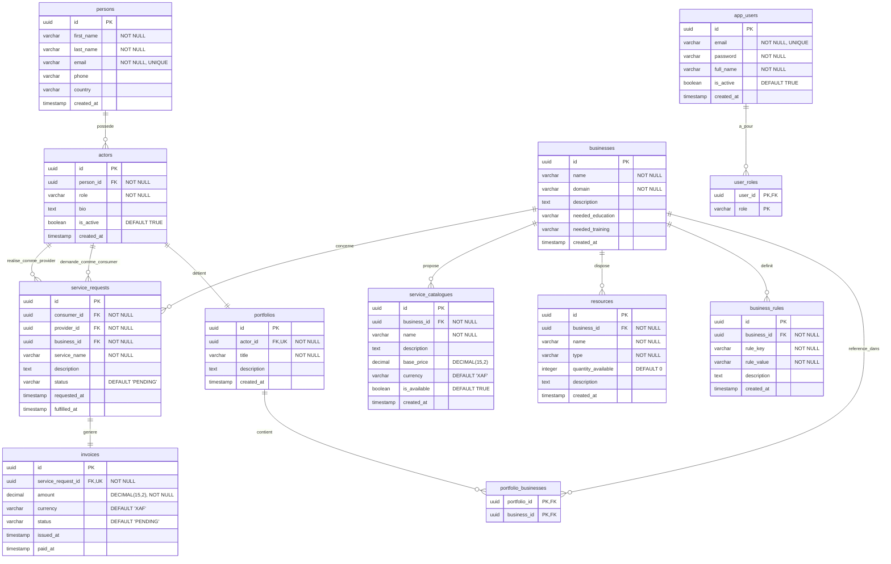

# MODÈLE LOGIQUE DE DONNÉES (MLD) - BIZCORE

## 1. INTRODUCTION

### 1.1 Du MCD au MLD

Le Modèle Logique de Données (MLD) est la transformation du Modèle Conceptuel de Données (MCD) en une représentation adaptée à la technologie de base de données relationnelle. Cette transformation suit des règles strictes qui garantissent la cohérence et l'intégrité des données.

**Objectifs du MLD :**
- Définir la structure exacte des tables PostgreSQL
- Spécifier les types de données et contraintes
- Documenter les relations et clés étrangères
- Optimiser les performances via les index
- Servir de référence pour le mapping JPA/Hibernate

### 1.2 Règles de transformation

| Règle MCD | Transformation MLD | Exemple |
|-----------|-------------------|---------|
| **Entité** | Devient une table | `PERSON` → `persons` |
| **Attribut** | Devient une colonne | `first_name` → `first_name VARCHAR(255)` |
| **Relation 1:N** | Clé étrangère côté "plusieurs" | `ACTORS.person_id` → FK vers `persons` |
| **Relation N:M** | Table d'association | `portfolio_businesses` avec PK composite |
| **Relation 1:1** | FK avec contrainte UNIQUE | `portfolios.actor_id` UNIQUE |
| **Identifiant** | Clé primaire UUID | `id UUID PRIMARY KEY` |

**Convention de nommage :**
- Tables : snake_case, pluriels (ex: `service_requests`)
- Colonnes : snake_case (ex: `created_at`)
- Contraintes : préfixe indiquant le type (ex: `fk_`, `pk_`, `idx_`)
- Index : `idx_{table}_{colonne(s)}`

---

## 2. DIAGRAMME MLD



---

## 3. SCHEMA DES TABLES

### 3.1 Table PERSONS

| Colonne | Type | Contraintes | Description |
|---------|------|-------------|-------------|
| id | UUID | PRIMARY KEY | Identifiant unique de la personne |
| first_name | VARCHAR(255) | NOT NULL | Prénom de la personne |
| last_name | VARCHAR(255) | NOT NULL | Nom de famille |
| email | VARCHAR(255) | NOT NULL, UNIQUE | Adresse email unique |
| phone | VARCHAR(255) | NULL | Numéro de téléphone |
| country | VARCHAR(255) | NULL | Pays de résidence |
| created_at | TIMESTAMP | NULL | Date de création du compte |

### 3.2 Table ACTORS

| Colonne | Type | Contraintes | Description |
|---------|------|-------------|-------------|
| id | UUID | PRIMARY KEY | Identifiant unique de l'acteur |
| person_id | UUID | NOT NULL, FK | Référence vers persons(id) |
| role | VARCHAR(255) | NOT NULL | Rôle de l'acteur (provider, consumer, etc.) |
| bio | TEXT | NULL | Biographie/description |
| is_active | BOOLEAN | DEFAULT TRUE | Statut actif/inactif |
| created_at | TIMESTAMP | NULL | Date de création |

### 3.3 Table BUSINESSES

| Colonne | Type | Contraintes | Description |
|---------|------|-------------|-------------|
| id | UUID | PRIMARY KEY | Identifiant unique du métier |
| name | VARCHAR(255) | NOT NULL | Nom du métier |
| domain | VARCHAR(255) | NOT NULL | Domaine d'activité |
| description | TEXT | NULL | Description détaillée |
| needed_education | VARCHAR(255) | NULL | Formation requise |
| needed_training | VARCHAR(255) | NULL | Certification requise |
| created_at | TIMESTAMP | NULL | Date de création |

### 3.4 Table PORTFOLIOS

| Colonne | Type | Contraintes | Description |
|---------|------|-------------|-------------|
| id | UUID | PRIMARY KEY | Identifiant unique du portfolio |
| actor_id | UUID | NOT NULL, UNIQUE, FK | Référence vers actors(id) |
| title | VARCHAR(255) | NOT NULL | Titre du portfolio |
| description | TEXT | NULL | Description du portfolio |
| created_at | TIMESTAMP | NULL | Date de création |

### 3.5 Table PORTFOLIO_BUSINESSES

Table de jointure N:M entre portfolios et businesses.

| Colonne | Type | Contraintes | Description |
|---------|------|-------------|-------------|
| portfolio_id | UUID | PRIMARY KEY, FK | Référence vers portfolios(id) |
| business_id | UUID | PRIMARY KEY, FK | Référence vers businesses(id) |

### 3.6 Table BUSINESS_RULES

| Colonne | Type | Contraintes | Description |
|---------|------|-------------|-------------|
| id | UUID | PRIMARY KEY | Identifiant unique de la règle |
| business_id | UUID | NOT NULL, FK | Référence vers businesses(id) |
| rule_key | VARCHAR(255) | NOT NULL | Clé identifiant la règle |
| rule_value | VARCHAR(255) | NOT NULL | Valeur de la règle |
| description | TEXT | NULL | Description de la règle |
| created_at | TIMESTAMP | NULL | Date de création |

### 3.7 Table RESOURCES

| Colonne | Type | Contraintes | Description |
|---------|------|-------------|-------------|
| id | UUID | PRIMARY KEY | Identifiant unique de la ressource |
| business_id | UUID | NOT NULL, FK | Référence vers businesses(id) |
| name | VARCHAR(255) | NOT NULL | Nom de la ressource |
| type | VARCHAR(255) | NOT NULL | Type de ressource |
| quantity_available | INTEGER | DEFAULT 0 | Quantité disponible |
| description | TEXT | NULL | Description de la ressource |
| created_at | TIMESTAMP | NULL | Date de création |

### 3.8 Table SERVICE_CATALOGUES

| Colonne | Type | Contraintes | Description |
|---------|------|-------------|-------------|
| id | UUID | PRIMARY KEY | Identifiant unique du service |
| business_id | UUID | NOT NULL, FK | Référence vers businesses(id) |
| name | VARCHAR(255) | NOT NULL | Nom du service |
| description | TEXT | NULL | Description du service |
| base_price | DECIMAL(15,2) | NULL | Prix de base |
| currency | VARCHAR(3) | DEFAULT 'XAF' | Devise |
| is_available | BOOLEAN | DEFAULT TRUE | Disponibilité du service |
| created_at | TIMESTAMP | NULL | Date de création |

### 3.9 Table SERVICE_REQUESTS

| Colonne | Type | Contraintes | Description |
|---------|------|-------------|-------------|
| id | UUID | PRIMARY KEY | Identifiant unique de la demande |
| consumer_id | UUID | NOT NULL, FK | Référence vers actors(id) - consommateur |
| provider_id | UUID | NOT NULL, FK | Référence vers actors(id) - prestataire |
| business_id | UUID | NOT NULL, FK | Référence vers businesses(id) |
| service_name | VARCHAR(255) | NOT NULL | Nom du service demandé |
| description | TEXT | NULL | Description de la demande |
| status | VARCHAR(50) | DEFAULT 'PENDING' | Statut (PENDING, ACCEPTED, IN_PROGRESS, FULFILLED, CANCELLED) |
| requested_at | TIMESTAMP | NULL | Date de la demande |
| fulfilled_at | TIMESTAMP | NULL | Date d'accomplissement |

### 3.10 Table INVOICES

| Colonne | Type | Contraintes | Description |
|---------|------|-------------|-------------|
| id | UUID | PRIMARY KEY | Identifiant unique de la facture |
| service_request_id | UUID | NOT NULL, UNIQUE, FK | Référence vers service_requests(id) |
| amount | DECIMAL(15,2) | NOT NULL | Montant de la facture |
| currency | VARCHAR(3) | DEFAULT 'XAF' | Devise |
| status | VARCHAR(50) | DEFAULT 'PENDING' | Statut (PENDING, PAID, CANCELLED) |
| issued_at | TIMESTAMP | NULL | Date d'émission |
| paid_at | TIMESTAMP | NULL | Date de paiement |

### 3.11 Table APP_USERS

| Colonne | Type | Contraintes | Description |
|---------|------|-------------|-------------|
| id | UUID | PRIMARY KEY | Identifiant unique de l'utilisateur |
| email | VARCHAR(255) | NOT NULL, UNIQUE | Email de connexion |
| password | VARCHAR(255) | NOT NULL | Mot de passe hashé |
| full_name | VARCHAR(255) | NOT NULL | Nom complet |
| is_active | BOOLEAN | DEFAULT TRUE | Compte actif/inactif |
| created_at | TIMESTAMP | NULL | Date de création |

### 3.12 Table USER_ROLES

Table de jointure pour les rôles multiples (relation N:M implémentée via @ElementCollection JPA).

| Colonne | Type | Contraintes | Description |
|---------|------|-------------|-------------|
| user_id | UUID | PRIMARY KEY, FK | Référence vers app_users(id) |
| role | VARCHAR(50) | PRIMARY KEY | Rôle (USER, ADMIN, PROVIDER, CONSUMER) |

---

## 4. SCRIPT SQL COMPLET

```sql
-- =====================================================
-- BIZCORE - SCRIPT DE CREATION DES TABLES
-- Base de données PostgreSQL
-- =====================================================

-- -----------------------------------------------------
-- 1. Table PERSONS
-- -----------------------------------------------------
CREATE TABLE persons (
    id UUID PRIMARY KEY,
    first_name VARCHAR(255) NOT NULL,
    last_name VARCHAR(255) NOT NULL,
    email VARCHAR(255) NOT NULL,
    phone VARCHAR(255),
    country VARCHAR(255),
    created_at TIMESTAMP
);

-- Contrainte UNIQUE sur email
ALTER TABLE persons ADD CONSTRAINT uk_persons_email UNIQUE (email);

-- -----------------------------------------------------
-- 2. Table BUSINESSES
-- -----------------------------------------------------
CREATE TABLE businesses (
    id UUID PRIMARY KEY,
    name VARCHAR(255) NOT NULL,
    domain VARCHAR(255) NOT NULL,
    description TEXT,
    needed_education VARCHAR(255),
    needed_training VARCHAR(255),
    created_at TIMESTAMP
);

-- -----------------------------------------------------
-- 3. Table ACTORS
-- -----------------------------------------------------
CREATE TABLE actors (
    id UUID PRIMARY KEY,
    person_id UUID NOT NULL,
    role VARCHAR(255) NOT NULL,
    bio TEXT,
    is_active BOOLEAN DEFAULT TRUE,
    created_at TIMESTAMP
);

-- Clé étrangère vers persons
ALTER TABLE actors 
ADD CONSTRAINT fk_actors_person 
FOREIGN KEY (person_id) REFERENCES persons(id);

-- -----------------------------------------------------
-- 4. Table PORTFOLIOS
-- -----------------------------------------------------
CREATE TABLE portfolios (
    id UUID PRIMARY KEY,
    actor_id UUID NOT NULL,
    title VARCHAR(255) NOT NULL,
    description TEXT,
    created_at TIMESTAMP
);

-- Contrainte UNIQUE sur actor_id (relation 1:1)
ALTER TABLE portfolios ADD CONSTRAINT uk_portfolios_actor UNIQUE (actor_id);

-- Clé étrangère vers actors
ALTER TABLE portfolios 
ADD CONSTRAINT fk_portfolios_actor 
FOREIGN KEY (actor_id) REFERENCES actors(id);

-- -----------------------------------------------------
-- 5. Table PORTFOLIO_BUSINESSES (N:M)
-- -----------------------------------------------------
CREATE TABLE portfolio_businesses (
    portfolio_id UUID NOT NULL,
    business_id UUID NOT NULL,
    PRIMARY KEY (portfolio_id, business_id)
);

-- Clés étrangères
ALTER TABLE portfolio_businesses 
ADD CONSTRAINT fk_portfolio_businesses_portfolio 
FOREIGN KEY (portfolio_id) REFERENCES portfolios(id) ON DELETE CASCADE;

ALTER TABLE portfolio_businesses 
ADD CONSTRAINT fk_portfolio_businesses_business 
FOREIGN KEY (business_id) REFERENCES businesses(id) ON DELETE CASCADE;

-- -----------------------------------------------------
-- 6. Table BUSINESS_RULES
-- -----------------------------------------------------
CREATE TABLE business_rules (
    id UUID PRIMARY KEY,
    business_id UUID NOT NULL,
    rule_key VARCHAR(255) NOT NULL,
    rule_value VARCHAR(255) NOT NULL,
    description TEXT,
    created_at TIMESTAMP
);

-- Clé étrangère vers businesses
ALTER TABLE business_rules 
ADD CONSTRAINT fk_business_rules_business 
FOREIGN KEY (business_id) REFERENCES businesses(id) ON DELETE CASCADE;

-- -----------------------------------------------------
-- 7. Table RESOURCES
-- -----------------------------------------------------
CREATE TABLE resources (
    id UUID PRIMARY KEY,
    business_id UUID NOT NULL,
    name VARCHAR(255) NOT NULL,
    type VARCHAR(255) NOT NULL,
    quantity_available INTEGER DEFAULT 0,
    description TEXT,
    created_at TIMESTAMP
);

-- Clé étrangère vers businesses
ALTER TABLE resources 
ADD CONSTRAINT fk_resources_business 
FOREIGN KEY (business_id) REFERENCES businesses(id) ON DELETE CASCADE;

-- Contrainte CHECK sur quantity_available
ALTER TABLE resources 
ADD CONSTRAINT chk_resources_quantity CHECK (quantity_available >= 0);

-- -----------------------------------------------------
-- 8. Table SERVICE_CATALOGUES
-- -----------------------------------------------------
CREATE TABLE service_catalogues (
    id UUID PRIMARY KEY,
    business_id UUID NOT NULL,
    name VARCHAR(255) NOT NULL,
    description TEXT,
    base_price DECIMAL(15,2),
    currency VARCHAR(3) DEFAULT 'XAF',
    is_available BOOLEAN DEFAULT TRUE,
    created_at TIMESTAMP
);

-- Clé étrangère vers businesses
ALTER TABLE service_catalogues 
ADD CONSTRAINT fk_service_catalogues_business 
FOREIGN KEY (business_id) REFERENCES businesses(id) ON DELETE CASCADE;

-- -----------------------------------------------------
-- 9. Table SERVICE_REQUESTS
-- -----------------------------------------------------
CREATE TABLE service_requests (
    id UUID PRIMARY KEY,
    consumer_id UUID NOT NULL,
    provider_id UUID NOT NULL,
    business_id UUID NOT NULL,
    service_name VARCHAR(255) NOT NULL,
    description TEXT,
    status VARCHAR(50) DEFAULT 'PENDING',
    requested_at TIMESTAMP,
    fulfilled_at TIMESTAMP
);

-- Clés étrangères
ALTER TABLE service_requests 
ADD CONSTRAINT fk_service_requests_consumer 
FOREIGN KEY (consumer_id) REFERENCES actors(id);

ALTER TABLE service_requests 
ADD CONSTRAINT fk_service_requests_provider 
FOREIGN KEY (provider_id) REFERENCES actors(id);

ALTER TABLE service_requests 
ADD CONSTRAINT fk_service_requests_business 
FOREIGN KEY (business_id) REFERENCES businesses(id);

-- Contrainte CHECK sur status
ALTER TABLE service_requests 
ADD CONSTRAINT chk_service_requests_status 
CHECK (status IN ('PENDING', 'ACCEPTED', 'IN_PROGRESS', 'FULFILLED', 'CANCELLED'));

-- -----------------------------------------------------
-- 10. Table INVOICES
-- -----------------------------------------------------
CREATE TABLE invoices (
    id UUID PRIMARY KEY,
    service_request_id UUID NOT NULL,
    amount DECIMAL(15,2) NOT NULL,
    currency VARCHAR(3) DEFAULT 'XAF',
    status VARCHAR(50) DEFAULT 'PENDING',
    issued_at TIMESTAMP,
    paid_at TIMESTAMP
);

-- Contrainte UNIQUE sur service_request_id (relation 1:1)
ALTER TABLE invoices ADD CONSTRAINT uk_invoices_service_request UNIQUE (service_request_id);

-- Clé étrangère vers service_requests
ALTER TABLE invoices 
ADD CONSTRAINT fk_invoices_service_request 
FOREIGN KEY (service_request_id) REFERENCES service_requests(id);

-- Contrainte CHECK sur status
ALTER TABLE invoices 
ADD CONSTRAINT chk_invoices_status 
CHECK (status IN ('PENDING', 'PAID', 'CANCELLED'));

-- Contrainte CHECK sur amount (positif)
ALTER TABLE invoices 
ADD CONSTRAINT chk_invoices_amount CHECK (amount > 0);

-- -----------------------------------------------------
-- 11. Table APP_USERS
-- -----------------------------------------------------
CREATE TABLE app_users (
    id UUID PRIMARY KEY,
    email VARCHAR(255) NOT NULL,
    password VARCHAR(255) NOT NULL,
    full_name VARCHAR(255) NOT NULL,
    is_active BOOLEAN DEFAULT TRUE,
    created_at TIMESTAMP
);

-- Contrainte UNIQUE sur email
ALTER TABLE app_users ADD CONSTRAINT uk_app_users_email UNIQUE (email);

-- -----------------------------------------------------
-- 12. Table USER_ROLES
-- -----------------------------------------------------
CREATE TABLE user_roles (
    user_id UUID NOT NULL,
    role VARCHAR(50) NOT NULL,
    PRIMARY KEY (user_id, role)
);

-- Clé étrangère vers app_users
ALTER TABLE user_roles 
ADD CONSTRAINT fk_user_roles_user 
FOREIGN KEY (user_id) REFERENCES app_users(id) ON DELETE CASCADE;
```

---

## 5. INDEX ET OPTIMISATIONS

### 5.1 Index primaires

Tous les index primaires sont automatiquement créés par la déclaration `PRIMARY KEY` sur les colonnes id.

| Table | Colonne | Type |
|-------|---------|------|
| persons | id | PRIMARY KEY |
| actors | id | PRIMARY KEY |
| businesses | id | PRIMARY KEY |
| portfolios | id | PRIMARY KEY |
| portfolio_businesses | portfolio_id, business_id | PRIMARY KEY (composite) |
| business_rules | id | PRIMARY KEY |
| resources | id | PRIMARY KEY |
| service_catalogues | id | PRIMARY KEY |
| service_requests | id | PRIMARY KEY |
| invoices | id | PRIMARY KEY |
| app_users | id | PRIMARY KEY |
| user_roles | user_id, role | PRIMARY KEY (composite) |

### 5.2 Index secondaires (UNIQUE)

```sql
-- Index UNIQUE sur persons.email
CREATE UNIQUE INDEX idx_persons_email ON persons(email);

-- Index UNIQUE sur portfolios.actor_id (relation 1:1)
CREATE UNIQUE INDEX idx_portfolios_actor ON portfolios(actor_id);

-- Index UNIQUE sur invoices.service_request_id (relation 1:1)
CREATE UNIQUE INDEX idx_invoices_service_request ON invoices(service_request_id);

-- Index UNIQUE sur app_users.email
CREATE UNIQUE INDEX idx_app_users_email ON app_users(email);
```

### 5.3 Index pour les recherches fréquentes

```sql
-- Index sur actors.person_id (recherche d'acteurs par personne)
CREATE INDEX idx_actors_person_id ON actors(person_id);

-- Index sur actors.role (filtrage par rôle)
CREATE INDEX idx_actors_role ON actors(role);

-- Index sur actors.is_active (filtrage des actifs)
CREATE INDEX idx_actors_is_active ON actors(is_active);

-- Index sur business_rules.business_id (recherche de règles par métier)
CREATE INDEX idx_business_rules_business_id ON business_rules(business_id);

-- Index sur resources.business_id (recherche de ressources par métier)
CREATE INDEX idx_resources_business_id ON resources(business_id);

-- Index sur service_catalogues.business_id (recherche de services par métier)
CREATE INDEX idx_service_catalogues_business_id ON service_catalogues(business_id);

-- Index sur service_catalogues.is_available (filtrage des services disponibles)
CREATE INDEX idx_service_catalogues_is_available ON service_catalogues(is_available);

-- Index composite sur service_requests (recherche par consommateur/prestataire)
CREATE INDEX idx_service_requests_consumer_id ON service_requests(consumer_id);
CREATE INDEX idx_service_requests_provider_id ON service_requests(provider_id);
CREATE INDEX idx_service_requests_consumer_provider ON service_requests(consumer_id, provider_id);

-- Index sur service_requests.status (filtrage par statut)
CREATE INDEX idx_service_requests_status ON service_requests(status);

-- Index composite sur service_requests (statut + dates)
CREATE INDEX idx_service_requests_status_requested ON service_requests(status, requested_at);

-- Index sur service_requests.business_id (recherche par métier)
CREATE INDEX idx_service_requests_business_id ON service_requests(business_id);

-- Index sur invoices.status (filtrage des factures par statut)
CREATE INDEX idx_invoices_status ON invoices(status);

-- Index sur invoices.issued_at (tri par date d'émission)
CREATE INDEX idx_invoices_issued_at ON invoices(issued_at DESC);

-- Index sur portfolio_businesses.business_id (recherche de portfolios par métier)
CREATE INDEX idx_portfolio_businesses_business_id ON portfolio_businesses(business_id);

-- Index sur app_users.is_active (filtrage des comptes actifs)
CREATE INDEX idx_app_users_is_active ON app_users(is_active);

-- Index sur user_roles.role (recherche par rôle)
CREATE INDEX idx_user_roles_role ON user_roles(role);
```

### 5.4 Index pour les jointures fréquentes

```sql
-- Optimisation des jointures Person → Actor
CREATE INDEX idx_actors_person_id_lookup ON actors(person_id, id, role, is_active);

-- Optimisation des jointures Actor → Portfolio
CREATE INDEX idx_portfolios_actor_id_lookup ON portfolios(actor_id, id, title);

-- Optimisation des jointures Business → ServiceCatalogue
CREATE INDEX idx_service_catalogues_business_lookup ON service_catalogues(business_id, is_available, name);

-- Optimisation des jointures ServiceRequest → Invoice
CREATE INDEX idx_invoices_service_request_lookup ON invoices(service_request_id, status, amount);
```

---

## 6. NOTES DE MAPPING JPA

### 6.1 Correspondance Entité ↔ Table

| Entité Java | Table SQL | Fichier |
|-------------|-----------|---------|
| [`Person`](src/main/java/com/bizcore/bizcore_backend/domain/Person.java) | persons | Person.java |
| [`Actor`](src/main/java/com/bizcore/bizcore_backend/domain/Actor.java) | actors | Actor.java |
| [`Business`](src/main/java/com/bizcore/bizcore_backend/domain/Business.java) | businesses | Business.java |
| [`Portfolio`](src/main/java/com/bizcore/bizcore_backend/domain/Portfolio.java) | portfolios | Portfolio.java |
| [`BusinessRule`](src/main/java/com/bizcore/bizcore_backend/domain/BusinessRule.java) | business_rules | BusinessRule.java |
| [`Resource`](src/main/java/com/bizcore/bizcore_backend/domain/Resource.java) | resources | Resource.java |
| [`ServiceCatalogue`](src/main/java/com/bizcore/bizcore_backend/domain/ServiceCatalogue.java) | service_catalogues | ServiceCatalogue.java |
| [`ServiceRequest`](src/main/java/com/bizcore/bizcore_backend/domain/ServiceRequest.java) | service_requests | ServiceRequest.java |
| [`Invoice`](src/main/java/com/bizcore/bizcore_backend/domain/Invoice.java) | invoices | Invoice.java |
| [`AppUser`](src/main/java/com/bizcore/bizcore_backend/domain/AppUser.java) | app_users | AppUser.java |

### 6.2 Stratégies de génération d'ID

Toutes les entités utilisent la stratégie **UUID** pour la génération des identifiants :

```java
@Id
@GeneratedValue(strategy = GenerationType.UUID)
private UUID id;
```

**Avantages de cette stratégie :**
- Identifiants universellement uniques (pas de collision entre instances)
- Sécurité : impossible de deviner le prochain ID
- Pas besoin de séquence ou d'auto-incrément côté base de données
- Facilite la réplication et la distribution des données

### 6.3 Mapping des relations

#### Relation 1:N (Person → Actor)

```java
// Côté ACTOR (possède la clé étrangère)
@ManyToOne(fetch = FetchType.EAGER)
@JoinColumn(name = "person_id", nullable = false)
private Person person;
```

#### Relation 1:1 (Actor → Portfolio)

```java
// Côté PORTFOLIO (possède la clé étrangère avec UNIQUE)
@OneToOne(fetch = FetchType.EAGER)
@JoinColumn(name = "actor_id", nullable = false, unique = true)
private Actor actor;
```

#### Relation N:M (Portfolio ↔ Business)

```java
// Côté PORTFOLIO (propriétaire de la relation)
@ManyToMany(fetch = FetchType.EAGER)
@JoinTable(
    name = "portfolio_businesses",
    joinColumns = @JoinColumn(name = "portfolio_id"),
    inverseJoinColumns = @JoinColumn(name = "business_id")
)
private Set<Business> businesses = new HashSet<>();
```

#### Relation 1:N avec référence multiple (ServiceRequest)

```java
// ServiceRequest référence deux fois Actor (consumer et provider)
@ManyToOne(fetch = FetchType.EAGER)
@JoinColumn(name = "consumer_id", nullable = false)
private Actor consumer;

@ManyToOne(fetch = FetchType.EAGER)
@JoinColumn(name = "provider_id", nullable = false)
private Actor provider;
```

#### Relation 1:1 (ServiceRequest → Invoice)

```java
// Côté INVOICE (possède la clé étrangère avec UNIQUE)
@OneToOne(fetch = FetchType.EAGER)
@JoinColumn(name = "service_request_id", nullable = false, unique = true)
private ServiceRequest serviceRequest;
```

#### Collection d'éléments (AppUser → Roles)

```java
// Table de jointure implicite pour les énumérations
@ElementCollection(fetch = FetchType.EAGER)
@CollectionTable(name = "user_roles", joinColumns = @JoinColumn(name = "user_id"))
@Enumerated(EnumType.STRING)
@Column(name = "role")
private Set<Role> roles = new HashSet<>();
```

### 6.4 Mapping des types Java ↔ PostgreSQL

| Java | JPA Annotation | PostgreSQL |
|------|----------------|------------|
| `UUID` | `@Id @GeneratedValue(strategy = GenerationType.UUID)` | `UUID` |
| `String` | `@Column(name = "first_name")` | `VARCHAR(255)` |
| `String` (long) | `@Column(columnDefinition = "TEXT")` | `TEXT` |
| `BigDecimal` | `@Column(precision = 15, scale = 2)` | `DECIMAL(15,2)` |
| `Integer` | `@Column(name = "quantity_available")` | `INTEGER` |
| `Boolean` | `@Column(name = "is_active")` | `BOOLEAN` |
| `LocalDateTime` | `@Column(name = "created_at", updatable = false)` | `TIMESTAMP` |
| `Enum` | `@Enumerated(EnumType.STRING)` | `VARCHAR` |

### 6.5 Auditing automatique

Toutes les entités utilisent l'annotation `@PrePersist` pour l'initialisation automatique des dates :

```java
@PrePersist
protected void onCreate() {
    this.createdAt = LocalDateTime.now();
}
```

**Note :** Pour une solution d'auditing plus complète, envisager l'utilisation de `@CreatedDate` avec `@EntityListeners(AuditingEntityListener.class)` et `@EnableJpaAuditing`.

---

## 7. CONTRAINTES D'INTEGRITE REFERENTIELLE

### 7.1 Suppression en cascade

| Table parent | Table enfant | Comportement | Justification |
|--------------|--------------|--------------|---------------|
| businesses | business_rules | `ON DELETE CASCADE` | Les règles n'ont pas de sens sans le métier |
| businesses | resources | `ON DELETE CASCADE` | Les ressources sont spécifiques au métier |
| businesses | service_catalogues | `ON DELETE CASCADE` | Les services sont liés au métier |
| portfolios | portfolio_businesses | `ON DELETE CASCADE` | Suppression des associations si portfolio supprimé |
| businesses | portfolio_businesses | `ON DELETE CASCADE` | Suppression des associations si métier supprimé |
| app_users | user_roles | `ON DELETE CASCADE` | Suppression des rôles si utilisateur supprimé |

### 7.2 Restrictions de suppression

| Table parent | Table enfant | Comportement | Justification |
|--------------|--------------|--------------|---------------|
| persons | actors | RESTRICT | Impossible de supprimer une personne ayant des acteurs |
| actors | portfolios | RESTRICT | Impossible de supprimer un acteur ayant un portfolio |
| actors | service_requests | RESTRICT | Impossible de supprimer un acteur ayant des demandes |
| businesses | service_requests | RESTRICT | Impossible de supprimer un métier ayant des demandes |
| service_requests | invoices | RESTRICT | Impossible de supprimer une demande ayant une facture |

---

## 8. RECOMMANDATIONS DE PERFORMANCE

### 8.1 Partitionnement

Pour les tables à fort volume, envisager le partitionnement :

```sql
-- Partitionnement par année pour service_requests
CREATE TABLE service_requests_partitioned (
    LIKE service_requests INCLUDING ALL
) PARTITION BY RANGE (requested_at);

CREATE TABLE service_requests_2026 PARTITION OF service_requests_partitioned
    FOR VALUES FROM ('2026-01-01') TO ('2027-01-01');
```

### 8.2 Archivage

Mettre en place une stratégie d'archivage pour :
- `service_requests` : status = 'FULFILLED' et fulfilled_at > 2 ans
- `invoices` : status = 'PAID' et paid_at > 5 ans

### 8.3 Maintenance

```sql
-- Recommandation : exécuter périodiquement
VACUUM ANALYZE persons;
VACUUM ANALYZE actors;
VACUUM ANALYZE businesses;
VACUUM ANALYZE service_requests;
VACUUM ANALYZE invoices;
```

---

**Document version** : 1.0  
**Date de création** : Mars 2026  
**Auteur** : BizCore Team  
**Base de données** : PostgreSQL 15+  
**Framework ORM** : JPA/Hibernate 6+
