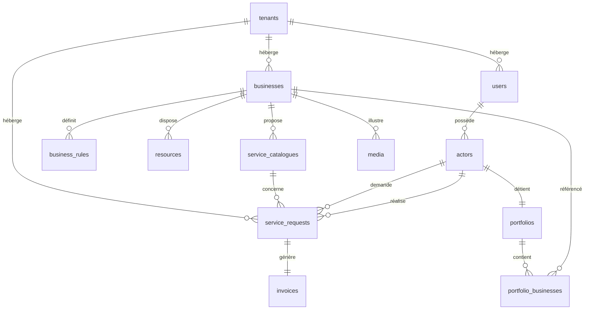

# MODÈLE LOGIQUE DE DONNÉES (MLD) - BIZCORE

## 1. SCHEMA DES TABLES (11 tables validées)

```mermaid
erDiagram
    tenants ||--o{ users : "héberge"
    tenants ||--o{ businesses : "héberge"
    tenants ||--o{ service_requests : "héberge"
    users ||--o{ actors : "possède"
    actors ||--|| portfolios : "détient"
    portfolios ||--o{ portfolio_businesses : "contient"
    businesses ||--o{ portfolio_businesses : "référencé"
    businesses ||--o{ business_rules : "définit"
    businesses ||--o{ resources : "dispose"
    businesses ||--o{ service_catalogues : "propose"
    businesses ||--o{ media : "illustre"
    service_catalogues ||--o{ service_requests : "concerne"
    actors ||--o{ service_requests : "demande"
    actors ||--o{ service_requests : "réalise"
    service_requests ||--|| invoices : "génère"
```

---

## 2. DÉTAIL DES TABLES

### 2.1 Table TENANTS

| Colonne | Type | Contraintes | Description |
|---------|------|-------------|-------------|
| id | UUID | PK | Identifiant unique |
| name | VARCHAR(255) | NOT NULL, UNIQUE | Nom du tenant |
| domain | VARCHAR(255) | NOT NULL | Domaine métier |
| description | TEXT | NULL | Description libre |
| is_active | BOOLEAN | DEFAULT TRUE | Statut actif |
| created_at | TIMESTAMP | NULL | Date de création |

### 2.2 Table USERS (fusion PERSON + APP_USER)

| Colonne | Type | Contraintes | Description |
|---------|------|-------------|-------------|
| id | UUID | PK | Identifiant unique |
| tenant_id | UUID | NOT NULL, FK → tenants(id) | Tenant hébergeur |
| first_name | VARCHAR(255) | NOT NULL | Prénom |
| last_name | VARCHAR(255) | NOT NULL | Nom de famille |
| email | VARCHAR(255) | NOT NULL, UNIQUE | Email unique |
| password | VARCHAR(255) | NOT NULL | Mot de passe hashé |
| phone | VARCHAR(255) | NULL | Téléphone |
| country | VARCHAR(255) | NULL | Pays |
| is_active | BOOLEAN | DEFAULT TRUE | Statut actif |
| created_at | TIMESTAMP | NULL | Date de création |

**Index :** `idx_users_tenant_id`, `idx_users_email`

### 2.3 Table USER_ROLES (N:M)

| Colonne | Type | Contraintes | Description |
|---------|------|-------------|-------------|
| user_id | UUID | PK, FK → users(id), ON DELETE CASCADE | Référence vers user |
| role | VARCHAR(50) | PK | Rôle (USER, ADMIN, PROVIDER, CONSUMER) |

**Index :** `idx_user_roles_user_id`

### 2.4 Table ACTORS

| Colonne | Type | Contraintes | Description |
|---------|------|-------------|-------------|
| id | UUID | PK | Identifiant unique |
| user_id | UUID | NOT NULL, FK → users(id) | Référence vers utilisateur |
| role | VARCHAR(255) | NOT NULL | Rôle (provider, consumer) |
| bio | TEXT | NULL | Biographie |
| is_active | BOOLEAN | DEFAULT TRUE | Statut actif |
| created_at | TIMESTAMP | NULL | Date de création |

**Index :** `idx_actors_user_id`, `idx_actors_role`

*Hérite du tenant via USER*

### 2.5 Table PORTFOLIOS

| Colonne | Type | Contraintes | Description |
|---------|------|-------------|-------------|
| id | UUID | PK | Identifiant unique |
| actor_id | UUID | NOT NULL, UNIQUE, FK → actors(id) | Référence vers acteur |
| title | VARCHAR(255) | NOT NULL | Titre du portfolio |
| description | TEXT | NULL | Description |
| created_at | TIMESTAMP | NULL | Date de création |

**Index :** `idx_portfolios_actor_id` (UNIQUE)

*Hérite du tenant via ACTOR → USER*

### 2.6 Table PORTFOLIO_BUSINESSES (N:M)

| Colonne | Type | Contraintes | Description |
|---------|------|-------------|-------------|
| portfolio_id | UUID | PK, FK → portfolios(id) | Référence vers portfolio |
| business_id | UUID | PK, FK → businesses(id) | Référence vers métier |

**Suppression en cascade :** `ON DELETE CASCADE` sur les deux FK.

### 2.7 Table BUSINESSES

| Colonne | Type | Contraintes | Description |
|---------|------|-------------|-------------|
| id | UUID | PK | Identifiant unique |
| tenant_id | UUID | NOT NULL, FK → tenants(id) | Tenant hébergeur |
| name | VARCHAR(255) | NOT NULL | Nom du métier |
| domain | VARCHAR(255) | NOT NULL | Domaine d'activité |
| description | TEXT | NULL | Description détaillée |
| needed_education | VARCHAR(255) | NULL | Formation requise |
| needed_training | VARCHAR(255) | NULL | Certification requise |
| type_of_involved_actors | TEXT | NULL | Types d'acteurs impliqués |
| required_job_profiles | TEXT | NULL | Profils métier requis |
| created_at | TIMESTAMP | NULL | Date de création |

**Index :** `idx_businesses_tenant_id`

### 2.8 Table BUSINESS_RULES

| Colonne | Type | Contraintes | Description |
|---------|------|-------------|-------------|
| id | UUID | PK | Identifiant unique |
| business_id | UUID | NOT NULL, FK → businesses(id) | Référence vers métier |
| rule_key | VARCHAR(255) | NOT NULL | Clé identifiant la règle |
| rule_value | VARCHAR(255) | NOT NULL | Valeur de la règle |
| description | TEXT | NULL | Description |
| created_at | TIMESTAMP | NULL | Date de création |

**Index :** `idx_business_rules_business_id`

*Hérite du tenant via BUSINESS*

### 2.9 Table RESOURCES

| Colonne | Type | Contraintes | Description |
|---------|------|-------------|-------------|
| id | UUID | PK | Identifiant unique |
| business_id | UUID | NOT NULL, FK → businesses(id) | Référence vers métier |
| name | VARCHAR(255) | NOT NULL | Nom de la ressource |
| type | VARCHAR(255) | NOT NULL | Type de ressource |
| quantity_available | INTEGER | DEFAULT 0 | Quantité disponible |
| description | TEXT | NULL | Description |
| created_at | TIMESTAMP | NULL | Date de création |

**Index :** `idx_resources_business_id`
**CHECK :** `quantity_available >= 0`

*Hérite du tenant via BUSINESS*

### 2.10 Table SERVICE_CATALOGUES

| Colonne | Type | Contraintes | Description |
|---------|------|-------------|-------------|
| id | UUID | PK | Identifiant unique |
| business_id | UUID | NOT NULL, FK → businesses(id) | Référence vers métier |
| name | VARCHAR(255) | NOT NULL | Nom du service |
| description | TEXT | NULL | Description |
| base_price | DECIMAL(15,2) | NULL | Prix de base |
| currency | VARCHAR(10) | DEFAULT 'XAF' | Devise |
| is_available | BOOLEAN | DEFAULT TRUE | Disponibilité |
| created_at | TIMESTAMP | NULL | Date de création |

**Index :** `idx_service_catalogues_business_id`, `idx_service_catalogues_is_available`

*Hérite du tenant via BUSINESS*

### 2.11 Table SERVICE_REQUESTS

| Colonne | Type | Contraintes | Description |
|---------|------|-------------|-------------|
| id | UUID | PK | Identifiant unique |
| tenant_id | UUID | NOT NULL, FK → tenants(id) | Tenant hébergeur |
| consumer_id | UUID | NOT NULL, FK → actors(id) | Consommateur |
| provider_id | UUID | NOT NULL, FK → actors(id) | Prestataire |
| service_catalogue_id | UUID | NOT NULL, FK → service_catalogues(id) | Catalogue concerné |
| service_name | VARCHAR(255) | NOT NULL | Nom du service |
| description | TEXT | NULL | Description |
| status | VARCHAR(50) | DEFAULT 'PENDING' | Statut |
| trace_id | UUID | NULL | Traçabilité réseau |
| correlation_id | UUID | NULL | Corrélation avec Invoice |
| requested_at | TIMESTAMP | NULL | Date de demande |
| accepted_at | TIMESTAMP | NULL | Date d'acceptation |
| started_at | TIMESTAMP | NULL | Date de début |
| fulfilled_at | TIMESTAMP | NULL | Date d'accomplissement |
| cancelled_at | TIMESTAMP | NULL | Date d'annulation |

**Index :** `idx_sr_tenant_id`, `idx_sr_service_catalogue_id`, `idx_sr_trace_id`, `idx_sr_consumer_id`, `idx_sr_provider_id`, `idx_sr_status`

**CHECK :** `status IN ('PENDING', 'ACCEPTED', 'IN_PROGRESS', 'FULFILLED', 'CANCELLED')`

### 2.12 Table MEDIA

| Colonne | Type | Contraintes | Description |
|---------|------|-------------|-------------|
| id | UUID | PK | Identifiant unique |
| business_id | UUID | NOT NULL, FK → businesses(id) | Référence vers métier |
| name | VARCHAR(255) | NOT NULL | Nom du média |
| url | VARCHAR(1024) | NOT NULL | URL |
| type | VARCHAR(255) | NOT NULL | Type (IMAGE, VIDEO...) |
| description | TEXT | NULL | Description |
| created_at | TIMESTAMP | NULL | Date de création |

**Index :** `idx_media_business_id`, `idx_media_type`
**Suppression :** `ON DELETE CASCADE` sur business_id

*Hérite du tenant via BUSINESS*

### 2.13 Table INVOICES

| Colonne | Type | Contraintes | Description |
|---------|------|-------------|-------------|
| id | UUID | PK | Identifiant unique |
| service_request_id | UUID | NOT NULL, UNIQUE, FK → service_requests(id) | Demande associée |
| amount | DECIMAL(15,2) | NOT NULL | Montant |
| currency | VARCHAR(10) | DEFAULT 'XAF' | Devise |
| status | VARCHAR(50) | DEFAULT 'PENDING' | Statut |
| issued_at | TIMESTAMP | NULL | Date d'émission |
| paid_at | TIMESTAMP | NULL | Date de paiement |

**CHECK :** `status IN ('PENDING', 'PAID', 'CANCELLED')`
**CHECK :** `amount > 0`

*Hérite du tenant via SERVICE_REQUEST*

---

## 3. CORRESPONDANCE ENTITÉ ↔ TABLE

| Entité Java | Table SQL | Fichier |
|-------------|-----------|---------|
| Tenant | tenants | Tenant.java |
| User | users | User.java |
| Actor | actors | Actor.java |
| Portfolio | portfolios | Portfolio.java |
| Business | businesses | businesses |
| BusinessRule | business_rules | BusinessRule.java |
| Resource | resources | Resource.java |
| ServiceCatalogue | service_catalogues | ServiceCatalogue.java |
| ServiceRequest | service_requests | ServiceRequest.java |
| Media | media | Media.java |
| Invoice | invoices | Invoice.java |

---

## 4. NOTES DE CONCEPTION

### 4.1 Héritage de tenant

Le tenant est héritable via les parents selon la chaîne :
- TENANT → USER → ACTOR → PORTFOLIO
- TENANT → BUSINESS → (BUSINESS_RULE, RESOURCE, SERVICE_CATALOGUE, MEDIA)
- TENANT → SERVICE_REQUEST → INVOICE

Les FK directs vers TENANT sont conservés sur : USER, BUSINESS, SERVICE_REQUEST.
Les autres entités n'ont pas de FK directe vers TENANT.

### 4.2 Multi-tenancy (exigence Project List 3GI)

Analogie réseau :
- TENANT = VLAN (isolation réseau)
- SERVICE_REQUEST = paquet métier
- traceId = trace réseau (identification de requête)
- INVOICE = ACK (accusé de réception)

Pile 5 couches : Infrastructure, Transport, Tenant&Routing, Context&Policy, Business capabilities.

---

**Document version** : 2.0  
**Date de création** : Avril 2026  
**Auteur** : BizCore Team  
**Base de données** : PostgreSQL 15+  
**Framework ORM** : JPA/Hibernate 6+
