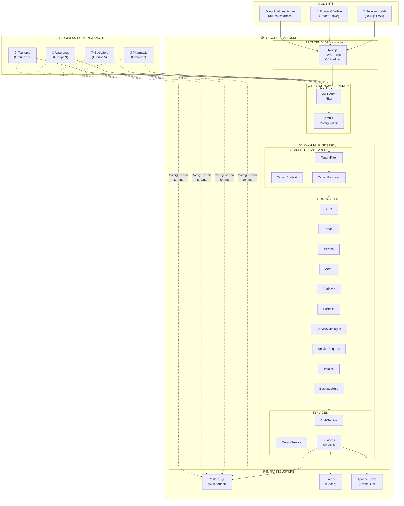
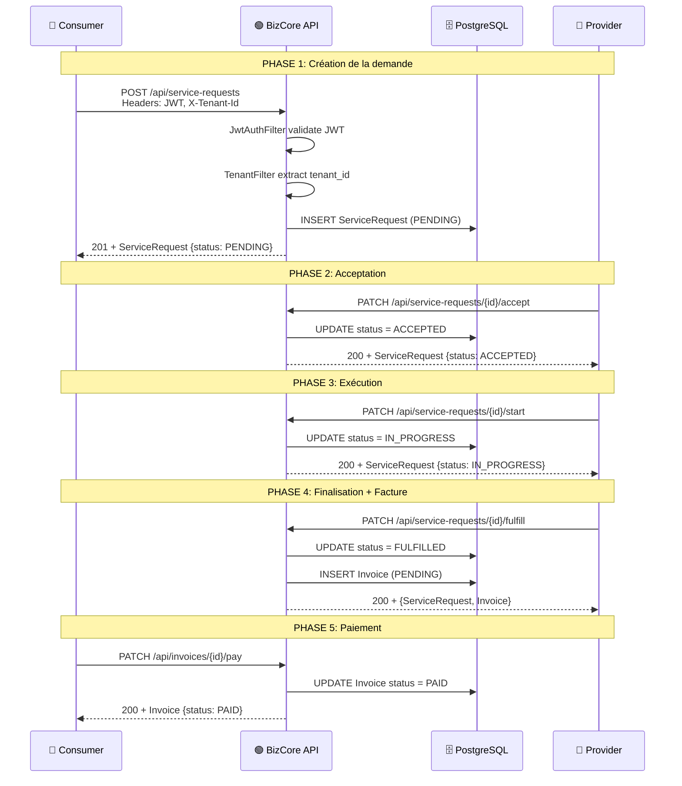
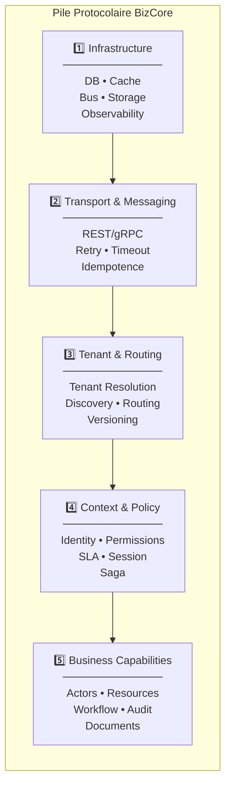
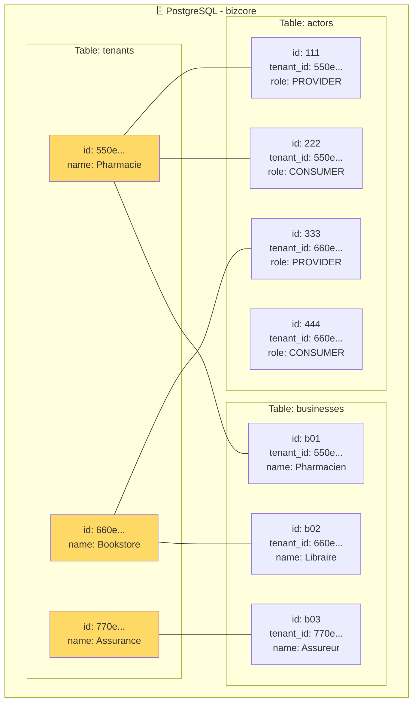
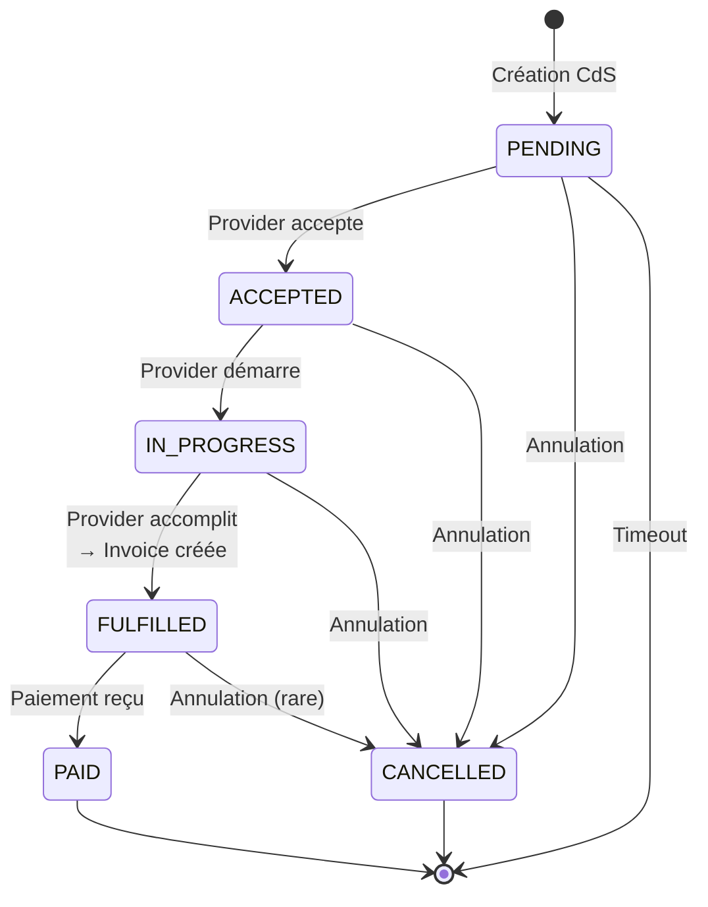
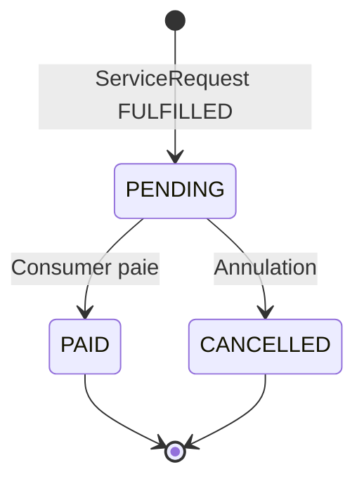
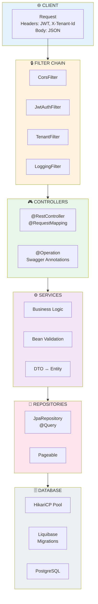
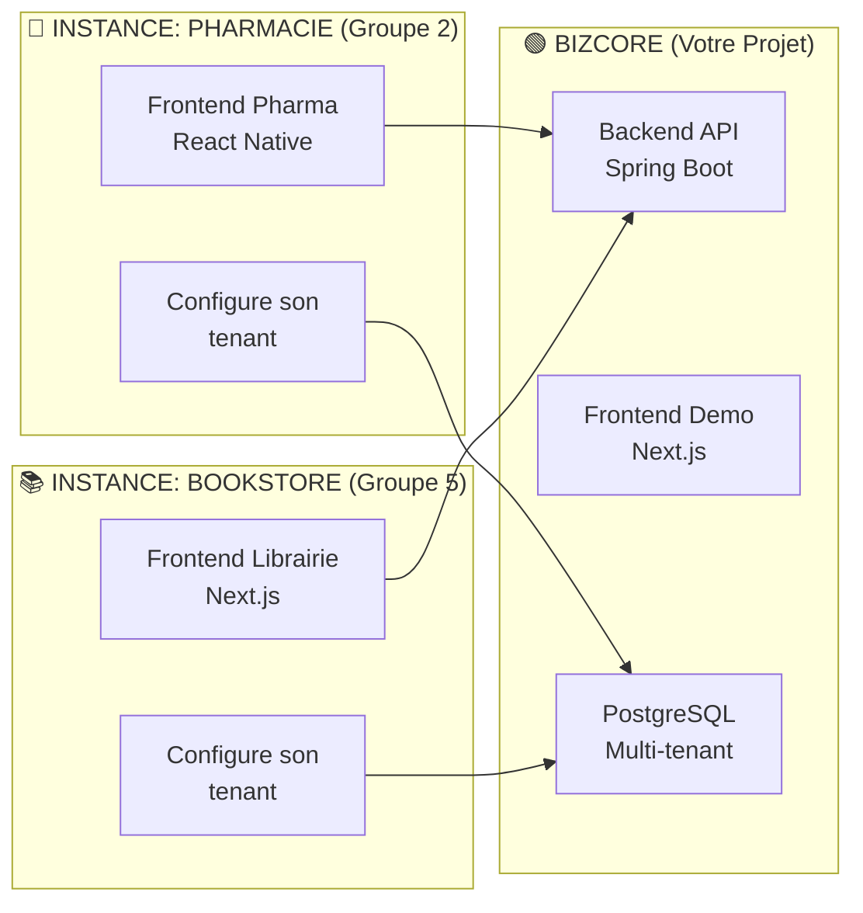
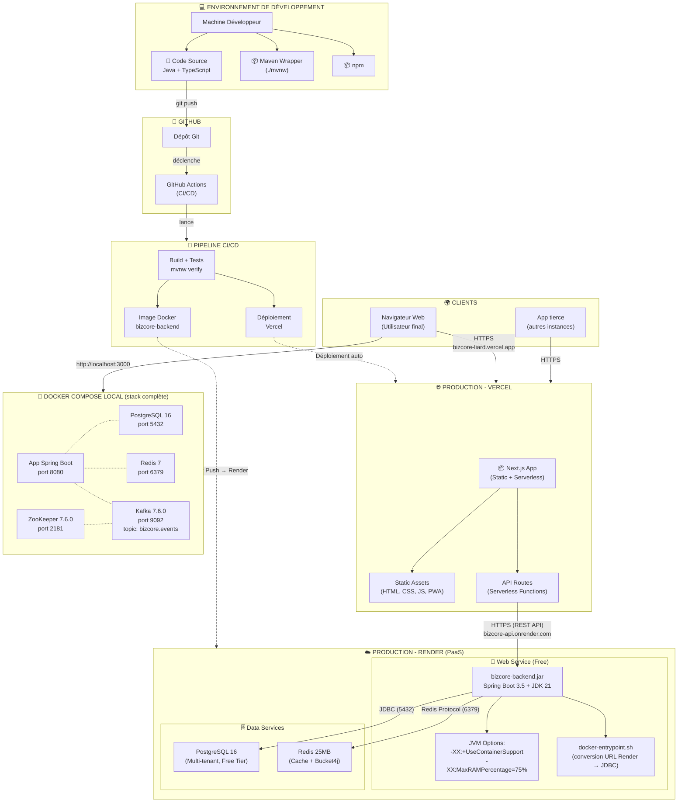
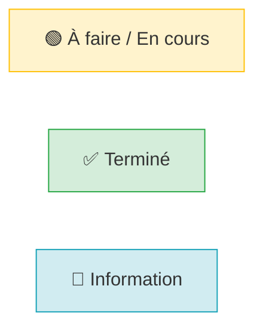

# ARCHITECTURE BIZCORE - Diagrammes

## 1. Architecture Système Complète



## 2. Flux d'une Requête CdS → FdS



## 3. Pile Protocolaire (5 Couches)



## 4. Encapsulation des Headers

```mermaid
flowchart LR
    subgraph Paquet["📦 Paquet Métier"]
        H_NET["Header Réseau<br/>─────────────<br/>IP: source/dest<br/>Port<br/>Protocol"]
        
        H_BIZ["Header BizCore<br/>─────────────<br/>X-Tenant-Id<br/>X-Trace-Id<br/>X-Correlation-Id<br/>X-Locale<br/>X-Actor-Id<br/>X-Role"]
        
        PAYLOAD["Payload Métier<br/>─────────────<br/>{<br/>  \"serviceName\": \"...\",<br/>  \"description\": \"...\"<br/>}"]
    end

    style H_NET fill:#e1e5e8
    style H_BIZ fill:#ffd966
    style PAYLOAD fill:#b4d7a4
```

## 5. Multi-Tenant Isolation



## 6. Cycle de Vie ServiceRequest



## 6bis. Cycle de Vie d'une Facture (Invoice)



## 7. Architecture Détaillée du Backend



## 8. Comparaison BizCore vs Instances



## 9. Diagramme de Déploiement



---

## Légende



## Commandes Utiles

```bash
# Démarrer le backend
cd backend && ./mvnw spring-boot:run

# Démarrer le frontend
cd frontend && npm run dev

# Voir la documentation API
open http://localhost:8080/swagger-ui.html

# Vérifier les migrations Liquibase
cd backend && ./mvnw liquibase:status
```

---

*Diagrammes générés pour BizCore - Business Core as a Service*
