# Diagrammes de Séquence BizCore

> Tous les diagrammes de séquence UML du projet BizCore — Business Core as a Service.
> Chaque diagramme décrit un flux métier ou technique en suivant le code source.

---

## 1. 🔐 Authentification & Utilisateurs

### 1.1 Inscription

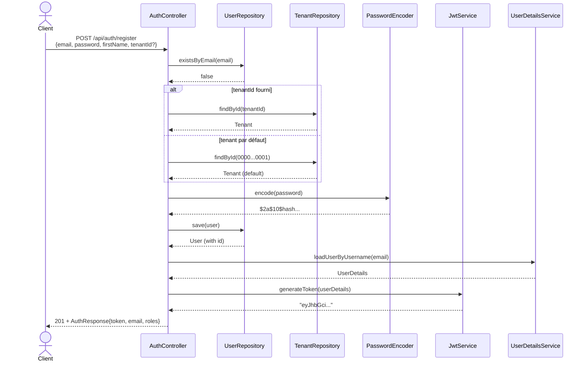
```mermaid
sequenceDiagram
    actor C as Client
    participant AC as AuthController
    participant UR as UserRepository
    participant TR as TenantRepository
    participant PE as PasswordEncoder
    participant JS as JwtService
    participant UDS as UserDetailsService

    C->>AC: POST /api/auth/register<br/>{email, password, firstName, tenantId?}
    AC->>UR: existsByEmail(email)
    UR-->>AC: false
    alt tenantId fourni
        AC->>TR: findById(tenantId)
        TR-->>AC: Tenant
    else tenant par défaut
        AC->>TR: findById(0000...0001)
        TR-->>AC: Tenant (default)
    end
    AC->>PE: encode(password)
    PE-->>AC: $2a$10$hash...
    AC->>UR: save(user)
    UR-->>AC: User (with id)
    AC->>UDS: loadUserByUsername(email)
    UDS-->>AC: UserDetails
    AC->>JS: generateToken(userDetails)
    JS-->>AC: "eyJhbGci..."
    AC-->>C: 201 + AuthResponse{token, email, roles}
```

### 1.2 Connexion

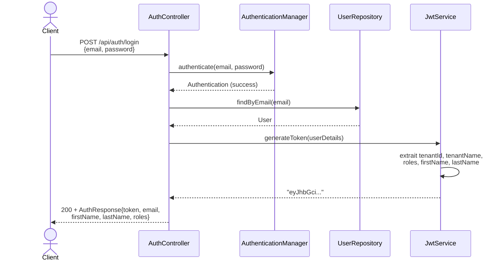
```mermaid
sequenceDiagram
    actor C as Client
    participant AC as AuthController
    participant AM as AuthenticationManager
    participant UR as UserRepository
    participant JS as JwtService

    C->>AC: POST /api/auth/login<br/>{email, password}
    AC->>AM: authenticate(email, password)
    AM-->>AC: Authentication (success)
    AC->>UR: findByEmail(email)
    UR-->>AC: User
    AC->>JS: generateToken(userDetails)
    JS->>JS: extrait tenantId, tenantName,<br/>roles, firstName, lastName
    JS-->>AC: "eyJhbGci..."
    AC-->>C: 200 + AuthResponse{token, email,<br/>firstName, lastName, roles}
```

### 1.3 Validation JWT (Filter Chain)

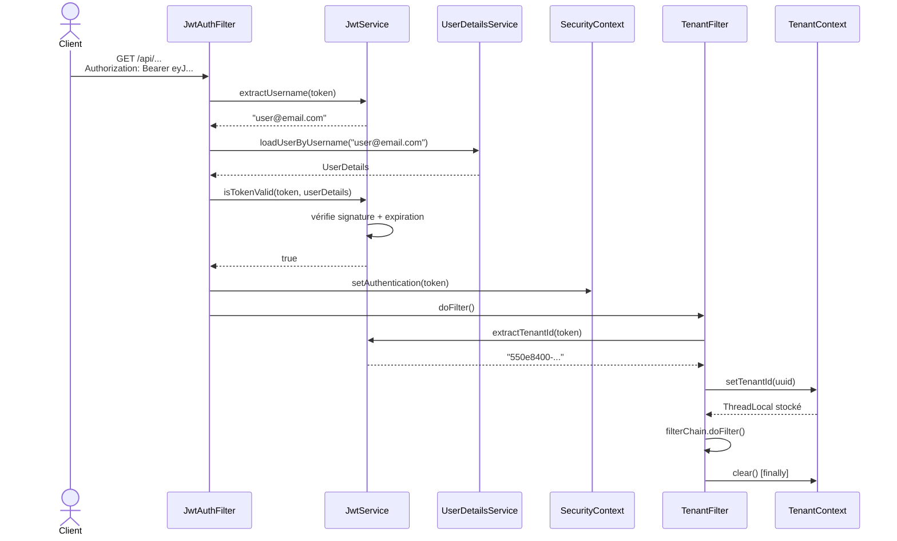
```mermaid
sequenceDiagram
    actor C as Client
    participant JAF as JwtAuthFilter
    participant JS as JwtService
    participant UDS as UserDetailsService
    participant SC as SecurityContext
    participant TF as TenantFilter
    participant TC as TenantContext

    C->>JAF: GET /api/...<br/>Authorization: Bearer eyJ...
    JAF->>JS: extractUsername(token)
    JS-->>JAF: "user@email.com"
    JAF->>UDS: loadUserByUsername("user@email.com")
    UDS-->>JAF: UserDetails
    JAF->>JS: isTokenValid(token, userDetails)
    JS->>JS: vérifie signature + expiration
    JS-->>JAF: true
    JAF->>SC: setAuthentication(token)
    JAF->>TF: doFilter()
    TF->>JS: extractTenantId(token)
    JS-->>TF: "550e8400-..."
    TF->>TC: setTenantId(uuid)
    TC-->>TF: ThreadLocal stocké
    TF->>TF: filterChain.doFilter()
    TF->>TC: clear() [finally]
```

### 1.4 Structure du JWT

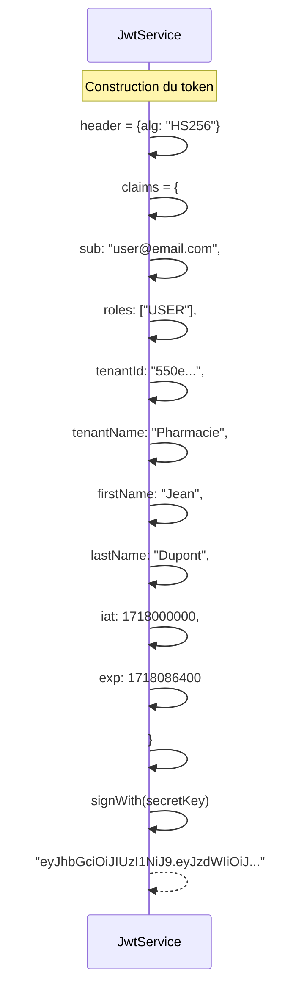
```mermaid
sequenceDiagram
    participant JS as JwtService
    Note over JS: Construction du token
    JS->>JS: header = {alg: "HS256"}
    JS->>JS: claims = {
    JS->>JS:   sub: "user@email.com",
    JS->>JS:   roles: ["USER"],
    JS->>JS:   tenantId: "550e...",
    JS->>JS:   tenantName: "Pharmacie",
    JS->>JS:   firstName: "Jean",
    JS->>JS:   lastName: "Dupont",
    JS->>JS:   iat: 1718000000,
    JS->>JS:   exp: 1718086400
    JS->>JS: }
    JS->>JS: signWith(secretKey)
    JS-->>JS: "eyJhbGciOiJIUzI1NiJ9.eyJzdWIiOiJ..."
```

### 1.5 Gestion des rôles (Admin)

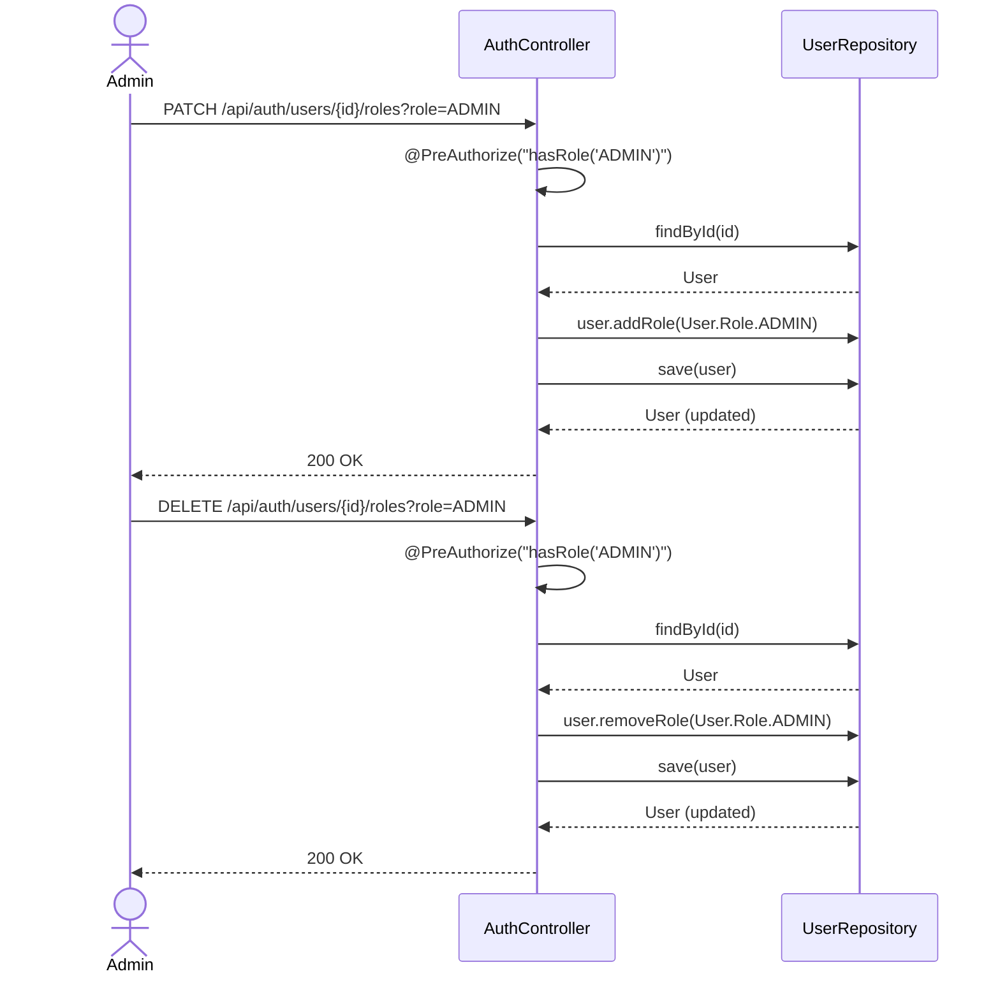
```mermaid
sequenceDiagram
    actor A as Admin
    participant AC as AuthController
    participant UR as UserRepository

    A->>AC: PATCH /api/auth/users/{id}/roles?role=ADMIN
    AC->>AC: @PreAuthorize("hasRole('ADMIN')")
    AC->>UR: findById(id)
    UR-->>AC: User
    AC->>UR: user.addRole(User.Role.ADMIN)
    AC->>UR: save(user)
    UR-->>AC: User (updated)
    AC-->>A: 200 OK

    A->>AC: DELETE /api/auth/users/{id}/roles?role=ADMIN
    AC->>AC: @PreAuthorize("hasRole('ADMIN')")
    AC->>UR: findById(id)
    UR-->>AC: User
    AC->>UR: user.removeRole(User.Role.ADMIN)
    AC->>UR: save(user)
    UR-->>AC: User (updated)
    AC-->>A: 200 OK
```

### 1.6 Validation de la clé secrète au démarrage

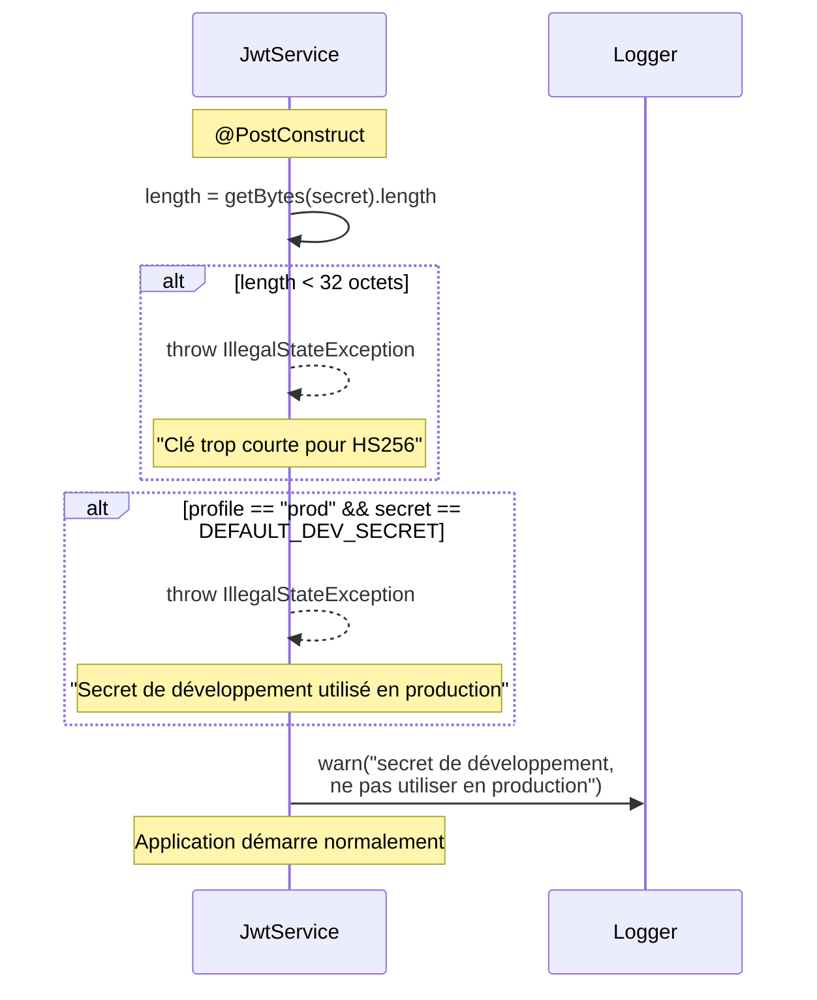
```mermaid
sequenceDiagram
    participant JS as JwtService
    participant LOG as Logger

    Note over JS: @PostConstruct
    JS->>JS: length = getBytes(secret).length
    alt length < 32 octets
        JS-->>JS: throw IllegalStateException
        Note over JS: "Clé trop courte pour HS256"
    end
    alt profile == "prod" && secret == DEFAULT_DEV_SECRET
        JS-->>JS: throw IllegalStateException
        Note over JS: "Secret de développement utilisé en production"
    end
    JS->>LOG: warn("secret de développement,<br/> ne pas utiliser en production")
    Note over JS: Application démarre normalement
```

---

## 2. 🏢 Multi-Tenant

### 2.1 Résolution du tenant

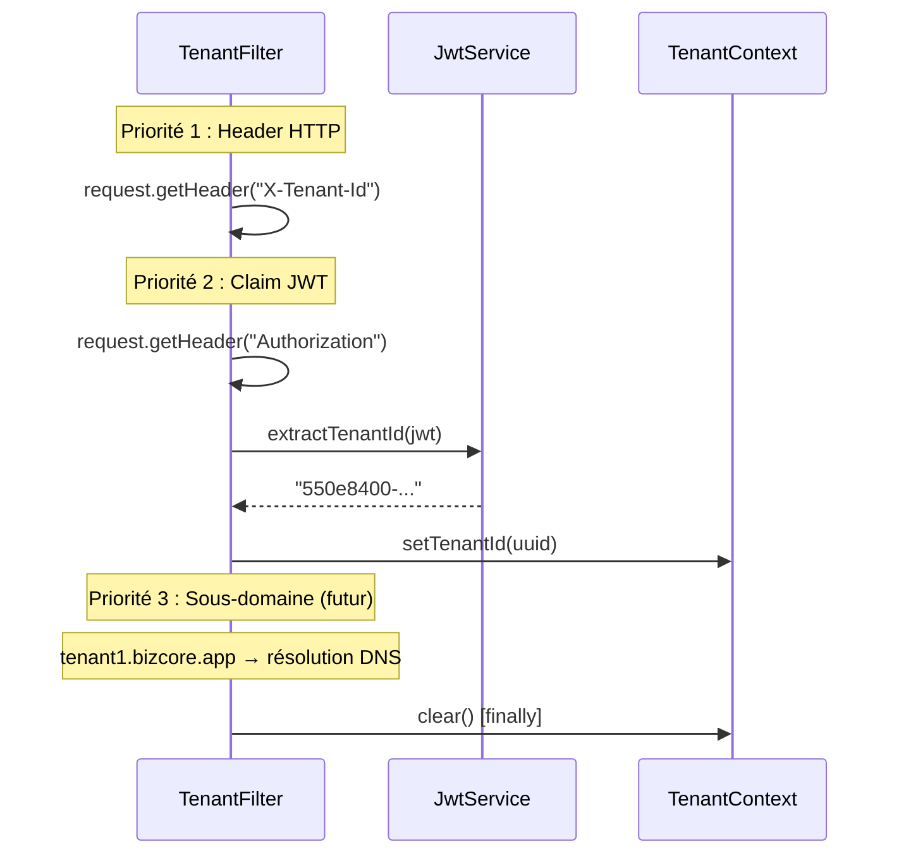
```mermaid
sequenceDiagram
    participant TF as TenantFilter
    participant JS as JwtService
    participant TC as TenantContext

    Note over TF: Priorité 1 : Header HTTP
    TF->>TF: request.getHeader("X-Tenant-Id")
    Note over TF: Priorité 2 : Claim JWT
    TF->>TF: request.getHeader("Authorization")
    TF->>JS: extractTenantId(jwt)
    JS-->>TF: "550e8400-..."
    TF->>TC: setTenantId(uuid)
    Note over TF: Priorité 3 : Sous-domaine (futur)
    Note over TF: tenant1.bizcore.app → résolution DNS
    TF->>TC: clear() [finally]
```

### 2.2 Cycle de vie TenantContext

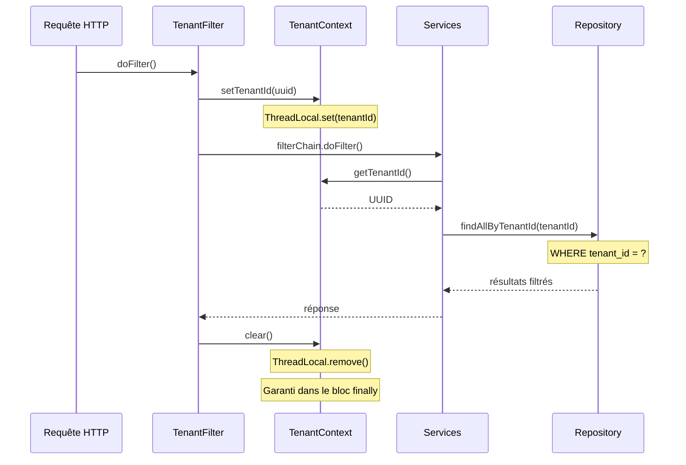
```mermaid
sequenceDiagram
    participant REQ as Requête HTTP
    participant TF as TenantFilter
    participant TC as TenantContext
    participant SRV as Services
    participant REPO as Repository

    REQ->>TF: doFilter()
    TF->>TC: setTenantId(uuid)
    Note over TC: ThreadLocal.set(tenantId)
    TF->>SRV: filterChain.doFilter()
    SRV->>TC: getTenantId()
    TC-->>SRV: UUID
    SRV->>REPO: findAllByTenantId(tenantId)
    Note over REPO: WHERE tenant_id = ?
    REPO-->>SRV: résultats filtrés
    SRV-->>TF: réponse
    TF->>TC: clear()
    Note over TC: ThreadLocal.remove()
    Note over TC: Garanti dans le bloc finally
```

### 2.3 Isolation des données (Repository)

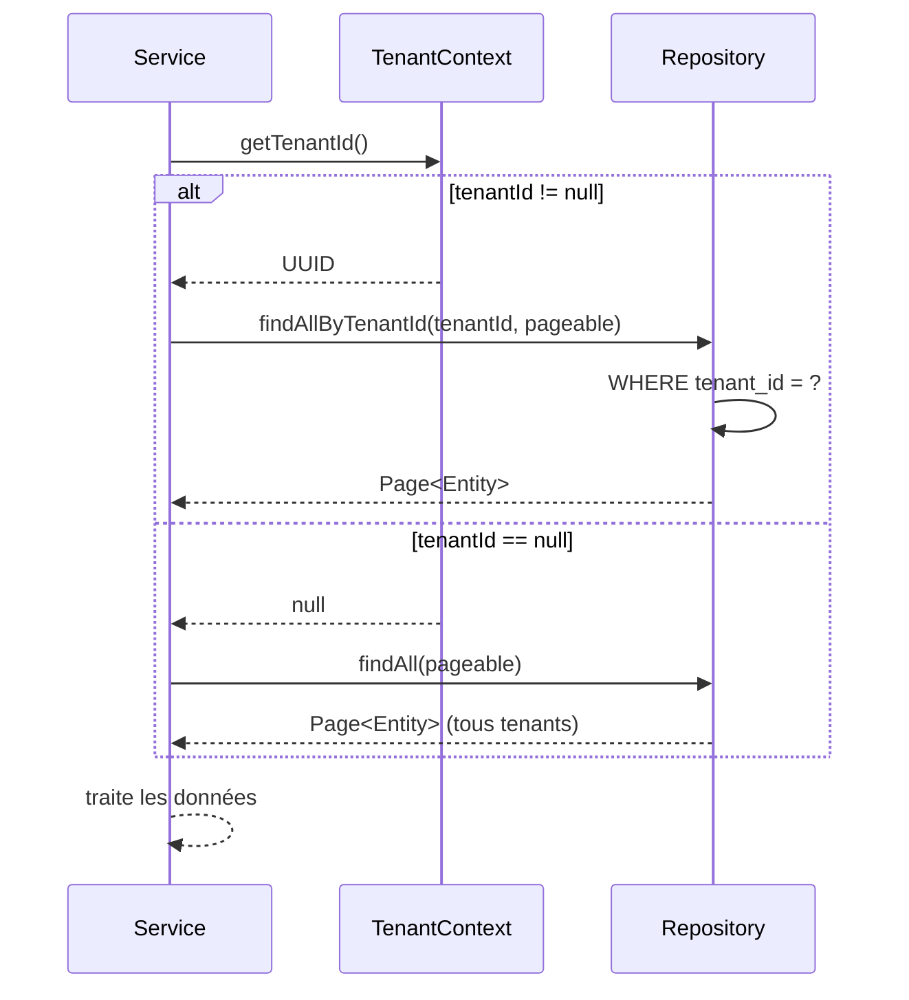
```mermaid
sequenceDiagram
    participant S as Service
    participant TC as TenantContext
    participant R as Repository

    S->>TC: getTenantId()
    alt tenantId != null
        TC-->>S: UUID
        S->>R: findAllByTenantId(tenantId, pageable)
        R->>R: WHERE tenant_id = ?
        R-->>S: Page<Entity>
    else tenantId == null
        TC-->>S: null
        S->>R: findAll(pageable)
        R-->>S: Page<Entity> (tous tenants)
    end
    S-->>S: traite les données
```

### 2.4 Provisioning d'un nouveau tenant

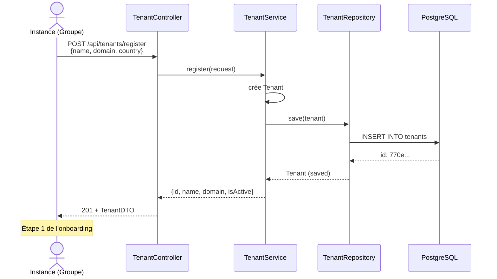
```mermaid
sequenceDiagram
    actor I as Instance (Groupe)
    participant TC as TenantController
    participant TS as TenantService
    participant TR as TenantRepository
    participant DB as PostgreSQL

    I->>TC: POST /api/tenants/register<br/>{name, domain, country}
    TC->>TS: register(request)
    TS->>TS: crée Tenant
    TS->>TR: save(tenant)
    TR->>DB: INSERT INTO tenants
    DB-->>TR: id: 770e...
    TR-->>TS: Tenant (saved)
    TS-->>TC: {id, name, domain, isActive}
    TC-->>I: 201 + TenantDTO

    Note over I: Étape 1 de l'onboarding
```

### 2.5 CRUD Tenant (Admin)

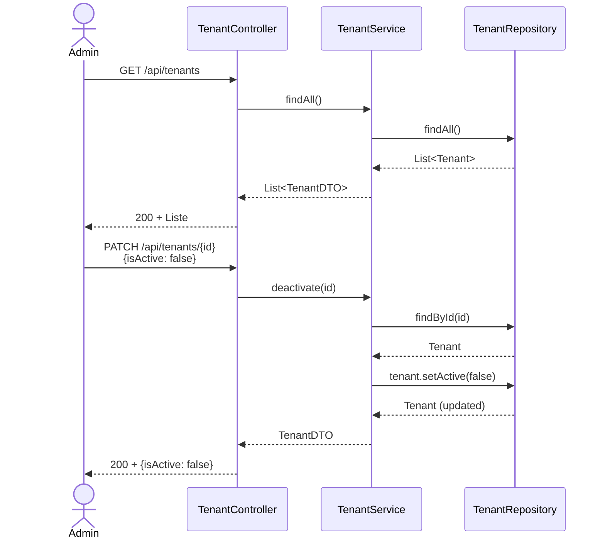
```mermaid
sequenceDiagram
    actor A as Admin
    participant TC as TenantController
    participant TS as TenantService
    participant TR as TenantRepository

    A->>TC: GET /api/tenants
    TC->>TS: findAll()
    TS->>TR: findAll()
    TR-->>TS: List<Tenant>
    TS-->>TC: List<TenantDTO>
    TC-->>A: 200 + Liste

    A->>TC: PATCH /api/tenants/{id}<br/>{isActive: false}
    TC->>TS: deactivate(id)
    TS->>TR: findById(id)
    TR-->>TS: Tenant
    TS->>TR: tenant.setActive(false)
    TR-->>TS: Tenant (updated)
    TS-->>TC: TenantDTO
    TC-->>A: 200 + {isActive: false}
```

### 2.6 Modèle de données multi-tenant

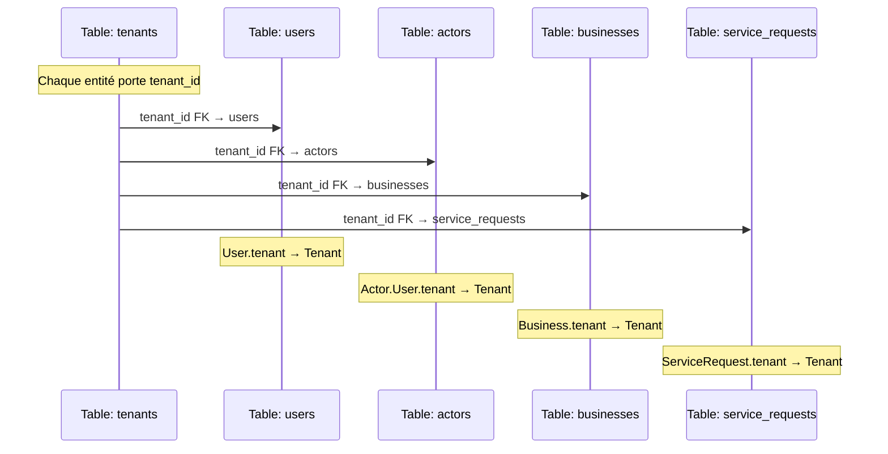
```mermaid
sequenceDiagram
    participant T as Table: tenants
    participant U as Table: users
    participant A as Table: actors
    participant B as Table: businesses
    participant SR as Table: service_requests

    Note over T: Chaque entité porte tenant_id
    T->>U: tenant_id FK → users
    T->>A: tenant_id FK → actors
    T->>B: tenant_id FK → businesses
    T->>SR: tenant_id FK → service_requests

    Note over U: User.tenant → Tenant
    Note over A: Actor.User.tenant → Tenant
    Note over B: Business.tenant → Tenant
    Note over SR: ServiceRequest.tenant → Tenant
```

---

## 3. 📦 Gestion des entités (CRUD)

### 3.1 Création d'un User

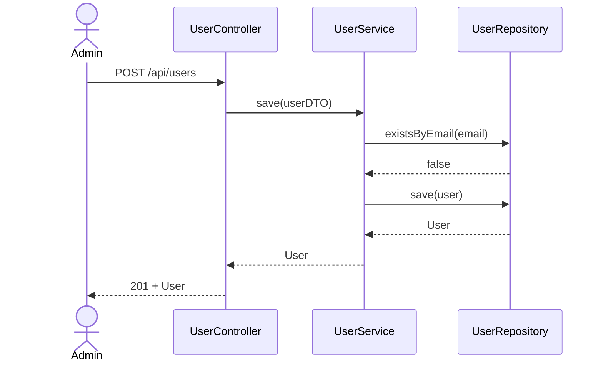
```mermaid
sequenceDiagram
    actor A as Admin
    participant UC as UserController
    participant US as UserService
    participant UR as UserRepository

    A->>UC: POST /api/users
    UC->>US: save(userDTO)
    US->>UR: existsByEmail(email)
    UR-->>US: false
    US->>UR: save(user)
    UR-->>US: User
    US-->>UC: User
    UC-->>A: 201 + User
```

### 3.2 Création d'un Actor

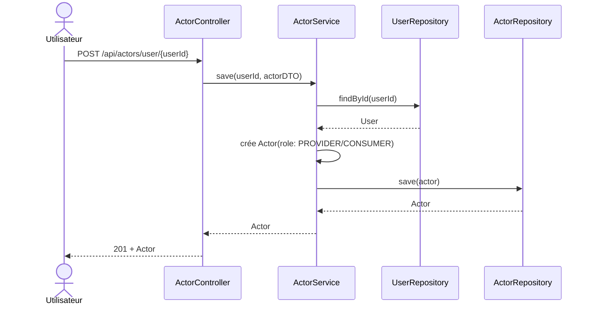
```mermaid
sequenceDiagram
    actor A as Utilisateur
    participant AC as ActorController
    participant AS as ActorService
    participant UR as UserRepository
    participant AR as ActorRepository

    A->>AC: POST /api/actors/user/{userId}
    AC->>AS: save(userId, actorDTO)
    AS->>UR: findById(userId)
    UR-->>AS: User
    AS->>AS: crée Actor(role: PROVIDER/CONSUMER)
    AS->>AR: save(actor)
    AR-->>AS: Actor
    AS-->>AC: Actor
    AC-->>A: 201 + Actor
```

### 3.3 Query Actors

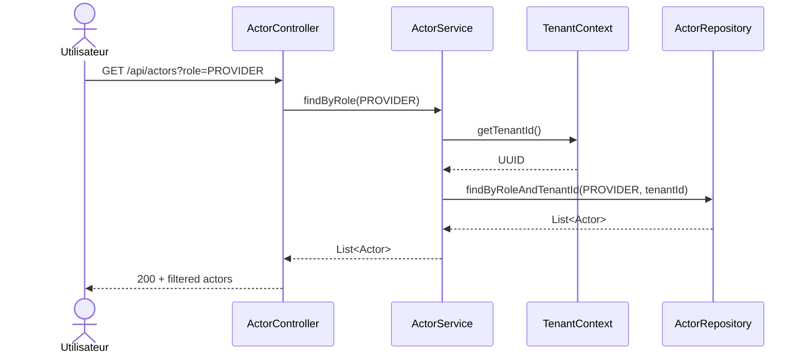
```mermaid
sequenceDiagram
    actor U as Utilisateur
    participant AC as ActorController
    participant AS as ActorService
    participant TC as TenantContext
    participant AR as ActorRepository

    U->>AC: GET /api/actors?role=PROVIDER
    AC->>AS: findByRole(PROVIDER)
    AS->>TC: getTenantId()
    TC-->>AS: UUID
    AS->>AR: findByRoleAndTenantId(PROVIDER, tenantId)
    AR-->>AS: List<Actor>
    AS-->>AC: List<Actor>
    AC-->>U: 200 + filtered actors
```

### 3.4 CRUD Business

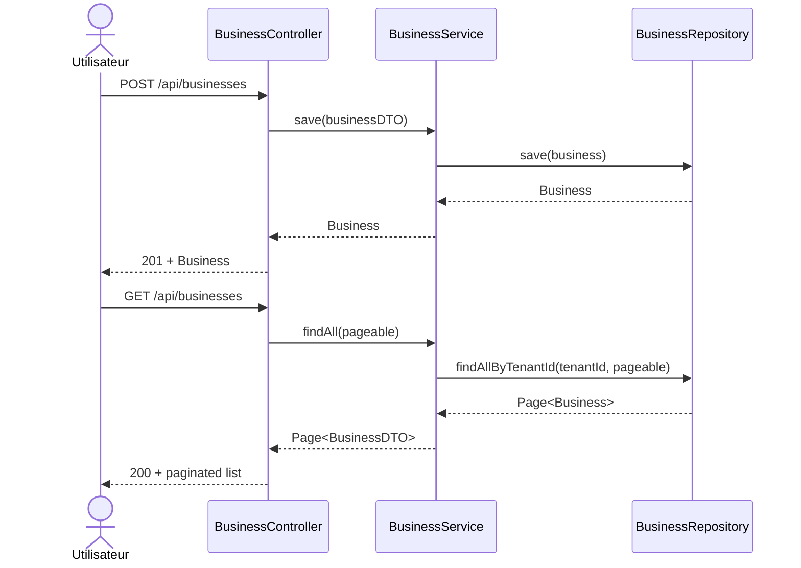
```mermaid
sequenceDiagram
    actor U as Utilisateur
    participant BC as BusinessController
    participant BS as BusinessService
    participant BR as BusinessRepository

    U->>BC: POST /api/businesses
    BC->>BS: save(businessDTO)
    BS->>BR: save(business)
    BR-->>BS: Business
    BS-->>BC: Business
    BC-->>U: 201 + Business

    U->>BC: GET /api/businesses
    BC->>BS: findAll(pageable)
    BS->>BR: findAllByTenantId(tenantId, pageable)
    BR-->>BS: Page<Business>
    BS-->>BC: Page<BusinessDTO>
    BC-->>U: 200 + paginated list
```

### 3.5 CRUD ServiceCatalogue

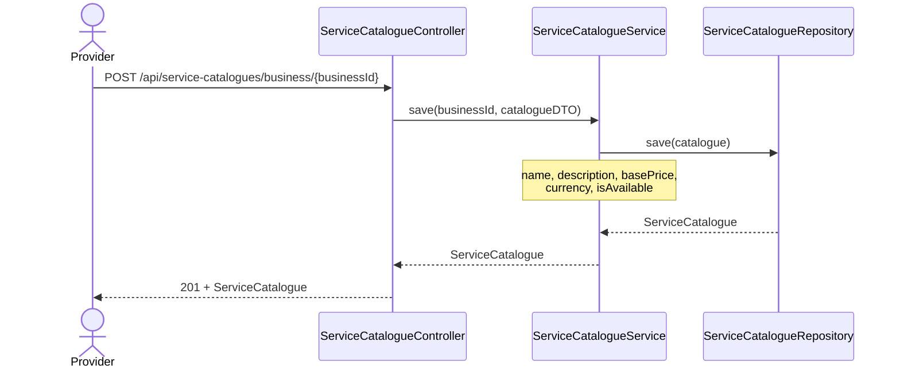
```mermaid
sequenceDiagram
    actor P as Provider
    participant SCC as ServiceCatalogueController
    participant SCS as ServiceCatalogueService
    participant SCR as ServiceCatalogueRepository

    P->>SCC: POST /api/service-catalogues/business/{businessId}
    SCC->>SCS: save(businessId, catalogueDTO)
    SCS->>SCR: save(catalogue)
    Note over SCS: name, description, basePrice,<br/>currency, isAvailable
    SCR-->>SCS: ServiceCatalogue
    SCS-->>SCC: ServiceCatalogue
    SCC-->>P: 201 + ServiceCatalogue
```

### 3.6 Portfolio (Actor → Businesses)

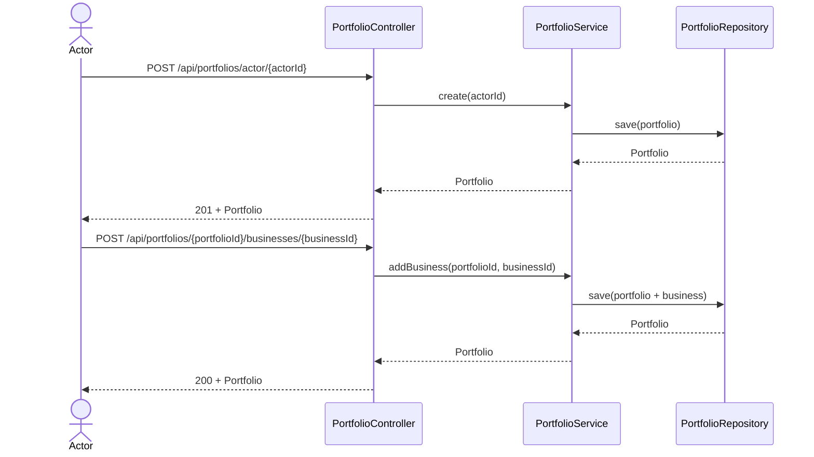
```mermaid
sequenceDiagram
    actor A as Actor
    participant PC as PortfolioController
    participant PS as PortfolioService
    participant PR as PortfolioRepository

    A->>PC: POST /api/portfolios/actor/{actorId}
    PC->>PS: create(actorId)
    PS->>PR: save(portfolio)
    PR-->>PS: Portfolio
    PS-->>PC: Portfolio
    PC-->>A: 201 + Portfolio

    A->>PC: POST /api/portfolios/{portfolioId}/businesses/{businessId}
    PC->>PS: addBusiness(portfolioId, businessId)
    PS->>PR: save(portfolio + business)
    PR-->>PS: Portfolio
    PS-->>PC: Portfolio
    PC-->>A: 200 + Portfolio
```

### 3.7 CRUD BusinessRule

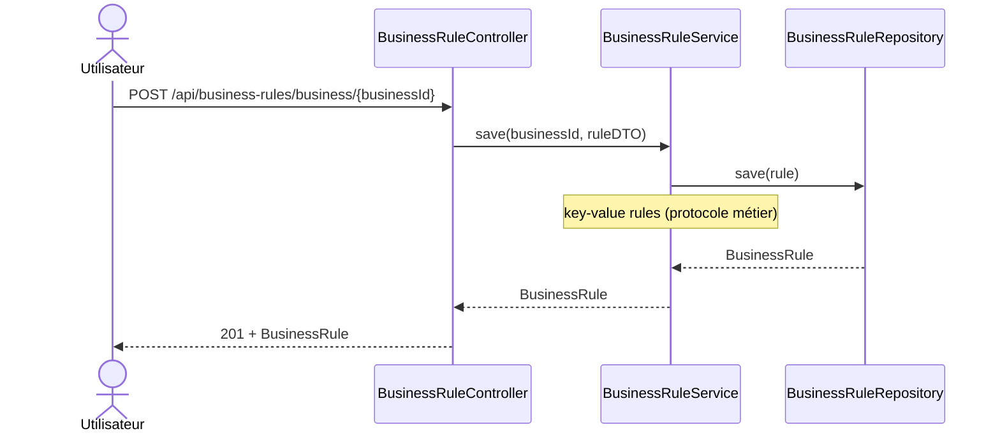
```mermaid
sequenceDiagram
    actor U as Utilisateur
    participant BRC as BusinessRuleController
    participant BRS as BusinessRuleService
    participant BRR as BusinessRuleRepository

    U->>BRC: POST /api/business-rules/business/{businessId}
    BRC->>BRS: save(businessId, ruleDTO)
    BRS->>BRR: save(rule)
    Note over BRS: key-value rules (protocole métier)
    BRR-->>BRS: BusinessRule
    BRS-->>BRC: BusinessRule
    BRC-->>U: 201 + BusinessRule
```

### 3.8 CRUD Resource

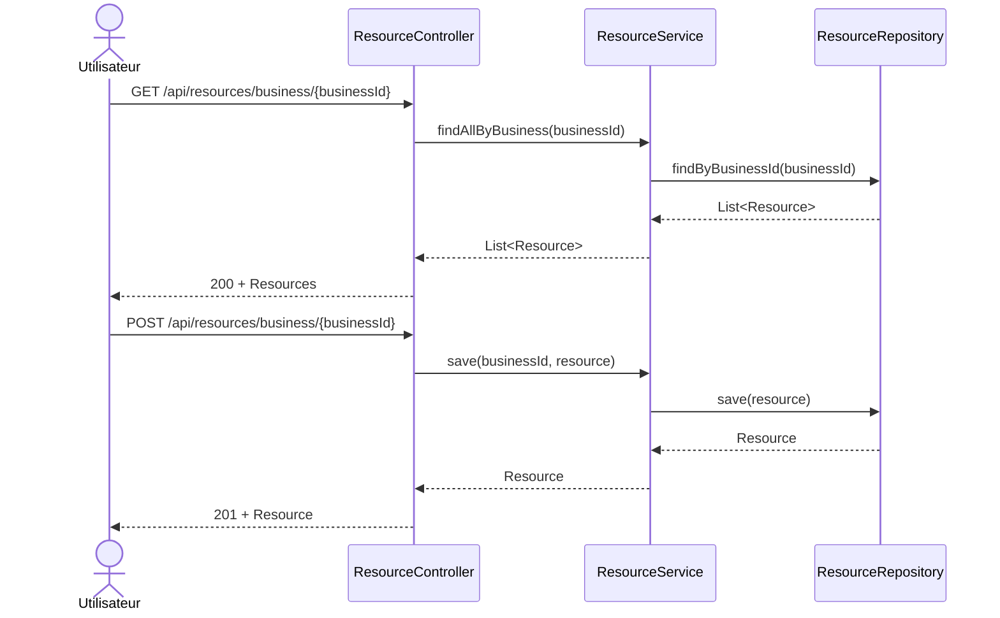
```mermaid
sequenceDiagram
    actor U as Utilisateur
    participant RC as ResourceController
    participant RS as ResourceService
    participant RR as ResourceRepository

    U->>RC: GET /api/resources/business/{businessId}
    RC->>RS: findAllByBusiness(businessId)
    RS->>RR: findByBusinessId(businessId)
    RR-->>RS: List<Resource>
    RS-->>RC: List<Resource>
    RC-->>U: 200 + Resources

    U->>RC: POST /api/resources/business/{businessId}
    RC->>RS: save(businessId, resource)
    RS->>RR: save(resource)
    RR-->>RS: Resource
    RS-->>RC: Resource
    RC-->>U: 201 + Resource
```

### 3.9 CRUD Media

```mermaid
sequenceDiagram
    actor U as Utilisateur
    participant MC as MediaController
    participant MS as MediaService
    participant MR as MediaRepository

    U->>MC: POST /api/media/business/{businessId}
    MC->>MS: save(businessId, mediaDTO)
    MS->>MR: save(media)
    MR-->>MS: Media
    MS-->>MC: Media
    MC-->>U: 201 + Media

    U->>MC: GET /api/media/business/{businessId}?type=IMAGE
    MC->>MS: findByBusinessAndType(businessId, IMAGE)
    MS->>MR: findByBusinessIdAndType(businessId, IMAGE)
    MR-->>MS: List<Media>
    MS-->>MC: List<Media>
    MC-->>U: 200 + filtered media
```

### 3.10 Liste et validation des devises

```mermaid
sequenceDiagram
    actor U as Utilisateur
    participant CC as CurrencyController
    participant SC as SupportedCurrency (enum)

    U->>CC: GET /api/currencies
    CC->>SC: values()
    SC-->>CC: [XAF, XOF, NGN, KES, GHS, USD, EUR, GBP]
    CC-->>U: 200 + ["XAF", "XOF", "NGN", ...]

    U->>CC: GET /api/currencies/validate/USD
    CC->>SC: isSupported("USD")
    SC-->>CC: true
    CC-->>U: 200 + {valid: true}
```

---

## 4. 🔄 Cycle de vie ServiceRequest

### 4.1 Création d'une ServiceRequest

```mermaid
sequenceDiagram
    actor C as Consumer
    participant SRC as ServiceRequestController
    participant SRS as ServiceRequestService
    participant AR as ActorRepository
    participant SCR as ServiceCatalogueRepository
    participant SRR as ServiceRequestRepository
    participant AS as AuditService
    participant DB as PostgreSQL

    C->>SRC: POST /api/service-requests<br/>/consumer/{cId}/provider/{pId}/catalogue/{scId}
    Note over C: Body: {serviceName, description}
    SRC->>SRS: save(cId, pId, scId, request)
    SRS->>AR: findById(consumerId)
    AR-->>SRS: Actor (CONSUMER)
    SRS->>AR: findById(providerId)
    AR-->>SRS: Actor (PROVIDER)
    SRS->>SCR: findById(serviceCatalogueId)
    SCR-->>SRS: ServiceCatalogue
    SRS->>SRS: request.setStatus(PENDING)
    SRS->>SRS: request.setTraceId(UUID.randomUUID())
    SRS->>SRS: request.setTenant(consumer.tenant)
    SRS->>SRR: save(request)
    SRR->>DB: INSERT INTO service_requests
    DB-->>SRR: id, requestedAt, ...
    SRR-->>SRS: ServiceRequest
    SRS->>AS: logServiceRequestCreated(saved, consumerId)
    AS->>DB: INSERT INTO audit_events (REQUIRES_NEW)
    DB-->>AS: AuditEvent
    AS-->>SRS: ok
    SRS-->>SRC: ServiceRequest
    SRC-->>C: 201 + {id, status: PENDING, ...}
```

### 4.2 Acceptation (PENDING → ACCEPTED)

```mermaid
sequenceDiagram
    actor P as Provider
    participant SRC as ServiceRequestController
    participant SRS as ServiceRequestService
    participant SRR as ServiceRequestRepository
    participant AS as AuditService
    participant DB as PostgreSQL

    P->>SRC: PATCH /api/service-requests/{id}/accept
    Note over P: JWT → email du provider
    SRC->>SRS: accept(id, "provider@email.com")
    SRS->>SRR: findById(id)
    SRR-->>SRS: ServiceRequest (PENDING)
    SRS->>SRS: resolveActingActor(sr, email, "provider")
    Note over SRS: Vérifie que l'email JWT =<br/>provider.user.email
    SRS->>SRS: transitionTo(sr, ACCEPTED, actorId)
    SRS->>SRS: VALID_TRANSITIONS[PENDING] contient ACCEPTED
    SRS->>SRS: sr.setStatus(ACCEPTED)
    SRS->>AS: logServiceRequestStatusChange(sr, PENDING, actorId)
    AS->>DB: INSERT audit_event (REQUIRES_NEW)
    SRS->>SRS: sr.setAcceptedAt(now)
    SRS->>SRR: save(sr)
    SRR->>DB: UPDATE service_requests SET status=ACCEPTED
    SRR-->>SRS: ServiceRequest (ACCEPTED)
    SRS-->>SRC: ServiceRequestDTO
    SRC-->>P: 200 + {status: ACCEPTED}
```

### 4.3 Démarrage (ACCEPTED → IN_PROGRESS)

```mermaid
sequenceDiagram
    actor P as Provider
    participant SRC as ServiceRequestController
    participant SRS as ServiceRequestService
    participant SRR as ServiceRequestRepository
    participant AS as AuditService

    P->>SRC: PATCH /api/service-requests/{id}/start
    SRC->>SRS: start(id, "provider@email.com")
    SRS->>SRR: findById(id)
    SRR-->>SRS: ServiceRequest (ACCEPTED)
    SRS->>SRS: resolveActingActor → provider
    SRS->>SRS: transitionTo(sr, IN_PROGRESS, actorId)
    SRS->>SRS: VALID_TRANSITIONS[ACCEPTED] contient IN_PROGRESS
    SRS->>SRS: sr.setStatus(IN_PROGRESS)
    SRS->>AS: logStatusChange(PENDING → ACCEPTED)
    SRS->>SRS: sr.setStartedAt(now)
    SRS->>SRR: save(sr)
    SRR-->>SRS: ServiceRequest (IN_PROGRESS)
    SRS-->>SRC: ServiceRequestDTO
    SRC-->>P: 200 + {status: IN_PROGRESS}
```

### 4.4 Finalisation + Auto-création facture (IN_PROGRESS → FULFILLED)

```mermaid
sequenceDiagram
    actor P as Provider
    participant SRC as ServiceRequestController
    participant SRS as ServiceRequestService
    participant SRR as ServiceRequestRepository
    participant IR as InvoiceRepository
    participant AS as AuditService
    participant DB as PostgreSQL

    P->>SRC: PATCH /api/service-requests/{id}/fulfill
    SRC->>SRS: fulfill(id)
    SRS->>SRR: findById(id)
    SRR-->>SRS: ServiceRequest (IN_PROGRESS)
    SRS->>SRS: transitionTo(sr, FULFILLED, providerId)
    SRS->>SRS: sr.setStatus(FULFILLED)
    SRS->>SRS: sr.setFulfilledAt(now)
    SRS->>SRR: save(sr)
    SRR->>DB: UPDATE status = FULFILLED
    SRS->>AS: logStatusChange(IN_PROGRESS → FULFILLED)
    SRS->>SRS: crée Invoice
    Note over SRS: Invoice.setStatus(PENDING)
    Note over SRS: Invoice.setAmount(catalogue.basePrice)
    Note over SRS: Invoice.setCurrency(catalogue.currency)
    SRS->>IR: save(invoice)
    IR->>DB: INSERT INTO invoices<br/>(issuedAt géré par @PrePersist)
    IR-->>SRS: Invoice
    SRS-->>SRC: FulfillResponseDTO{ServiceRequest, Invoice}
    SRC-->>P: 200 + {serviceRequest, invoice}
```

### 4.5 Annulation (any → CANCELLED)

```mermaid
sequenceDiagram
    actor U as Consumer ou Provider
    participant SRC as ServiceRequestController
    participant SRS as ServiceRequestService
    participant SRR as ServiceRequestRepository
    participant AS as AuditService

    U->>SRC: PATCH /api/service-requests/{id}/cancel
    SRC->>SRS: cancel(id, "user@email.com")
    SRS->>SRR: findById(id)
    SRR-->>SRS: ServiceRequest (currentStatus)
    SRS->>SRS: resolveActingActor(sr, email, "any")
    Note over SRS: Consumer OU Provider peut annuler
    SRS->>SRS: transitionTo(sr, CANCELLED, actorId)
    Note over SRS: VALID_TRANSITIONS[current] contient CANCELLED
    SRS->>SRS: sr.setStatus(CANCELLED)
    SRS->>SRS: sr.setCancelledAt(now)
    SRS->>SRR: save(sr)
    SRR-->>SRS: ServiceRequest (CANCELLED)
    SRS-->>SRC: ServiceRequestDTO
    SRC-->>U: 200 + {status: CANCELLED}
```

### 4.6 Validation FSM (transitionTo interne)

```mermaid
sequenceDiagram
    participant SRS as ServiceRequestService
    participant SR as ServiceRequest
    participant AS as AuditService

    Note over SRS: Table de routage FSM

    SRS->>SRS: transitionTo(sr, target, actorId)
    SRS->>SR: getStatus()
    SR-->>SRS: oldStatus (ex: PENDING)
    SRS->>SRS: allowed = VALID_TRANSITIONS[oldStatus]
    alt target dans allowed
        SRS->>SR: setStatus(target)
        SRS->>AS: logStatusChange(sr, oldStatus, actorId)
        AS-->>SRS: AuditEvent logged
    else
        SRS-->>SRS: throw IllegalStateException
        Note over SRS: "Transition invalide : PENDING → FULFILLED"
    end
```

### 4.7 Autorisation acteur (resolveActingActor)

```mermaid
sequenceDiagram
    participant SRS as ServiceRequestService
    participant SR as ServiceRequest
    participant SC as SecurityContext

    SRS->>SRS: resolveActingActor(sr, email, expectedRole)
    SRS->>SR: getProvider().getUser().getEmail()
    SR-->>SRS: "provider@email.com"
    SRS->>SR: getConsumer().getUser().getEmail()
    SR-->>SRS: "consumer@email.com"
    SRS->>SRS: isProvider = email == providerEmail
    SRS->>SRS: isConsumer = email == consumerEmail

    alt expectedRole == "provider"
        alt isProvider
            SRS-->>SRS: return provider Actor
        else
            SRS-->>SRS: throw AccessDeniedException
        end
    else expectedRole == "any"
        alt isConsumer
            SRS-->>SRS: return consumer Actor
        else isProvider
            SRS-->>SRS: return provider Actor
        else
            SRS-->>SRS: throw AccessDeniedException
        end
    end
```

### 4.8 Query ServiceRequests

```mermaid
sequenceDiagram
    actor U as Utilisateur
    participant SRC as ServiceRequestController
    participant SRS as ServiceRequestService
    participant TC as TenantContext
    participant SRR as ServiceRequestRepository

    U->>SRC: GET /api/service-requests?page=0&size=10
    SRC->>SRS: findAll(PageRequest)
    SRS->>TC: getTenantId()
    TC-->>SRS: UUID
    SRS->>SRR: findAllByTenantId(tenantId, pageable)
    SRR-->>SRS: Page<ServiceRequest>
    SRS-->>SRC: Page<ServiceRequest>
    SRC-->>U: 200 + paginated list

    U->>SRC: GET /api/service-requests/consumer/{consumerId}
    SRC->>SRS: findByConsumer(consumerId)
    SRS->>SRR: findByConsumerIdAndTenantId(consumerId, tenantId)
    SRR-->>SRS: List<ServiceRequest>
    SRS-->>SRC: List<ServiceRequestDTO>
    SRC-->>U: 200 + filtered list
```

---

## 5. 💳 Facture & Paiement

### 5.1 Création manuelle d'une facture

```mermaid
sequenceDiagram
    actor U as Utilisateur
    participant IC as InvoiceController
    participant IS as InvoiceService
    participant SRR as ServiceRequestRepository
    participant IR as InvoiceRepository

    U->>IC: POST /api/invoices/service-request/{srId}
    IC->>IS: save(srId, invoiceDTO)
    IS->>SRR: findById(srId)
    SRR-->>IS: ServiceRequest (FULFILLED)
    IS->>IS: validateCurrency(currency)
    IS->>IR: invoice.setServiceRequest(sr)
    IS->>IR: invoice.setStatus(PENDING)
    IS->>IR: save(invoice)
    Note over IR: @PrePersist gère issuedAt
    IR-->>IS: Invoice
    IS-->>IC: Invoice
    IC-->>U: 201 + Invoice
```

### 5.2 Paiement (PENDING → PAID)

```mermaid
sequenceDiagram
    actor C as Consumer
    participant IC as InvoiceController
    participant IS as InvoiceService
    participant IR as InvoiceRepository

    C->>IC: PATCH /api/invoices/{id}/pay
    IC->>IS: pay(id)
    IS->>IR: findById(id)
    IR-->>IS: Invoice (PENDING)
    IS->>IR: invoice.setStatus(PAID)
    IS->>IR: invoice.setPaidAt(now)
    IS->>IR: save(invoice)
    IR-->>IS: Invoice
    IS-->>IC: Invoice
    IC-->>C: 200 + {status: PAID, paidAt}
```

### 5.3 Annulation facture (PENDING → CANCELLED)

```mermaid
sequenceDiagram
    actor U as Utilisateur
    participant IC as InvoiceController
    participant IS as InvoiceService
    participant IR as InvoiceRepository

    U->>IC: PATCH /api/invoices/{id}/cancel
    IC->>IS: cancel(id)
    IS->>IR: findById(id)
    IR-->>IS: Invoice (PENDING)
    IS->>IR: invoice.setStatus(CANCELLED)
    IS->>IR: save(invoice)
    IR-->>IS: Invoice
    IS-->>IC: Invoice
    IC-->>U: 200 + {status: CANCELLED}
```

### 5.4 Machine à états Invoice

```mermaid
sequenceDiagram
    participant FSM as Invoice FSM
    participant SR as ServiceRequest
    participant I as Invoice

    Note over FSM: États et transitions
    SR->>I: Fulfill() → crée Invoice
    Note over I: État initial: PENDING
    
    I->>I: pay() → PAID
    Note over I: payable uniquement depuis PENDING
    
    I->>I: cancel() → CANCELLED
    Note over I: annulable uniquement depuis PENDING

    Note over I: PAID et CANCELLED sont terminaux
```

### 5.5 Query factures

```mermaid
sequenceDiagram
    actor U as Utilisateur
    participant IC as InvoiceController
    participant IS as InvoiceService
    participant TC as TenantContext
    participant IR as InvoiceRepository

    U->>IC: GET /api/invoices/status/PAID
    IC->>IS: findByStatus(PAID)
    IS->>TC: getTenantId()
    TC-->>IS: UUID
    IS->>IR: findByStatusAndTenantId(PAID, tenantId)
    IR-->>IS: List<Invoice>
    IS-->>IC: List<InvoiceDTO>
    IC-->>U: 200 + paid invoices

    U->>IC: GET /api/invoices/service-request/{srId}
    IC->>IS: findByServiceRequestId(srId)
    IS->>IR: findByServiceRequestIdAndTenantId(srId, tenantId)
    IR-->>IS: Invoice
    IS-->>IC: InvoiceDTO
    IC-->>U: 200 + invoice
```

---

## 6. 💬 Messagerie (Chat)

### 6.1 Envoi d'un message

```mermaid
sequenceDiagram
    actor A as Actor (Consumer/Provider)
    participant MC as MessageController
    participant MS as MessageService
    participant SRR as ServiceRequestRepository
    participant AR as ActorRepository
    participant MR as MessageRepository
    participant RT as RedisTemplate (Pub/Sub)

    A->>MC: POST /api/service-requests/{requestId}<br/>/messages?senderId={actorId}
    MC->>MS: sendMessage(requestId, senderId, content)
    MS->>SRR: findById(requestId)
    SRR-->>MS: ServiceRequest
    MS->>AR: findById(senderId)
    AR-->>MS: Actor
    MS->>MS: Verify sender is participant
    Note over MS: senderId == consumer.id<br/>OU senderId == provider.id
    MS->>MR: save(new Message(request, sender, content))
    MR-->>MS: Message (saved)
    MS->>RT: convertAndSend("messages:{requestId}", message)
    Note over RT: Diffusion temps réel
    MS-->>MC: Message
    MC-->>A: 201 + {id, content, createdAt}
```

### 6.2 Lecture des messages

```mermaid
sequenceDiagram
    actor A as Actor
    participant MC as MessageController
    participant MS as MessageService
    participant MR as MessageRepository

    A->>MC: GET /api/service-requests/{requestId}<br/>/messages?page=0&size=20
    MC->>MS: getMessagesForServiceRequest(requestId, 0, 20)
    MS->>MR: findByServiceRequestId(requestId, PageRequest)
    Note over MR: ORDER BY createdAt ASC
    MR-->>MS: Page<Message>
    MS-->>MC: Page<Message>
    MC-->>A: 200 + paginated messages
```

### 6.3 Messages non lus

```mermaid
sequenceDiagram
    actor A as Actor
    participant MC as MessageController
    participant MS as MessageService
    participant MR as MessageRepository

    A->>MC: GET /api/service-requests/{requestId}<br/>/messages/unread-count?actorId={actorId}
    MC->>MS: getUnreadCount(requestId, actorId)
    MS->>MR: countUnreadByServiceRequestIdAndActorId(requestId, actorId)
    MR-->>MS: 5 (nombre)
    MS-->>MC: 5
    MC-->>A: 200 + {unreadCount: 5}
```

### 6.4 Marquer tout lu

```mermaid
sequenceDiagram
    actor A as Actor
    participant MC as MessageController
    participant MS as MessageService
    participant MR as MessageRepository

    A->>MC: PATCH /api/service-requests/{requestId}<br/>/messages/read-all?actorId={actorId}
    MC->>MS: markAllAsRead(requestId, actorId)
    MS->>MR: markAllAsReadForServiceRequestAndActor(requestId, actorId)
    Note over MR: UPDATE messages SET is_read = true
    MR-->>MS: rows updated
    MS-->>MC: ok
    MC-->>A: 200 OK
```

### 6.5 Suppression d'un message

```mermaid
sequenceDiagram
    actor A as Actor
    participant MC as MessageController
    participant MS as MessageService
    participant MR as MessageRepository

    A->>MC: DELETE /api/service-requests/{requestId}<br/>/messages/{msgId}?actorId={actorId}
    MC->>MS: deleteMessage(msgId, actorId)
    MS->>MR: findById(msgId)
    MR-->>MS: Message
    MS->>MS: message.sender.id == actorId ?
    alt propriétaire
        MS->>MR: delete(message)
        MR-->>MS: ok
        MS-->>MC: ok
        MC-->>A: 204 No Content
    else
        MS-->>MS: throw RuntimeException
        Note over MS: "You can only delete your own messages"
    end
```

---

## 7. 🔔 Notifications (Kafka Event Bus)

### 7.1 Publication d'un événement Kafka

```mermaid
sequenceDiagram
    participant SR as ServiceRequest
    participant KP as KafkaProducer (future)
    participant TOPIC as Topic: bizcore.events
    participant KL as NotificationKafkaListener

    Note over SR: Lors d'un changement d'état
    SR->>KP: publish("SERVICE_REQUEST_CREATED", event)
    KP->>TOPIC: send(event)
    Note over TOPIC: Partition par tenantId (clé)
    TOPIC-->>KL: Consume
```

### 7.2 NotificationKafkaListener — Traitement des événements

```mermaid
sequenceDiagram
    participant KL as NotificationKafkaListener
    participant NS as NotificationService
    participant NR as NotificationRepository

    KL->>KL: @KafkaListener(topics = "bizcore.events")
    KL->>KL: event.type = "SERVICE_REQUEST_CREATED"
    KL->>KL: switch(eventType)
    alt SERVICE_REQUEST_CREATED
        KL->>NS: createNotification(providerId,<br/>SERVICE_REQUEST_CREATED, title, msg, requestId)
        NS->>NR: save(notification)
        NR-->>NS: Notification
    else SERVICE_REQUEST_ACCEPTED
        KL->>NS: createNotification(consumerId,<br/>SERVICE_REQUEST_ACCEPTED, ...)
    else SERVICE_REQUEST_FULFILLED
        KL->>NS: createNotification(consumerId,<br/>SERVICE_REQUEST_FULFILLED, ...)
    else INVOICE_CREATED
        KL->>NS: createNotification(userId,<br/>INVOICE_CREATED, ...)
    else INVOICE_PAID
        KL->>NS: createNotification(providerId,<br/>INVOICE_PAID, ...)
    end
```

### 7.3 SR Created → Notifier Provider

```mermaid
sequenceDiagram
    participant C as Consumer
    participant SRS as ServiceRequestService
    participant KP as Kafka Producer
    participant KL as NotificationKafkaListener
    participant NS as NotificationService
    participant NR as NotificationRepository
    participant P as Provider

    C->>SRS: create ServiceRequest
    Note over SRS: SR créée en PENDING
    SRS->>KP: publish("SERVICE_REQUEST_CREATED",<br/>{providerId, requestId, ...})
    KP->>KL: consume event
    KL->>NS: createNotification(providerId,<br/>SERVICE_REQUEST_CREATED,<br/>"Nouvelle demande de service")
    NS->>NR: save(notification)
    NR-->>NS: Notification
    Note over P: Provider reçoit notif
    NS-->>P: (future WebSocket/polling)
```

### 7.4 SR Accepted → Notifier Consumer

```mermaid
sequenceDiagram
    participant P as Provider
    participant SRS as ServiceRequestService
    participant KP as Kafka Producer
    participant KL as NotificationKafkaListener
    participant NS as NotificationService
    participant C as Consumer

    P->>SRS: accept ServiceRequest
    Note over SRS: SR → ACCEPTED
    SRS->>KP: publish("SERVICE_REQUEST_ACCEPTED",<br/>{consumerId, requestId})
    KP->>KL: consume event
    KL->>NS: createNotification(consumerId,<br/>SERVICE_REQUEST_ACCEPTED,<br/>"Demande acceptée")
    Note over C: Consumer notifié
```

### 7.5 SR Fulfilled → Notifier Consumer

```mermaid
sequenceDiagram
    participant P as Provider
    participant SRS as ServiceRequestService
    participant KP as Kafka Producer
    participant KL as NotificationKafkaListener
    participant NS as NotificationService
    participant C as Consumer

    P->>SRS: fulfill ServiceRequest
    Note over SRS: SR → FULFILLED + Invoice créée
    SRS->>KP: publish("SERVICE_REQUEST_FULFILLED",<br/>{consumerId, requestId})
    KP->>KL: consume event
    KL->>NS: createNotification(consumerId,<br/>SERVICE_REQUEST_FULFILLED,<br/>"Demande terminée")
    Note over C: Consumer notifié
```

### 7.6 Invoice Created → Notifier User

```mermaid
sequenceDiagram
    participant SRS as ServiceRequestService
    participant KP as Kafka Producer
    participant KL as NotificationKafkaListener
    participant NS as NotificationService
    participant U as User

    Note over SRS: Lors du fulfill(),<br/>Invoice est créée
    SRS->>KP: publish("INVOICE_CREATED",<br/>{userId, invoiceId})
    KP->>KL: consume event
    KL->>NS: createNotification(userId,<br/>INVOICE_CREATED,<br/>"Nouvelle facture")
    Note over U: Utilisateur notifié de la facture
```

### 7.7 Invoice Paid → Notifier Provider

```mermaid
sequenceDiagram
    participant C as Consumer
    participant IS as InvoiceService
    participant KP as Kafka Producer
    participant KL as NotificationKafkaListener
    participant NS as NotificationService
    participant P as Provider

    C->>IS: pay Invoice
    Note over IS: Invoice → PAID
    IS->>KP: publish("INVOICE_PAID",<br/>{providerId, invoiceId})
    KP->>KL: consume event
    KL->>NS: createNotification(providerId,<br/>INVOICE_PAID,<br/>"Facture payée")
    Note over P: Provider notifié du paiement
```

### 7.8 CRUD Notifications

```mermaid
sequenceDiagram
    actor U as User
    participant NC as NotificationController
    participant NS as NotificationService
    participant NR as NotificationRepository

    U->>NC: GET /api/notifications?page=0&size=20
    NC->>NS: findByRecipient(userId, pageable)
    NS->>NR: findByRecipientIdOrderByCreatedAtDesc(userId, pageable)
    NR-->>NS: Page<Notification>
    NS-->>NC: Page<Notification>
    NC-->>U: 200 + notifications

    U->>NC: GET /api/notifications/unread-count
    NC->>NS: countUnread(userId)
    NS->>NR: countByRecipientIdAndReadFalse(userId)
    NR-->>NS: 3
    NC-->>U: 200 + {unreadCount: 3}

    U->>NC: PATCH /api/notifications/{id}/read
    NC->>NS: markAsRead(id)
    NS->>NR: findById(id)
    NR-->>NS: Notification
    NS->>NR: notification.setRead(true)
    NR-->>NS: Notification
    NC-->>U: 200 OK
```

### 7.9 Tous les types de notification (par destinataire)

```mermaid
sequenceDiagram
    participant EVENT as Événement
    participant KL as NotificationKafkaListener
    participant NS as NotificationService
    participant DEST as Destinataire

    Note over EVENT: SERVICE_REQUEST_CREATED
    EVENT->>KL: event
    KL->>NS: createNotification(providerId, SERVICE_REQUEST_CREATED)
    Note over DEST: → Provider

    Note over EVENT: SERVICE_REQUEST_RECEIVED
    EVENT->>KL: event
    KL->>NS: createNotification(providerId, SERVICE_REQUEST_RECEIVED)
    Note over DEST: → Provider

    Note over EVENT: SERVICE_REQUEST_ACCEPTED
    EVENT->>KL: event
    KL->>NS: createNotification(consumerId, SERVICE_REQUEST_ACCEPTED)
    Note over DEST: → Consumer

    Note over EVENT: SERVICE_REQUEST_STARTED
    EVENT->>KL: event
    KL->>NS: createNotification(consumerId, SERVICE_REQUEST_STARTED)
    Note over DEST: → Consumer

    Note over EVENT: SERVICE_REQUEST_FULFILLED
    EVENT->>KL: event
    KL->>NS: createNotification(consumerId, SERVICE_REQUEST_FULFILLED)
    Note over DEST: → Consumer

    Note over EVENT: SERVICE_REQUEST_CANCELLED
    EVENT->>KL: event
    KL->>NS: createNotification(otherParty, SERVICE_REQUEST_CANCELLED)
    Note over DEST: → Autre partie

    Note over EVENT: INVOICE_CREATED
    EVENT->>KL: event
    KL->>NS: createNotification(userId, INVOICE_CREATED)
    Note over DEST: → User

    Note over EVENT: INVOICE_PAID
    EVENT->>KL: event
    KL->>NS: createNotification(providerId, INVOICE_PAID)
    Note over DEST: → Provider

    Note over EVENT: MESSAGE_RECEIVED
    EVENT->>KL: event
    KL->>NS: createNotification(otherActorId, MESSAGE_RECEIVED)
    Note over DEST: → Autre participant

    Note over EVENT: SYSTEM
    EVENT->>KL: event
    KL->>NS: createNotification(userId, SYSTEM)
    Note over DEST: → Tous (admin)
```

---

## 8. 📊 Analytics

### 8.1 Calcul des KPI

```mermaid
sequenceDiagram
    actor A as Admin
    participant ALC as AnalyticsController
    participant ALS as AnalyticsService
    participant SRR as ServiceRequestRepository
    participant IR as InvoiceRepository

    A->>ALC: GET /api/analytics/tenants/{tenantId}<br/>/kpis?from=...&to=...
    ALC->>ALS: calculateTenantKPIs(tenantId, from, to)
    ALS->>SRR: findAllByTenantIdAndRequestedAtBetween(tenantId, from, to)
    SRR-->>ALS: List<ServiceRequest>
    ALS->>IR: findAll()
    IR-->>ALS: List<Invoice>
    ALS->>ALS: totalRequests = requests.size()
    ALS->>ALS: fulfilledRequests = count(FULFILLED)
    ALS->>ALS: conversionRate = fulfilled / total * 100
    ALS->>ALS: avgProcessingTime = avg(fulfilledAt - requestedAt)
    ALS->>ALS: totalRevenue = sum(paid invoice amounts)
    ALS->>ALS: paidInvoices = count(PAID)
    ALS->>ALS: paymentRate = paidInvoices / totalInvoices * 100
    ALS->>ALS: averageBasket = totalRevenue / paidInvoices
    ALS-->>ALC: KPIs {conversionRate, avgTime, revenue, ...}
    ALC-->>A: 200 + KPIs
```

### 8.2 Pipeline taux de conversion

```mermaid
sequenceDiagram
    participant ALS as AnalyticsService
    participant SRR as ServiceRequestRepository

    ALS->>SRR: findAllByTenantIdAndRequestedAtBetween()
    SRR-->>ALS: List<ServiceRequest>
    ALS->>ALS: totalRequests = list.size()
    ALS->>ALS: fulfilledRequests = list.stream()
    ALS->>ALS:     .filter(r → r.status == FULFILLED)
    ALS->>ALS:     .count()
    ALS->>ALS: conversionRate = totalRequests > 0
    ALS->>ALS:     ? (fulfilledRequests * 100.0 / totalRequests)
    ALS->>ALS:     : 0.0
    Note over ALS: Exemple : 90/120 = 75%
```

### 8.3 Pipeline revenus

```mermaid
sequenceDiagram
    participant ALS as AnalyticsService
    participant IR as InvoiceRepository

    ALS->>IR: findAll()
    IR-->>ALS: List<Invoice>
    ALS->>ALS: paidInvoices = invoices.stream()
    ALS->>ALS:     .filter(i → i.status == PAID)
    ALS->>ALS:     .count()
    ALS->>ALS: totalRevenue = invoices.stream()
    ALS->>ALS:     .filter(i → i.status == PAID)
    ALS->>ALS:     .map(Invoice::getAmount)
    ALS->>ALS:     .reduce(0, BigDecimal::add)
    Note over ALS: Somme des montants des factures payées
    ALS->>ALS: averageBasket = paidInvoices > 0
    ALS->>ALS:     ? totalRevenue / paidInvoices
    ALS->>ALS:     : 0.0
```

### 8.4 Pipeline temps moyen de traitement

```mermaid
sequenceDiagram
    participant ALS as AnalyticsService
    participant SR as ServiceRequest (FULFILLED)

    ALS->>SR: getRequestedAt()
    ALS->>SR: getFulfilledAt()
    ALS->>ALS: Duration.between(requestedAt, fulfilledAt)
    ALS->>ALS:     .toMinutes()
    ALS->>ALS: average = fulfilledRequests.stream()
    ALS->>ALS:     .filter(r → r.requestedAt != null && r.fulfilledAt != null)
    ALS->>ALS:     .mapToLong(r → Duration.between(...).toMinutes())
    ALS->>ALS:     .average()
    ALS->>ALS:     .orElse(0.0)
    Note over ALS: Exemple : moyenne de 12.5 minutes
```

---

## 9. 📝 Audit Trail

### 9.1 Log création d'entité

```mermaid
sequenceDiagram
    participant SRS as ServiceRequestService
    participant AS as AuditService
    participant AR as AuditEventRepository
    participant DB as PostgreSQL

    SRS->>SRS: save(consumerId, providerId, catalogueId, request)
    Note over SRS: SR créée et persistée
    SRS->>AS: logServiceRequestCreated(saved, consumerId)
    AS->>AR: @Transactional(REQUIRES_NEW)
    Note over AS: Nouvelle transaction indépendante
    AS->>AS: AuditEvent.setTenantId(sr.tenant.id)
    AS->>AS: AuditEvent.setTraceId(sr.traceId)
    AS->>AS: AuditEvent.setActorId(actorId)
    AS->>AS: AuditEvent.setEntityType(SERVICE_REQUEST)
    AS->>AS: AuditEvent.setEntityId(sr.id)
    AS->>AS: AuditEvent.setAction(CREATED)
    AS->>AS: AuditEvent.setNewStatus(PENDING)
    AS->>AS: AuditEvent.setIpAddress(request.remoteAddr)
    AS->>AS: AuditEvent.setUserAgent(request.header("User-Agent"))
    AS->>AR: save(event)
    AR->>DB: INSERT INTO audit_events
    DB-->>AR: AuditEvent
    AR-->>AS: ok
    AS-->>SRS: ok
```

### 9.2 Log changement de statut

```mermaid
sequenceDiagram
    participant SRS as ServiceRequestService
    participant AS as AuditService
    participant AR as AuditEventRepository

    SRS->>SRS: transitionTo(sr, target, actorId)
    SRS->>SRS: oldStatus = sr.getStatus()
    SRS->>SRS: sr.setStatus(target)
    
    SRS->>AS: logServiceRequestStatusChange(sr, oldStatus, actorId)
    AS->>AR: @Transactional(REQUIRES_NEW)
    AS->>AS: AuditEvent.setTenantId(sr.tenant.id)
    AS->>AS: AuditEvent.setTraceId(sr.traceId)
    AS->>AS: AuditEvent.setActorId(actorId)
    AS->>AS: AuditEvent.setEntityType(SERVICE_REQUEST)
    AS->>AS: AuditEvent.setEntityId(sr.id)
    AS->>AS: AuditEvent.setAction(STATUS_CHANGED)
    AS->>AS: AuditEvent.setPreviousStatus(oldStatus)
    AS->>AS: AuditEvent.setNewStatus(target)
    AS->>AS: AuditEvent.setIpAddress(request.remoteAddr)
    AS->>AS: AuditEvent.setUserAgent(request.header("User-Agent"))
    AS->>AR: save(event)
    AR-->>AS: AuditEvent
    AS-->>SRS: ok
```

### 9.3 Query Audit Trail

```mermaid
sequenceDiagram
    actor A as Admin
    participant AEC as AuditEventController
    participant AS as AuditService
    participant AR as AuditEventRepository

    A->>AEC: GET /api/audit/service-request/{srId}
    AEC->>AS: getAuditForServiceRequest(srId)
    AS->>AR: findAllForServiceRequest(srId)
    AR-->>AS: List<AuditEvent>
    AS-->>AEC: immutable events
    AEC-->>A: 200 + audit trail

    A->>AEC: GET /api/audit/actors/{actorId}
    AEC->>AS: getAuditForActor(actorId)
    AS->>AR: findAllForActor(actorId)
    AR-->>AS: List<AuditEvent>
    AEC-->>A: 200 + events by actor

    A->>AEC: GET /api/audit/trace/{traceId}
    AEC->>AS: getAuditByTraceId(traceId)
    AS->>AR: findAllByTraceId(traceId)
    AR-->>AS: List<AuditEvent>
    AEC-->>A: 200 + events by trace
```

---

## 10. 🌐 Infrastructure & Système

### 10.1 Cycle complet requête HTTP

```mermaid
sequenceDiagram
    actor C as Client
    participant CF as CorsFilter
    participant JAF as JwtAuthFilter
    participant TF as TenantFilter
    participant LGF as LoggingFilter
    participant CTRL as Controller
    participant SVC as Service
    participant REPO as Repository
    participant DB as PostgreSQL

    C->>CF: Requête HTTP
    CF->>CF: Vérifie origin CORS
    CF->>JAF: Authorization: Bearer eyJ...
    JAF->>JAF: Valide JWT + extrait username
    JAF->>TF: doFilter()
    TF->>TF: Extrait tenantId du JWT
    TF->>TF: set TenantContext
    TF->>LGF: doFilter()
    LGF->>LGF: Log requête + timing
    LGF->>CTRL: Controller.method()
    CTRL->>SVC: business logic
    SVC->>REPO: JPA query
    REPO->>DB: SQL
    DB-->>REPO: result
    REPO-->>SVC: entities
    SVC-->>CTRL: DTOs
    CTRL-->>LGF: ResponseEntity
    LGF->>LGF: Log réponse + durée
    LGF-->>TF: response
    TF->>TF: finally { TenantContext.clear() }
    TF-->>JAF: response
    JAF-->>CF: response
    CF-->>C: HTTP Response
```

### 10.2 Gestion des erreurs

```mermaid
sequenceDiagram
    participant SVC as Service
    participant GEH as GlobalExceptionHandler
    participant AE as ApiError

    alt ResourceNotFoundException
        SVC-->>GEH: throw ResourceNotFoundException(id)
        GEH->>GEH: @ExceptionHandler
        GEH->>AE: 404 + {error: "Resource not found", id}
        GEH-->>SVC: ResponseEntity(404)
    else AccessDeniedException
        SVC-->>GEH: throw AccessDeniedException("Seul le provider...")
        GEH->>AE: 403 + {error: "Access denied"}
        GEH-->>SVC: ResponseEntity(403)
    else IllegalStateException
        SVC-->>GEH: throw IllegalStateException("Transition invalide...")
        GEH->>AE: 400 + {error: "Invalid transition"}
        GEH-->>SVC: ResponseEntity(400)
    else RuntimeException (currency)
        SVC-->>GEH: throw RuntimeException("Devise non supportée")
        GEH->>AE: 400 + {error, supportedCurrencies}
        GEH-->>SVC: ResponseEntity(400)
    end
```

### 10.3 Stratégie cache Redis

```mermaid
sequenceDiagram
    participant SVC as Service
    participant RC as RedisCache
    participant DB as PostgreSQL

    Note over SVC: Cache-Aside Pattern

    SVC->>RC: get("business_rules:{businessId}")
    alt cache hit
        RC-->>SVC: cached rules
    else cache miss
        RC-->>SVC: null
        SVC->>DB: SELECT * FROM business_rules WHERE business_id = ?
        DB-->>SVC: List<BusinessRule>
        SVC->>RC: put("business_rules:{businessId}", rules, TTL=24h)
        RC-->>SVC: cached
    end

    Note over SVC: Caches configurés :
    Note over SVC: business_rules → TTL 24h
    Note over SVC: tenant_config → TTL 6h
    Note over SVC: service_catalogue → TTL 30min
```

### 10.4 Redis Pub/Sub pour messages temps réel

```mermaid
sequenceDiagram
    participant S1 as Sender (Actor)
    participant MS as MessageService
    participant RT as RedisTemplate
    participant RS as Redis (Channel)
    participant R as Receiver (Actor)

    S1->>MS: sendMessage(requestId, actorId, content)
    MS->>MS: save Message (DB)
    MS->>RT: convertAndSend("messages:{requestId}", message)
    RT->>RS: publish to channel
    RS->>R: (subscriber receives)
    Note over R: Réception temps réel<br/>via WebSocket/SSE
```

### 10.5 Migration Liquibase

```mermaid
sequenceDiagram
    participant APP as Application (Spring Boot)
    participant LB as Liquibase
    participant DB as PostgreSQL

    Note over APP: Au démarrage
    APP->>LB: run()
    LB->>LB: lit db/changelog/db.changelog-master.xml
    LB->>DB: SELECT * FROM DATABASECHANGELOG
    DB-->>LB: list of executed changesets

    alt migration 001
        LB->>DB: CREATE TABLE tenants (...)
        LB->>DB: INSERT INTO DATABASECHANGELOG (id="001")
    end
    alt migration 004
        LB->>DB: ALTER TABLE notifications ADD tenant_id
        LB->>DB: INSERT INTO DATABASECHANGELOG (id="004")
    end

    Note over LB: 9 migrations XML
    Note over APP: Application démarre après migrations
```

### 10.6 Architecture système (vue d'ensemble)

```mermaid
sequenceDiagram
    participant BROWSER as Navigateur
    participant VER as Vercel (Frontend Next.js)
    participant REN as Render (Backend Spring Boot)
    participant PG as PostgreSQL
    participant RD as Redis
    participant KK as Kafka

    BROWSER->>VER: HTTPS (bizcore-liard.vercel.app)
    Note over VER: PWA, i18n, Offline-first
    VER->>REN: HTTPS (REST API) via Axios
    Note over REN: bizcore-api.onrender.com
    REN->>PG: JDBC (multi-tenant)
    REN->>RD: Redis protocol (cache + rate limiting)
    REN->>KK: Kafka protocol (async events)
    Note over KK: Topic: bizcore.events
    REN-->>VER: JSON Response
    VER-->>BROWSER: HTML/JSON
```

---

## 11. 🔗 Flux Bout-en-Bout Composites

### 11.1 Flux complet CdS→FdS 5 phases (synthèse)

```mermaid
sequenceDiagram
    participant C as Consumer
    participant P as Provider
    participant API as BizCore API
    participant DB as PostgreSQL

    Note over C,P: PHASE 1 : Création
    C->>API: POST /api/service-requests/consumer/{c}/provider/{p}/catalogue/{sc}
    API->>API: JWT + Tenant validation
    API->>DB: INSERT ServiceRequest (PENDING)
    API-->>C: 201 + {status: PENDING}

    Note over C,P: PHASE 2 : Acceptation
    P->>API: PATCH /api/service-requests/{id}/accept
    API->>API: resolveActingActor → provider
    API->>DB: UPDATE status = ACCEPTED
    API-->>P: 200 + {status: ACCEPTED}

    Note over C,P: PHASE 3 : Exécution
    P->>API: PATCH /api/service-requests/{id}/start
    API->>DB: UPDATE status = IN_PROGRESS
    API-->>P: 200 + {status: IN_PROGRESS}

    Note over C,P: PHASE 4 : Finalisation + Facture
    P->>API: PATCH /api/service-requests/{id}/fulfill
    API->>DB: UPDATE status = FULFILLED
    API->>DB: INSERT Invoice (PENDING)
    API-->>P: 200 + {serviceRequest, invoice}

    Note over C,P: PHASE 5 : Paiement
    C->>API: PATCH /api/invoices/{id}/pay
    API->>DB: UPDATE status = PAID + paidAt
    API-->>C: 200 + {status: PAID}
```

### 11.2 Flux complet avec notifications

```mermaid
sequenceDiagram
    participant C as Consumer
    participant P as Provider
    participant API as BizCore API
    participant KAFKA as Kafka (bizcore.events)
    participant NOTIF as NotificationService

    Note over C,P: Phase 1 : Création
    C->>API: create ServiceRequest
    API->>KAFKA: publish SERVICE_REQUEST_CREATED
    KAFKA->>NOTIF: Notifier Provider

    Note over C,P: Phase 2 : Acceptation
    P->>API: accept ServiceRequest
    API->>KAFKA: publish SERVICE_REQUEST_ACCEPTED
    KAFKA->>NOTIF: Notifier Consumer

    Note over C,P: Phase 3 : Démarrage
    P->>API: start ServiceRequest
    API->>KAFKA: publish SERVICE_REQUEST_STARTED
    KAFKA->>NOTIF: Notifier Consumer

    Note over C,P: Phase 4 : Finalisation
    P->>API: fulfill ServiceRequest
    API->>KAFKA: publish SERVICE_REQUEST_FULFILLED
    KAFKA->>NOTIF: Notifier Consumer
    API->>KAFKA: publish INVOICE_CREATED
    KAFKA->>NOTIF: Notifier User

    Note over C,P: Phase 5 : Paiement
    C->>API: pay Invoice
    API->>KAFKA: publish INVOICE_PAID
    KAFKA->>NOTIF: Notifier Provider
```

### 11.3 Flux complet avec audit

```mermaid
sequenceDiagram
    participant C as Consumer
    participant P as Provider
    participant API as BizCore API
    participant AUDIT as AuditService
    participant DB as PostgreSQL

    C->>API: create ServiceRequest
    API->>AUDIT: logServiceRequestCreated()
    AUDIT->>DB: INSERT audit_event (CREATED)

    P->>API: accept
    API->>AUDIT: logStatusChange(PENDING → ACCEPTED)
    AUDIT->>DB: INSERT audit_event (STATUS_CHANGED)

    P->>API: start
    API->>AUDIT: logStatusChange(ACCEPTED → IN_PROGRESS)
    AUDIT->>DB: INSERT audit_event

    P->>API: fulfill
    API->>AUDIT: logStatusChange(IN_PROGRESS → FULFILLED)
    AUDIT->>DB: INSERT audit_event

    C->>API: pay invoice
    Note over AUDIT: Chaque transition auditée<br/>dans une transaction REQUIRES_NEW
```

### 11.4 Flux chat pendant une ServiceRequest

```mermaid
sequenceDiagram
    participant C as Consumer
    participant P as Provider
    participant API as BizCore API
    participant REDIS as Redis Pub/Sub

    Note over C,P: Tout au long du cycle de vie
    C->>API: sendMessage(requestId, "Bonjour, quand commencez-vous ?")
    API->>API: vérifie sender participe à SR
    API->>API: save Message (DB)
    API->>REDIS: publish("messages:{requestId}", message)
    REDIS-->>P: réception temps réel
    P-->>P: lit le message

    P->>API: sendMessage(requestId, "Je commence demain matin")
    API->>API: save Message
    API->>REDIS: publish("messages:{requestId}", message)
    REDIS-->>C: réception temps réel
```

### 11.5 Onboarding complet d'une instance

```mermaid
sequenceDiagram
    actor G as Groupe (Instance)
    participant API as BizCore API
    participant DB as PostgreSQL

    Note over G: Étape 1 : Créer le tenant
    G->>API: POST /api/tenants/register<br/>{name: "Pharmacie", domain: "pharma"}
    API->>DB: INSERT tenants
    API-->>G: tenantId: 550e...

    Note over G: Étape 2 : Créer les utilisateurs
    G->>API: POST /api/auth/register<br/>{email, password, tenantId: "550e..."}
    API-->>G: JWT token

    Note over G: Étape 3 : Créer les acteurs
    G->>API: POST /api/actors/user/{userId}
    API-->>G: Actor PROVIDER/CONSUMER

    Note over G: Étape 4 : Créer le business
    G->>API: POST /api/businesses<br/>{name: "Pharmacie"}
    API-->>G: Business

    Note over G: Étape 5 : Catalogue de services
    G->>API: POST /api/service-catalogues/business/{bizId}
    API-->>G: ServiceCatalogue (basePrice, currency)

    Note over G: Étape 6 : Portfolio
    G->>API: POST /api/portfolios/actor/{actorId}/businesses/{bizId}
    API-->>G: Portfolio

    Note over G: Opérationnel !<br/>Prêt à utiliser ServiceRequests
```

### 11.6 Annulation par le consumer

```mermaid
sequenceDiagram
    participant C as Consumer
    participant P as Provider
    participant API as BizCore API
    participant DB as PostgreSQL
    participant AUDIT as AuditService
    participant KAFKA as Kafka

    C->>API: PATCH /api/service-requests/{id}/cancel
    API->>API: resolveActingActor("any") → consumer
    API->>API: transitionTo(CANCELLED)
    API->>DB: UPDATE status = CANCELLED
    API->>AUDIT: logStatusChange(previous → CANCELLED)
    API->>KAFKA: publish SERVICE_REQUEST_CANCELLED
    API-->>C: 200 + {status: CANCELLED}
    Note over P: Provider notifié de l'annulation
```

### 11.7 Rejet implicite (timeout)

```mermaid
sequenceDiagram
    participant C as Consumer
    participant P as Provider
    participant API as BizCore API
    participant DB as PostgreSQL

    C->>API: create ServiceRequest
    API-->>C: {status: PENDING}

    Note over P: Le provider ne répond pas

    Note over API: Timeout futur (non implémenté)
    Note over API: Planifié : un scheduler inspecte
    Note over API: les PENDING de + de 24h

    P->>API: PATCH /api/service-requests/{id}/cancel
    Note over P: OU annulation explicite
    API->>DB: UPDATE status = CANCELLED
    API-->>P: {status: CANCELLED}
```

---

## Légende des participants

| Icône | Rôle |
|-------|------|
| 👤 Client / Admin | Acteurs humains |
| 🟢 Controller | Contrôleur REST Spring |
| ⚙️ Service | Couche métier Spring |
| 💾 Repository | Couche d'accès aux données JPA |
| 🗄️ PostgreSQL | Base de données |
| 📦 Cache / Bus | Redis / Kafka |

---

*Généré pour BizCore — Business Core as a Service. 63 diagrammes de séquence.*
